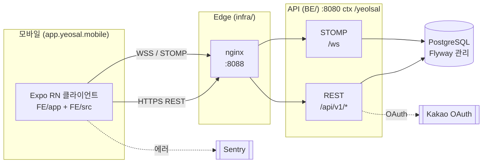

# Yeosal

> 친한 친구들끼리 매일 인증을 이어가는 모바일 서바이벌. 다음 날 **06:00 Asia/Seoul** 전에 회고를 제출하지 못하면 yellow, 7일 rolling window에 두 번 미스하면 red(탈락)입니다. 회생은 가입 시 받는 무료 회생권, 개인 포인트, 친구가 자기 포인트를 써서 선물하는 friend-gift 세 가지로만 가능합니다.

Yeosal은 모노레포입니다. Expo React Native 클라이언트, Java 21 / Spring Boot 3 기반 API, 그리고 nginx가 API를 감싸는 Docker Compose 스택으로 구성됩니다. URL 경로와 JWT issuer는 `yeolsal`, 레포·앱 번들·브랜드는 `yeosal` — 두 표기는 의도된 것입니다.

---

## 프로젝트 히스토리

- **2026-04-26 ~ 2026-05-02 — 1차 MVP 완료**. "데일리 미션 + 다음 날 06:00 KST 전 회고" 포맷으로 친구 그룹 책임감 앱을 출시. 이 시기 문서: [`docs/product.md`](./docs/product.md), 마이그레이션 V1–V10.
- **2026-05-09 이후 — 서바이벌로 피보팅**. 같은 06:00 KST day-boundary와 회고 메커닉은 유지하되, two-strike yellow→red 탈락 / spectator mode / 회생권 / 친구 선물 회생 / Final-3 ceremony 등 서바이벌 게임 메커닉을 추가. 1차의 daily entry / reflection / grass 스키마는 그대로 재사용. 피보팅 이후 정식 문서: [`_bmad-output/planning-artifacts/product-brief-yeolsal-distillate.md`](./_bmad-output/planning-artifacts/product-brief-yeolsal-distillate.md), [`_bmad-output/planning-artifacts/prd.md`](./_bmad-output/planning-artifacts/prd.md). 마이그레이션 V11 이후가 서바이벌 영역.

`docs/product.md`는 1차 시기 스냅샷으로 보존돼 있으며 갱신하지 않습니다. 서바이벌 규칙·메커닉의 canonical 출처는 BMad planning artifacts입니다.

## 스택 한눈에 보기

| 영역 | 기술 스택 |
|------|----------|
| `FE/` — 모바일 | Expo SDK 54 · React Native 0.81 · React 19.1 · TypeScript 5.9 (strict) · expo-router 6 · TanStack Query 5 · `@stomp/stompjs` 7 · Sentry RN |
| `BE/` — API | Java 21 · Spring Boot 3.3.5 · Spring Security · Spring Data JPA (`validate`) · Flyway (V1–V10 + V11~ 서바이벌) · JJWT 0.12 · STOMP/WebSocket · springdoc-openapi · Testcontainers |
| `infra/` — Edge & deploy | Docker Compose (`api` · `postgres` · `nginx`) 외부 포트 `8088`, 모바일 빌드는 EAS |
| 인증 | Kakao OAuth (REST API 키는 BE 전용) + 이메일 로그인, JWT access/refresh는 `expo-secure-store` |
| 실시간 | STOMP over WebSocket `/ws`, JWT는 `CONNECT` 프레임에서 검증, SockJS fallback 없음 |

운영 API base: `https://api.rearleg.com/yeolsal/api/v1`.

## 아키텍처



요청 envelope, JWT 라이프사이클, STOMP 토픽, REST/WS 중복 제거, 설정 경계는 [`docs/integration-architecture.md`](./docs/integration-architecture.md) 참고.

## 레포 레이아웃

```text
yeosal/
├── FE/                 Expo React Native 앱 (npm workspace)
│   ├── app/            expo-router 파일 라우트
│   └── src/            api · auth · components · domain · hooks · lib · providers · theme · types
├── BE/                 Spring Boot 3 API (Gradle)
│   └── src/main/java/com/yeosal/api/{auth,common,daily,friend,notification,profile,realtime,room,stats,user}
├── infra/              Docker Compose, nginx, deploy.sh, RUNBOOK-V11.md
├── scripts/            verify.sh · test.sh · build.sh (루트 `npm run …`이 호출)
├── docs/               product · architecture (FE/BE) · API contracts · data models · design system · test plan
├── _bmad/              BMad agent 하네스 자료
├── _bmad-output/       생성된 기획 산출물 (project-context.md, sprint-status.yaml, prd.md, …)
├── AGENTS.md           LLM 에이전트용 단축 규칙
├── CONTRIBUTING.md     stack-PR 머지 절차 (사고 기반 룰), 사전 검증
├── RUNBOOK.md          run / test / build 표준 명령
└── guide.md            ECC 하네스 설정 노트
```

파일 단위 깊이 있는 워크스루는 [`docs/source-tree-analysis.md`](./docs/source-tree-analysis.md).

## 사전 준비

- Node.js + npm (Expo SDK 54는 활성 LTS 노드 라인 지원)
- Java 21 (`BE/build.gradle`의 toolchain에 고정)
- Docker Desktop (Compose 스택 및 BE 이미지 빌드용)
- Android Studio + 에뮬레이터 (`npm run android` 시)
- Xcode (`npm run ios` 시)

## 빠른 시작

> [`RUNBOOK.md`](./RUNBOOK.md)가 표준 출처입니다. 아래는 가장 짧은 동선이고, 어긋나면 RUNBOOK을 보세요.

**한 번 설치하고 전체 검증.**

```bash
npm install                 # FE workspace 설치
bash scripts/verify.sh      # FE lint + typecheck + jest, BE gradle test/build, Docker 떠 있으면 BE 이미지 빌드까지
```

**모바일 앱을 운영 API로 실행** (기본).

```bash
cd FE
npm run android   # 또는: npm run ios
```

네이티브 모듈을 추가/변경한 직후(`expo-secure-store` 등)는 바이너리를 다시 깔아야 합니다 — Metro reload만으로는 안 됩니다:

```bash
adb uninstall app.yeosal.mobile && npm run android
```

**API + Postgres + nginx 풀스택을 로컬에서 Docker로.**

```bash
cd infra
cp .env.example .env        # POSTGRES_PASSWORD, YEOSAL_JWT_SECRET, KAKAO_* 채우기
docker compose up --build
curl http://localhost:8088/yeolsal/health
```

모바일 앱이 이 로컬 스택을 보게 하려면 `FE/.env`에 `EXPO_PUBLIC_API_BASE_URL`을 설정하세요 (Android 에뮬레이터는 `http://10.0.2.2:8088/yeolsal/api/v1`, iOS 시뮬레이터는 `http://localhost:8088/yeolsal/api/v1`). 변경 후 `npx expo start -c`로 Metro 캐시를 비우고 재시작.

**BE만 빠르게 돌리고 싶을 때.**

```bash
cd BE
JAVA_HOME=/opt/homebrew/opt/openjdk@21/libexec/openjdk.jdk/Contents/Home gradle test --no-daemon
```

`bootRun`, EAS 빌드, Sentry sourcemap 업로드 등 나머지는 [`RUNBOOK.md`](./RUNBOOK.md)의 해당 섹션을 참고하세요.

## 검증

`scripts/verify.sh` (루트 `npm run verify`로도 노출)가 "feature 완료 선언 전 한 번은 돌려야 하는" 단일 명령입니다.

| 단계 | 실행 내용 |
|------|----------|
| FE lint | `FE && npm run lint` |
| FE typecheck | `FE && npm run typecheck` |
| FE 단위 테스트 | `FE && npm test` |
| BE 테스트 | `BE && gradle test` (Testcontainers PostgreSQL — H2는 의도적으로 거부) |
| BE 빌드 | `BE && gradle build` |
| Docker 이미지 | Docker 데몬이 닿으면 `docker build` |

커버리지 목표는 도메인·서비스 로직 기준 80%. trivial getter나 config 클래스는 제외.

## 환경 변수 & 시크릿

`.env` 파일은 커밋하지 않습니다. `infra/.env.example`과 `FE/.env.example`이 source of truth.

| 변수 | 위치 | 비고 |
|------|------|------|
| `YEOSAL_JWT_SECRET` | BE | 32자 이상 필수. `dev-only-change-me-…` 기본값은 `StartupConfigValidator`가 부팅 시점에 거부. |
| `KAKAO_CLIENT_ID` | BE | Kakao REST API 키. **클라이언트에 노출 금지.** |
| `KAKAO_REDIRECT_URI` | BE | Kakao Developers에 등록한 값과 정확히 일치해야 함. |
| `KAKAO_MOBILE_REDIRECT_URI` | BE | 앱으로 돌아가는 딥링크 (예: `yeosal://auth/kakao`). |
| `POSTGRES_PASSWORD` | infra | Compose 전용 Postgres 자격증명. |
| `EXPO_PUBLIC_API_BASE_URL` | FE | 기본값은 운영 URL. 로컬 개발 시 오버라이드. `EXPO_PUBLIC_*` 키만 클라이언트 번들에 포함됨. |
| `EXPO_PUBLIC_SENTRY_DSN` | FE | 비워두면 Sentry 비활성. `src/lib/sentry.ts`가 no-op 경로 처리. |

Kakao 셋업과 Sentry 와이어링 상세는 [`RUNBOOK.md`](./RUNBOOK.md) 12·15절.

## 기여 & 워크플로

- `main`에서 `feat/…`, `fix/…`, `chore/…` 브랜치 분기. TDD 분할(`RED → GREEN → refactor`)은 별도 커밋으로 환영.
- Push 전: BE 변경이면 `cd BE && gradle test`, FE 변경이면 `cd FE && npm run lint && npm run typecheck && npm test`. Feature 완료 선언 전: `bash scripts/verify.sh`.
- **stack PR은 base chain 가장 아래부터 위로, `Delete branch` 켠 채 머지** — V7/V8 운영 미반영 사고가 있었습니다. stack PR을 열기 전 [`CONTRIBUTING.md`](./CONTRIBUTING.md) 필독.
- 스키마 변경은 Flyway 마이그레이션: `BE/src/main/resources/db/migration/V<N>__<slug>.sql`. `<N>`은 비어 있는 가장 작은 정수, 멱등 SQL 권장. partial unique expression index는 서비스 코드의 `INSERT … ON CONFLICT … WHERE …` 절과 정확히 매칭돼야 함.

## 문서 지도

- [`docs/index.md`](./docs/index.md) — 생성된 문서 인덱스, AI 보조 개발 진입점
- [`docs/product.md`](./docs/product.md) — 1차 MVP 시기의 스코프 (서바이벌 피보팅 전 스냅샷)
- [`_bmad-output/planning-artifacts/product-brief-yeolsal-distillate.md`](./_bmad-output/planning-artifacts/product-brief-yeolsal-distillate.md) — 서바이벌 메커닉 정식 출처 (locked decisions, rejected ideas, 시나리오)
- [`_bmad-output/planning-artifacts/prd.md`](./_bmad-output/planning-artifacts/prd.md) — 현재 PRD
- [`docs/architecture-fe.md`](./docs/architecture-fe.md) · [`docs/architecture-be.md`](./docs/architecture-be.md) — 표면별 아키텍처
- [`docs/api-contracts-be.md`](./docs/api-contracts-be.md) · [`docs/data-models-be.md`](./docs/data-models-be.md) — REST 표면과 영속 스키마
- [`docs/integration-architecture.md`](./docs/integration-architecture.md) — REST/STOMP 통합 계약
- [`docs/design-system.md`](./docs/design-system.md) — Risograph + neobrutalist 토큰
- [`docs/deployment-guide.md`](./docs/deployment-guide.md) — 운영 배포 절차
- [`AGENTS.md`](./AGENTS.md), [`_bmad-output/project-context.md`](./_bmad-output/project-context.md) — LLM 에이전트 운영 규칙 (시간대, 시크릿, day-boundary, 안티패턴)

## 상태

비공개 프로젝트. 모바일은 EAS로 빌드(`preview` = APK, `production` = AAB / iOS). Docker Compose 스택이 운영에서 외부 포트 `8088`로 API를 띄우고 `https://api.rearleg.com/yeolsal` 뒤에서 서비스됩니다.

## 라이선스

이 저장소의 코드와 문서는 **상업적 이용을 금지**합니다. 별도의 `LICENSE` 파일이 추가되기 전까지 모든 권리는 저작자에게 귀속되며, 학습·연구·개인적 참고 목적의 비상업적 열람만 허용됩니다. 운영, 배포, 재판매, 사내 도입 등 영리 활동에 사용하려면 저작자의 별도 허가가 필요합니다.
