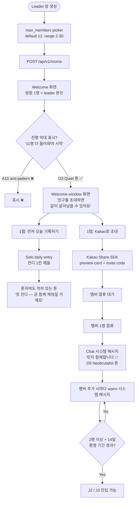
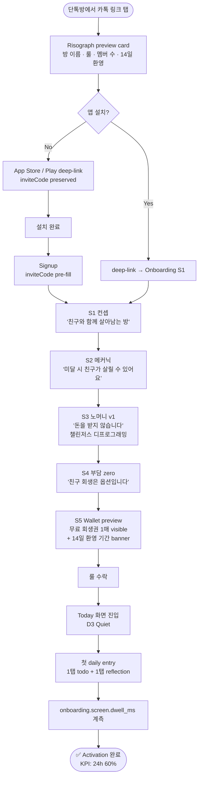
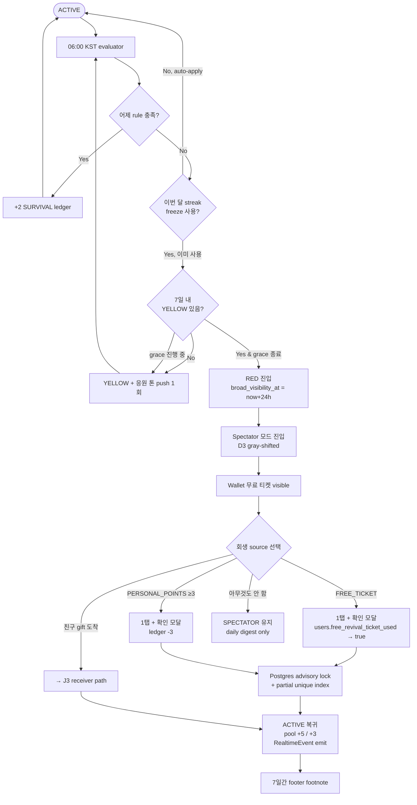
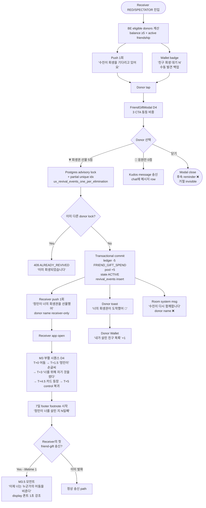
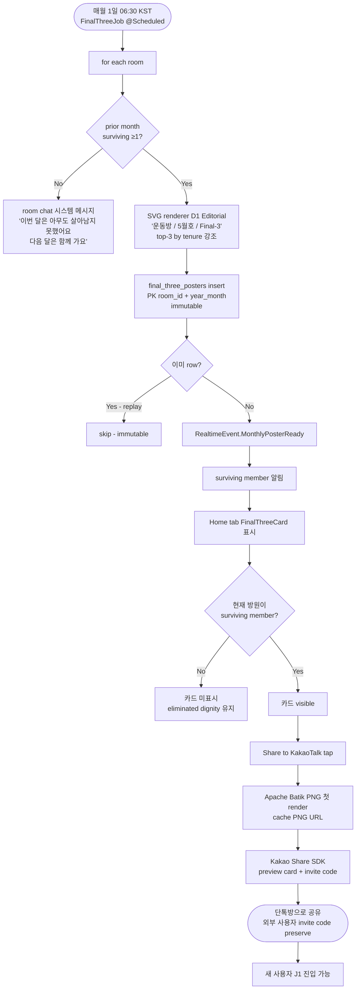

---
stepsCompleted:
  - step-01-init
  - step-02-discovery
  - step-03-core-experience
  - step-04-emotional-response
  - step-05-inspiration
  - step-06-design-system
  - step-07-defining-experience
  - step-08-visual-foundation
  - step-09-design-directions
  - step-10-user-journeys
  - step-11-component-strategy
  - step-12-ux-patterns
  - step-13-responsive-accessibility
  - step-14-complete
lastStep: 14
completedAt: '2026-05-10'
inputDocuments:
  - '_bmad-output/project-context.md'
  - '_bmad-output/planning-artifacts/product-brief-yeolsal.md'
  - '_bmad-output/planning-artifacts/product-brief-yeolsal-distillate.md'
  - '_bmad-output/planning-artifacts/prd.md'
  - '_bmad-output/planning-artifacts/prfaq-yeolsal.md'
  - '_bmad-output/planning-artifacts/prfaq-yeolsal-distillate.md'
  - '_bmad-output/planning-artifacts/architecture.md'
  - '_bmad-output/planning-artifacts/epics.md'
  - 'docs/index.md'
  - 'docs/product.md'
  - 'docs/design-system.md'
  - 'docs/architecture-fe.md'
  - 'docs/architecture.md'
  - 'docs/api-contract.md'
  - 'docs/test-plan.md'
  - 'docs/project-overview.md'
  - 'docs/architecture-be.md'
  - 'docs/api-contracts-be.md'
  - 'docs/data-models-be.md'
  - 'docs/integration-architecture.md'
  - 'docs/deployment-guide.md'
  - 'docs/source-tree-analysis.md'
workflowType: 'ux-design'
project_name: 'yeolsal (열살방)'
user_name: 'rearleg'
date: '2026-05-10'
status: 'complete'
---

# UX Design Specification — yeolsal (열살방)

**Author:** rearleg
**Date:** 2026-05-10

---

<!-- UX design content is appended sequentially through collaborative workflow steps -->

## Executive Summary

### Project Vision

열살방은 단톡방에서 매일 인증을 주고받는 한국 친구들을 위한 그룹 생존 게임이다.
약속을 놓친 친구는 패자가 아닌 관객이 되며, 다시 돌아올 때는 다른 친구가 보낸 회생권을
손에 쥔다. 보증금도 벌금도 없는 *수치심 없는(shame-free)* 경제 안에서, 함께 쌓은 노력만으로
굴러가는 14일을 Risograph 잉크처럼 거칠지만 따뜻하게 함께 견딘다.

> Launch criteria (Vision과 분리, success criteria 박스): activation ≥60%/24h · day-7 retention ≥45% ·
> friend-gift ≥1/active room/월 · room pool ≥50pt by Day-30 · shame-event-zero · 8주 빌드 / Day-60
> phase-2 트리거 게이트 4종 동시 충족.

### Target Users

- **Primary**: 20–40대 KR 자기관리 동호인. 단톡방 인증 문화에 이미 익숙하고, 단톡방이 못 주는
  *구조 + 내러티브 + 공유성*을 답답해함. 활성화 게이트는 친구의 카카오 초대 링크 → 가입 →
  첫 daily 등록.
- **Secondary (post-MVP, v1 빌드 타깃 아님)**: 수능/토익 D-day 코호트, 운동·식단 동호회, 회사
  30일 온보딩 코호트. themed-room preset이 unlock하는 다음 시장.

### Key Design Challenges

우선순위는 **빈도 × 임팩트 × KPI 직결성**으로 재정렬.

1. **C1 — 챌린저스 멘탈 모델 디프로그래밍 (60초 가설)**
   1.71M 명이 학습한 "보증금 환급 = habit app" 모델을 onboarding 5스크린 안에 재학습시키지
   못하면 cognitive load에서 진다. activation 60%/24h KPI 직결. *"60초"는 가설이며 onboarding
   체류 시간 텔레메트리(`onboarding.screen.dwell_ms`)로 검증.*

2. **C2 — 친구 회생 톤: "초대-아닌-부담"**
   친구회생 ≥1/active room/월 KPI에 직결. **load-bearing emotional moment.**
   push 1회 + 후속 reminder 없음 + 거절·미액션은 어디에도 노출 안 됨. 모달 카피·CTA·시각 모두
   죄책감을 유도하지 않는 invitation tone.

3. **C3 — 매일 06:00 KST 데드라인 ↔ dignity 톤 충돌 (매일 발생)**
   매일 새벽 6시 강제 데드라인은 *구조적으로* 불안·압박을 만드는 메커니즘. 빈도 365회/년/유저로
   가장 빈번한 감정 마찰점. 시각적 톤 + 카피 + push 발송 시점 정책이 dignity-first 어휘
   ("벌금/실패 금지")와 충돌하지 않게 매일 일관되어야 함.

4. **C4 — Spectator: "다시 열고 싶게 만들기"**
   *박탈감 ↔ dignity 균형*이라는 시소 비유보다 칼날 명제로 재정의: **"관객이 된 친구가 앱을
   다시 열고 싶게 만드는 것 — 푸시 없이, 부담 없이, 자존심 다치지 않게."** 채팅 read-only +
   Wallet 강조 + 24h soft-public 쿨다운 + daily digest only는 합의됨; 시각적 톤 차이는 Story 2.x
   AC에 명문화.

5. **C5 — J1 콜드스타트: 방장의 외로운 30초**
   12명 default 방인데 1명만 들어와 있는 시점에 방장 화면이 어떻게 생겼는가. "11명이 더 들어오면
   시작됩니다" 진행 막대는 dignity-first인가 압박인가? J1 핵심 mechanic이지만 비즈니스 가설
   (Kakao 분배)과 분리된 UX 가설로 미설계.

6. **C6 — Push notification 톤: shame-event-zero 게이트 직결**
   daily-promise 미체크 알림이 "shame-event"로 미끄러지면 PRD §3.1 KPI 자체가 무너짐.
   카피 + 발송 시점 정책이 FE `expo-notifications` 핸들러에 박혀야 하지만 현재 어느 epic에도
   명시 X. v1 빌드 첫주에 push 카피 lock 필요.

> **실행 디테일로 강등** (challenge가 아님): Wallet 4-track 정보 합주 (free ticket / personal pt /
> pool / received-history). 정보설계 문제이며 step-04 (감정 응답) 이후 step-11 (component strategy)
> 단계에서 다룬다. 대신 *AC fallback*: 4-tab 분리 옵션을 spec에 명시해 budget 충돌 흡수.
>
> **Tracked technical risk** (challenge가 아닌 architecture 영향 항목): 오프라인 / 통신 음영
> daily-checkin mutation queue 미정의. AsyncStorage persist는 있으나 retry queue 없음. 지하철·
> 통신 음영 시 daily-checkin 손실 시 dignity 톤 위반 가능. step-08~09에서 파생 결정 또는
> Architecture §7.x로 환류.

### Design Opportunities

v1 8주 빌드 budget을 침범하지 않는 선으로 **좁히고 톤을 리프레임**.

1. **O1 — 월 1회 Final-3 ceremony, 단 하나의 포스터 (생태계 ❌)**
   *"포스터 생태계"는 v3 언어 → v1 cut.* v1에서는 매월 1일 06:30 KST 단 한 번, 단일 Risograph
   포스터 + Kakao 카드 share. ASO 인덱싱은 deep link config 검증 수준만; 그룹 갤러리는 phase-2.

2. **O2 — Pool = "같이 쌓는 돌탑" (시들지 않는 누적 메타포)**
   *"함께 키우는 화분"은 시들 위험* (이탈 시 잎 시드는 애니메이션 = brand voice 위반).
   누적되기만 하고 줄어들지 않는 메타포로 교체 — *돌탑·천 짜기·도자기 굽기* 후보. **구현은
   5단계 정적 SVG/PNG swap 한정** (Reanimated/Skia 레이어 합성은 v1 8주 cut).

3. **O3 — "환영 기간(Welcome Window)" — 카운트다운이 아닌 의식**
   *"14일 카운트다운 배너"는 압박 메커니즘 → 톤 리프레임.* 같은 14일을 "환영 기간"으로 명명,
   Day-15 06:00 KST 전환의 *시각적 결말*을 디자인하는 게 진짜 opportunity. server time delta
   캐싱 필수 (클라이언트 시계 신뢰 금지).

4. **O4 — 매일 06:00 KST의 의식화 (ritual)**
   한국 자기관리 문화에서 "아침 6시"는 신성한 시간. deadline으로만 다루지 말고 매일 그 시각의
   화면 전환·인사·짧은 세리머니로 ritual화. C3(데드라인 ↔ dignity) 충돌을 **방어**가 아닌
   **가치**로 변환할 수 있는 단 하나의 opportunity.

### Vision-단계 Spec Lock 항목 (W1 kickoff 전 합의 필수)

다음 3개 단어가 vision 문장에서 가장 비싸므로 W1 시작 전 lock:

| 단어 | 무엇을 lock해야 하는가 |
|---|---|
| "Risograph + neobrutalist 결합" | RN에 native shader/SVG `<filter>` 미지원 → PNG noise overlay + `tintColor` layered fallback 합의 |
| "회생권 선물" | (1) DB row 이전 (2) Kakao share 외부 invite (3) in-app push 중 어느 의미인지 + WS event schema (`gift.revive.sent` / `.received`) 합의 |
| "trigger gate 측정" | analytics SDK 미선정 — Sentry는 error만. v1 release 시점 4개 게이트 측정 가능하도록 W1에 SDK 선정·통합 |

## Core User Experience

### Defining Experience

v1 핵심 경험은 단 하나의 인터랙션으로 수렴: **매일 todo 등록 + 다음날 06:00 KST 이전
reflection 제출.** 다른 모든 surface(Wallet, Friend Gift Modal, Final-3 ceremony,
Spectator)는 이 핵심 액션의 *결과·회복·축하 경로*다. 이 1개 인터랙션이 무너지면 retention,
friend-gift, pool 누적 모든 KPI가 함께 무너진다.

### Platform Strategy

- **모바일 단독** (iOS + Android via Expo SDK 54 / EAS). 웹·데스크탑은 v1 ❌.
- **KR-only v1**. English store metadata만 별도 (ASO 인덱싱 목적).
- 터치 단독, 한손 사용 가정. 단톡방 컨텍스트 스위치를 견디는 thumb-zone 디자인.
- Push (`expo-notifications`) 필수 — daily 알림 + 친구회생 prompt + spectator daily digest.
- KakaoTalk Share SDK는 native module → W5에 `adb uninstall app.yeosal.mobile` + clean
  rebuild 일정 명시.
- **오프라인 / 통신 음영**: TanStack Query AsyncStorage persist는 있으나 mutation queue는
  현재 미정의 (tracked technical risk). 지하철·통신 음영에서 daily-checkin 손실 시 dignity
  톤 위반 가능 — Architecture §7.x 또는 step-08~09에서 결정.

### Effortless Interactions (Zero-thought 목표)

다음 6개 인터랙션은 사용자가 생각하지 않고 손가락이 알아서 움직여야 한다.

1. **Daily check-in** — Home/Today 탭에서 1탭 todo 추가 + 1탭 reflection 모달. 06:00 KST
   직전 패닉 상황에서도 3초 컷.
2. **Free revival ticket 사용** — Spectator 모드 진입 직후 Wallet에 무료 티켓 visible,
   1탭 + 확인 모달 1회.
3. **Friend gift 수락** — push 알림 탭 → 모달 → "회생권 선물하기" CTA, 최대 3탭.
4. **KakaoTalk 초대 공유** — Room Settings → "Share to KakaoTalk", 2탭.
5. **Final-3 포스터 공유** — Home 탭 카드 → "Share to KakaoTalk", 2탭.
6. **Wallet 풀 확인** — 어떤 화면에서도 항상 visible (탭 전환 없이).

### Critical Success Moments (5 make-or-break)

다음 5개 *"처음 일어나는 순간"*이 모든 KPI 게이트를 결정한다.

| # | 순간 | KPI 직결 | Make 조건 | Break 조건 |
|---|---|---|---|---|
| M1 | 첫 daily entry (signup 후 24h) | activation ≥60%/24h | onboarding 5스크린 60초 + 1손가락 첫 todo 입력 | 챌린저스 멘탈 재학습 실패 |
| M2 | 첫 spectator → revival | day-7 retention ≥45% | 무료 티켓이 spectator 진입 즉시 visible | Spectator 화면 어조 "탈락" |
| M3 | 첫 친구→친구 회생 (방 단위 1회) | friend-gift ≥1/active room/월 | push 1회의 invitation tone, 모달 부담 zero | push가 demand로 읽힘 |
| M4 | 첫 Final-3 포스터 발행 | free marketing 자산 | 월 1회 단일 의식, 카톡 share 2탭 | 포스터 cheesy → 공유 ❌ |
| M5 | 14일 "환영 기간" 완주 | day-30 cohort survival ≥25% | Day-15 06:00 KST 시각적 결말이 의식적 | 카운트다운 압박으로 미리 이탈 |

### Experience Principles (6 가드레일)

step-04 ~ step-13 모든 의사결정의 기준선.

1. **Daily, dignified** — 매일 365회 발생하는 행위는 dignity 톤을 단 1회도 잃을 수 없다.
2. **Friend over self** — 친구를 살리는 행위가 자기 회생보다 *정서적으로 깊게* 디자인된다
   (load-bearing emotional moment).
3. **Show, don't shame** — 박탈은 visible하되 stigma는 절대 만들지 않는다 (24h 쿨다운,
   죽음 아이콘 ❌, leaderboard ❌).
4. **Thumb-zone first** — 한손·지하철·단톡방 멀티태스킹 콘텍스트에서 모든 핵심
   인터랙션이 작동한다.
5. **Push as invitation** — 모든 push는 초대 어조, 단 한 번. 후속 reminder는 dignity 위반.
6. **Ritual at 06:00** — 06:00 KST를 deadline이 아닌 ritual로 변환한다 (O4 opportunity와
   결합).

## Desired Emotional Response

> Step-04 party-mode 검토 (Sophia / Maya / Dr. Quinn)에서 다음 합의가 도출되어
> 초안을 격상함: (1) primary 감정 재명명 "목격(being-witnessed)" 격상, (2) M3 anchor를
> "기억(인지)"에서 "희생(자기 것을 씀)"으로 격상, (3) 모순 회피로 판정된 4개 원칙에
> *모순 해결 메커니즘* 보강, (4) 7번째 원칙 "Mutual witness > self-proof" 추가
> (Level 2 패러다임 lock), (5) 5개 감정 충돌 완충 장치 명시, (6) Maya 7일 다이어리
> 스터디는 별도 Validation Plan에 환류.

### Primary Emotional Goals

**"목격되고 싶음(being-witnessed) + 함께하고 싶다"** — load-bearing emotional moment.

소외감(FOMO)은 단톡방 침묵·읽씹·무반응으로 한국 사용자에게 이미 *과잉 공급*된 감정.
또 하나의 FOMO 엔진을 만드는 것은 기존 피로의 재포장에 불과. 진짜 엔진은 *목격*이며 —
"내가 했다"가 아니라 "네가 봤다"가 retention의 심장.

소외감은 *주의해야 할 그림자(secondary shadow)*로 격하: 디자인이 적극 활용하지 않고,
PRD §13의 spectator-FOMO 가설이 < 15%에서 죽으면 **Primary 가설을 "목격" 쪽으로
완전 이동**할 수 있도록 telemetry 분리 (target user의 retention 동인이 FOMO인지 목격인지
별도 측정).

**지지 감정 (secondary)**: 존엄(Dignity), 주체성(Agency), 공동현존(Co-presence),
의식(Ritual), 사소한 자랑(Quiet Pride), 추억의 따뜻함(Memorial Warmth).

**피해야 할 감정**: 수치심(Shame), 압박(Pressure), 소외(Isolation), 의무감(Obligation),
불안(Anxiety), 감시(Surveillance) — 브랜드 보이스 AVOID lexicon과 1:1 매핑.

### Emotional Journey Mapping (M1~M5 + M3.5 추가)

| 순간 | McKee | 직전 | 직후 | 깨지면 들어오는 감정 |
|---|---|---|---|---|
| **M1** 첫 daily entry | Inciting Incident | 회의 | 안도 + 시작의 자랑 + *전조 (불씨 한 줄)* | 수치심·압박 |
| **M2** 첫 spectator → 자기 회생 | Progressive Complication | 박탈감 + *외로움 잔향* | 컴백의 가벼움 (단, *혼자였다*는 잔향 보존) | 수치심·소외 |
| **M3** 첫 친구 → 친구 회생 | **Crisis + Climax** | giver: 주체성·따뜻함 / receiver: 깊은 anchor | **"친구가 나를 위해 자기 것을 썼다"** (substitutionary sacrifice) | 의무감·부담·사회적 부채 |
| **M3.5** *(신규)* 받은 자가 주는 자가 됨 | Resonance | 회복된 주체성 | "다음 영웅을 부른다" — 강화 루프의 닫힘 | donor가 자기 회복 못 하면 burnout |
| **M4** 첫 Final-3 포스터 | Resolution (1차) | 공동현존의 누적 | 집단 자랑 + 추억 artifact (*"우리의 14일"*, 1인칭 복수 톤) | "자랑질" 사회적 페널티 |
| **M5** 14일 환영 기간 종료 | Coda + 새 막의 서막 | 의식의 졸업 | "함께"의 본격 시작 (*변화한 자기 자각* 명시) | 절벽감 |

**M2 강화**: 자력 회생을 *너무 매끄럽게* 만들면 M3 절정의 절실함이 약화됨. M2는 충분히
외로워야 — 살아 돌아오긴 했으나 혼자였다는 잔향을 디자인에 보존 (예: 회생 직후 화면에
미세한 *고요함*, 친구 채팅의 *반쯤 흐려짐*에서 다시 또렷해지는 시각 시퀀스).

**M3 격상**: anchor 문장을 *진실의 농도*에 맞게 재단:
- ~~"친구가 나를 기억했다"~~ → **"친구가 나를 위해 자기 것을 썼다"** /
  **"내가 사라질 뻔한 자리를, 친구가 채웠다"**

**M3 4가지 서사 장치** (anchor를 놓치지 않게):
1. **지연(Delay)** — 친구 티켓 도착 → 부활 발효 사이 3-5초. 즉시 부활은 카드 결제처럼,
   지연된 부활은 기적처럼 느껴진다.
2. **반복(Echo)** — 부활 후 7일간 daily entry 화면 구석에 "○○가 너를 살린 지 N일째"
   *작은 풋노트* (빚이 아닌 기억의 향기).
3. **공명(Resonance)** — M3.5 모먼트 별도 디자인: 부활자가 처음 자기 티켓을 친구에게
   쓰는 순간 (받은 자가 주는 자가 되는 순환).
4. **전조(Foreshadowing)** — M1부터 아주 작게 "이 방에서 너는 혼자 살아남지 않을
   것이다" 한 줄을 미리 박아 절정의 기시감을 만든다.

**M5 강화**: "졸업"은 결말이 아니라 새 막의 서막. *Master of Two Worlds* — 14일 졸업생이
**무엇이 변했는가**(예: free ticket 소진 + 친구 회생 1회 송신 + N점 누적)를 시각적
회고 화면으로 명시.

### Micro-Emotions — 6쌍 Seesaw + KR 컨텍스트 보정

| Seesaw | KR 컨텍스트 보정 | UX 결정 |
|---|---|---|
| Belonging ↔ Isolation | KR에서 belonging은 *옵트아웃 어려운* belonging — "빠지면 욕먹는다" 톤 → **belonging ↔ 눈치**로 재조정 | 강제 옵트인 ❌, 14일 환영 기간 명시적 *그래듀에이션 의식* |
| Agency ↔ Obligation | KR에서 agency가 *책임 가중*으로 번역되는 함정 ("네가 선택했잖아" = 자책 무기) | 거절·미액션 invisible, 기록 공유 옵트인, *후일담형 보상 시그널*만 |
| Dignity ↔ Shame ✅ | KR에서 dignity ≈ 체면, 체면은 타인 시선 부재 시만 회복 → spectator 모드 직접 충돌 | spectator UI gray-out 한정 + 잔디 보존 + 24h 쿨다운, 죽음 아이콘 ❌ |
| Anticipation ↔ Anxiety | 06:00 KST는 KR에서 anticipation 아닌 *카운트다운*으로 읽힘 | "환영 기간(welcome window)" 톤 리프레임, 카운트다운 어휘 ❌ |
| Warmth ↔ Coldness ✅ | 한국 정·情과 결이 맞음. 가장 안전 | Risograph 텍스처, 함께/선물/응원 어휘 |
| 🚨 Ritual ↔ Routine drudgery | KR 인증 문화에서 ritual ↔ drudgery 경계 *3일째* 무너짐 | 06:00 KST 매일 같은 시각의 *짧은 의식* 디자인 (5초 컷, 3일째에도 신선) |

**KR 미세 지뢰 — "Pride is private, joy is shared"**:
서구권 self-affirmation과 KR 겸손 미덕이 충돌. M4 Final-3 포스터에서 **1인칭 단수 → 1인칭
복수 시프트** ("나의 14일" ❌ / **"우리의 14일"** ✅) 으로 *겸양의 외피* 입혀줌.

### Emotional Conflict Buffers (5+1 supplements)

UX는 감정 충돌이 *반드시* 일어나는 지점에 미리 완충 장치를 디자인.

1. **회생 차별 충돌** (M3 그림자) — A가 B는 살리고 C는 안 살릴 때, C가 spectator로 본다.
   - 완충: 회생 알림은 단톡방 공개 ❌, **giver→receiver 1:1 비공개 모먼트**로 봉인.
     spectator는 "누군가 살아났다"만 알고 *누가 살렸는지*는 모르게.
2. **자원 고갈 망설임 충돌** (12점 중 5점 망설임의 3초가 dignity 깎음).
   - 완충: 즉시 노출 ❌. **giver 후일담형 보상 시그널** ("이번 회생으로 다음 회생 쿨다운
     단축") — 결정 시점에는 숨김 (즉시 보이면 거래로 변질).
3. **방장 책임 과잉 충돌** (J1 leader가 모두를 살리려다 자기 OUT).
   - 완충: leader에게 **"이번 주는 받는 주"** 같은 *수동성 정당화* 의식 + leader 회생을
     room이 우선 떠맡는 시각적 유도 (받기만 하는 미안함을 디자인이 *명분*으로 흡수).
4. **Spectator 조롱 위험** (살아남은 사람이 spectator 채널에서 농담으로 건드림).
   - 완충: spectator 메시지 입력 시 부정 단어 감지 → **"응원 메시지 어때요?" 한 번 묻기**
     (검열 ❌, 살짝 흔들기 ✅). 답변 자유.
5. **회생 후 재탈락 이중 좌절** (B가 A 도움으로 살아 돌아왔는데 2일 뒤 또 OUT — B 자책 +
   A 미세 분노).
   - 완충: 회생 후 **48시간 보호 윈도우** — 시각적 *회복 중* 상태 + 재탈락 시 자동 streak
     freeze 1회 보너스 (의료 드라마의 회복실 톤).

**+1 supplements (Maya bonus)** — **앱 → 단톡방 역수출 통제**: 카카오 초대 받은 사용자가
앱 내 일을 단톡방으로 역수출당할 통제 상실감 위험. **앱→단톡방 공유는 항상 사용자
명시 액션**, 자동 전파 절대 ❌.

### Design Implications (감정 → UX 매핑)

| 감정 | 키우는 UX 결정 | 피하는 UX 결정 |
|---|---|---|
| 목격되고 싶음 (load-bearing) | 친구 잔디·풀·Final-3 *명단*에 자기 이름 visible, 매일 누군가 봤다는 미세 신호 ("○○가 잔디를 봤어요") | 익명 viewer count, "보였습니다" 통계 표시 |
| 함께하고 싶다 | Friend Gift Modal의 받는 친구 닉네임·상태 visible, 그룹 풀(돌탑) 누적 가시화, Final-3 카드 공동 명단 | 풀 줄어드는 애니메이션, 친구별 기여도 leaderboard |
| Dignity (체면) | spectator 채팅 read-only + 잔디 visible (회색조 옵션) + 24h 쿨다운, 죽음 아이콘 ❌ | spectator 진입 시 모달 알림, 친구별 elimination 카운트 |
| Agency (책임 가중 회피) | 친구 회생 push 1회 + Wallet 배지(수동 발견) + donor name receiver-only + 거절·미액션 invisible | 회생 push 후속 reminder, "친구가 너를 기다리고 있어요!" 강압 카피 |
| Quiet Pride (KR 겸양) | 매일 todo 완료 시 1초 핑크 micro-confirmation (자기에게만), Final-3 *우리의 14일* 1인칭 복수 톤 | 공개 streak 리더보드, "X일 연속!" 강조, *나의 N일* 단수 톤 |
| Co-presence | 그룹 풀 항상 visible, 친구 잔디 항상 visible (spectator 포함), 단톡방-like 채팅 톤 | 친구 활동 dashboard, 정량 대시보드 |
| Ritual (06:00) | 06:00 KST 5초 의식 (화면 전환·짧은 인사), 매월 1일 06:30 Final-3 ceremony | 매시간 알림, 임의 시각 push, "한국 새벽 6시 시간 압박" 어휘 |

### Emotional Design Principles — 7 가드레일 (1개 신규 + 4개 모순 해결 보강)

step-05 ~ step-13 모든 의사결정의 기준선. **★** 표시는 step-04 party-mode 결과 변경 또는
신규.

1. **Co-presence over notification** — 알림은 dignity와 FOMO를 분리할 수 없지만 존재감
   신호는 분리 가능. "있다"는 사실만 전하고 "왜 없냐"는 묻지 않는다 (모순 해결 ✅).
2. **Pride is private, joy is shared** — 비대칭 노출. 약한 면은 사적, 강한 면은 공적
   (TRIZ separation in space). KR 겸양 보정 — Final-3은 *1인칭 복수* (모순 해결 ✅).
3. **★ Loss is paused, not permanent — *재의미화로 모순 해체*** — 14일 grace는 의무를
   *연기*하는 게 아니라 "환영 기간"으로 *재명명*한다. 단순 시간 미루기는 모순 회피.
   재의미화는 모순 해체 (Dr. Quinn 보강).
4. **★ Invitation is one-time — *urgency는 "친구가 사라질 뻔했다는 인식"으로 격상*** —
   단순 push 1회로 urgency를 *거세*하면 friend-gift KPI 발화 압력 자체가 죽음. urgency는
   *어휘*가 아닌 *사건의 무게*에서 와야 함 (M3 substitutionary sacrifice anchor) (Dr. Quinn
   보강).
5. **★ Ritual time is sacred — *재의미화 메커니즘 명시*** — 06:00 KST를 sacred로 만드는
   구체 메커니즘: (a) 매일 같은 시각 5초의 짧은 의식, (b) 한 번도 거르지 않은 인사 톤,
   (c) 1일·15일·30일의 시각적 차이. 단순 "신성하다" 단언은 회피 (Dr. Quinn 보강).
6. **★ Visual warmth as antidote → *Visual warmth as native temperature*** — antidote는
   "독이 있다는 전제". Risograph 따뜻함은 사후 처리가 아닌 *시스템의 기본 온도*로 박는다
   (Dr. Quinn 보강).
7. **★ NEW: Mutual witness > self-proof (Level 2 패러다임 lock)** — 단톡방 인증의
   기본 패러다임 ("내가 약속을 지킨다고 친구들에게 증명한다", 일방향) 을 열살방의 패러다임
   ("우리가 서로의 약속을 지켜준다고 함께 본다", 쌍방향) 로 전환한다. 신규 사용자 첫
   7일 안에 *몸으로* 깨닫는 단 하나의 ritual moment를 step-08 이후 디자인 — 이게 빠지면
   다른 6 원칙 모두 단톡방 인증의 중력으로 끌려간다 (Dr. Quinn Level 2 leverage).

### Missing Balancing Loops (architecture 환류 후보)

step-04 시스템 검토에서 누락 발견 — *콘텐츠 결정 아님*, architecture에 환류:

1. **구원자 부담 가시화 루프** — 한 사람이 N회 이상 회생 송신 시 시스템이 *donor 보호
   신호* 발화 ("이번엔 다른 친구가 응원할 차례예요"). 강화 루프(M3.5)와 별도 보호.
2. **Shame-event 자동 압력 해소 루프** — RED 누적 또는 spectator FOMO 임계치 초과 시
   시스템이 자동 압력 빼는 회로 — 예: 7일 이상 spectator 상태 자동 *디지털 안식*
   (push 0건 + Wallet 무료 티켓 1회 자동 부여). PRD KPI shame-event-zero 게이트 직결.

→ Architecture §7.x 또는 step-13 이후 architecture revision으로 환류.

### Validation Plan (Maya)

step-04 콘텐츠가 *단언*이 아닌 *가설*임을 명시. v1 launch 직전 또는 W1 kickoff 사전:

- **회생 시뮬레이션 다이어리 스터디 7일** — 친밀도 高/中/低 섞은 5명 페어. "5점을 누구에게
  줄지 망설인 순간"과 "안 받았을 때의 감정"을 매일 음성/텍스트로 기록.
- **검증 질문**: M3가 진짜 retention anchor인가, 아니면 quiet churn trigger인가?
- **재계측**: Day-30 cohort에서 retention 동인을 "FOMO 강도" vs "목격됨 강도" 두 변수로
  분해. spectator-FOMO 가설이 <15%에서 죽으면 Primary 감정을 "목격" 쪽으로 완전 이동
  (PRD §13 fall-back 전략).

## UX Pattern Analysis & Inspiration

### Inspiring Products Analysis

**5 product-level inspirations**:

| # | 제품 | 무엇을 잘하는가 |
|---|---|---|
| I1 | **Duolingo** | streak freeze + gem 경제. Loss aversion 비추출적 monetize의 캐노니컬 사례 (4.5× DAU 성장) |
| I2 | **Strava** | Kudos 1탭 응원. Demand가 아닌 invitation, 소셜 압력 0, 따뜻함만 전달 |
| I3 | **BeReal** | 시간 윈도우 ritual. FOMO 있지만 stigma 없음. 모두가 동시에 한다는 *공동 현존* |
| I4 | **KakaoTalk** | 단톡방 인증의 *원어*. 시스템 메시지 톤·공유 카드·1:1 vs 단체·읽음 표시 — 모든 컨벤션이 base layer |
| I5 | **토스** | 영수증 스타일 시각적 절제 + 친근 마이크로카피. KR 친근함 디폴트 |

**시각 인스피레이션 레이어** (Risograph + Neobrutalist):
- Risograph print studios (Hato Press, Risolab, 루프 페이퍼) — 의도된 misregistration,
  형광 핑크/그린, 거친 종이 질감
- Korean indie magazine 잡지 (월간잡지, 별책부록) — 브루털한 헤드라인 위계, 손글씨/도장
- Neobrutalist 웹 (linear.app 초기, are.na, brutalistwebsites.com) — 두꺼운 검은 보더,
  그림자 없거나 hard offset only
- Concert poster (서울독립영화제, 자라섬재즈) — Final-3 명단 시각 위계 인스피레이션

### Transferable UX Patterns

🔒 = PRD/Architecture lock | 🟡 = adapt 후보 | 💡 = inspiration only

**Navigation / Information Architecture**
- 🔒 단톡방-like room chat (KakaoTalk) — 시스템 메시지 톤, 공유 카드, 읽음 표시
- 🟡 시간 윈도우 ritual landing (BeReal) — 06:00 KST 진입 시 *오늘의 ritual* 화면
  (O4 직결)
- 💡 영수증 스타일 daily review (토스) — Today 탭 reflection 부분

**Interaction Patterns**
- 🔒 Streak freeze 자동 적용 (Duolingo) — PRD FR-8.1.3 lock
- 🟡 Kudos = 1탭 응원 (Strava) — Friend Gift Modal에 보조 CTA "응원만 보내기 (점수 0)"
  추가 — Maya의 giver 부담 완충
- 🟡 Curated invite preview card (KakaoTalk) — PRD FR-8.6.2 lock; 디자인은 카톡 자체
  카드와 *Risograph 색감으로 시각 식별 가능*하게
- 🟡 시간 윈도우 한정 액션 (BeReal) — 06:00 KST 직후 5분간 *공동 인증 카운트* 라이브,
  이후 평범한 daily entry. 평범함과 특별함의 시간 차
- 💡 Receipt micro-copy (토스) — Wallet ledger 톤

**Visual Patterns**
- 🔒 Risograph 토큰 + 3-4px 보더 + 5-7px hard offset (yeolsal design-system.md)
- 🟡 Neobrutalist 큰 활자 hierarchy (linear.app 초기) — Today 헤드라인을 두툼하게
- 🟡 Concert poster 명단 시각화 (자라섬재즈 톤) — Final-3 surviving list 레이아웃
- 💡 잡지 표지 wordmark + 호 발행 (월간잡지) — Final-3에 "운동방 / 3월호 / Final-3"
  간행물 메타포

**Emotional Patterns**
- 🔒 Loss aversion 비추출적 monetization (Duolingo gem) — yeolsal 회생권 1:1 매핑
- 🟡 Mass simultaneous moment (BeReal) — 06:00 KST 공동 현존 신호
- 💡 Strava-style 친구 잔디 visible — *대시보드*가 아닌 *옆 사람 흔적*

### Anti-Patterns to Avoid

PRD §6.1 banned list + 경쟁 분석.

| # | Anti-pattern | 출처 / 사례 | 왜 |
|---|---|---|---|
| A1 | 보증금-환급 (Deposit-refund) | 챌린저스 | KR 1.71M 학습된 모델 정면충돌; gambling 위험; 자체 retention 한계 |
| A2 | 공개 실패-카운트 / 돈 리더보드 | Stickk-style | shame engine; brand voice 위반 |
| A3 | RPG quest / boss-fight | Habitica | KR 자기관리 페르소나에 too far; Risograph dignity 톤과 충돌 |
| A4 | 변동가 회생권 / 임의 보상 | gacha 류 | 한국 게임위 gambling-classification trip; PRD §6.1 banned |
| A5 | 위치 기반 todo 검증 | habit app 일부 | surveillance; PRD §6.1 banned |
| A6 | 친구 초대 = 보상 (피라미드) | growth hack 류 | ToS-unsafe; brand voice 위반 |
| A7 | 실패 알림 demand 톤 | many habit apps | invitation tone과 정면충돌; M3 push 톤 가드 위반 |
| A8 | 1인칭 단수 자랑 톤 | 운동 앱 weekly summary | KR 겸양 미덕 충돌 (Maya 보강) — 1인칭 복수만 |
| A9 | 자동 단톡방 역수출 | 일부 KR 앱 share toast | 통제 상실감; step-04 buffer +1 |
| A10 | 빈 방 = 진행 막대 압박 | onboarding 안티패턴 | "11명 더 들어와야 시작"식 — J1 방장 외로움 30초를 압박으로 변질 (Sally 보강) |

### Design Inspiration Strategy

**Adopt (그대로 차용)**
- Duolingo streak freeze 자동 적용 — UI는 *후일담* 톤만 ("이번 달 사용됨"), 사전 가용량
  강조 ❌, 도박 기대감 차단
- Strava Kudos = "응원만 보내기" 보조 CTA — Friend Gift Modal에 (5점 회생) + (0점 메시지만)
  두 트랙
- KakaoTalk preview card — *Risograph 색감 + 3-4px 보더로 시각 식별 가능*하게 (자동 카톡
  카드와 차별)
- 토스 receipt micro-copy — Wallet ledger 톤

**Adapt (변형 채용)**
- BeReal 시간 윈도우 → 06:00 KST 5분 라이브 *공동 인증 카운트* (방원 N명 중 X명 완료
  표시), 5분 후 평범한 daily entry. 압박 톤 ❌, 조용한 의식 ✅
- Concert poster 명단 → Final-3 포스터의 surviving member list 레이아웃 + "월간 OO방 X호"
  간행물 톤 (월간잡지)
- Mass simultaneous moment → 한국식 *조용한* 의식. 알림 ❌, 진입 시 조용한 인사. Sally의
  3일째 무너짐 우려 — 매일 신선한 변주 (요일별 인사·주간 메타·월간 톤 시프트)

**Avoid (design review 체크리스트)**
- A1~A10 모두. 특히 **A7 (demand 톤 알림)**, **A8 (1인칭 단수 자랑 톤)**,
  **A10 (빈 방 진행 막대)**은 KR 컨텍스트에서 자주 *나도 모르게* 흉내내게 되므로 PR 리뷰
  체크리스트에 명시.

## Design System Foundation

### Design System Choice

**Custom Design System** (Risograph + Neobrutalist) — established RN library 모두 부적합
(react-native-paper / NativeBase / Tamagui = Material/iOS 디폴트 미학과 충돌).
Token-driven 4-layer 구조로 over-build 위험을 좁힌다.

### Rationale for Selection

- **Brand uniqueness가 5축 차별화의 1축** — established system은 차별화 자체를 죽임
- **기존 자산 80% 적재** (`FE/src/theme/`, `docs/design-system.md`,
  `FE/src/components/ui/` 일부)
- **Single 풀스택 + AI 에이전트 보조** → minimal surface 필수: 5 신규 + 5 확장 컴포넌트로
  좁힘
- **8주 budget**: W1-W3 base, W4-W7 feature 단계 fit
- **Brand 자체가 retention asset** (Final-3 포스터 = free marketing) → custom ROI 정당화

### Implementation Approach — 4-Layer Token-Driven

```
┌────────────────────────────────────────────────────────────┐
│ L4 Pattern Layer                                           │
│   Wallet 4-track · FriendGiftModal · SurvivalBanner ·      │
│   FinalThreePoster · RoomInviteSheet · RitualMoment        │
├────────────────────────────────────────────────────────────┤
│ L3 Component Layer (Risograph atoms / molecules)           │
│   <RisoButton> <RisoCard> <RisoSheet> <PoolMeter>          │
│   <GrassGrid> <SystemMessage> <NoiseOverlay> <HardShadow>  │
│   <RitualMoment> <KudosButton>                             │
├────────────────────────────────────────────────────────────┤
│ L2 Primitive Layer (RN + SVG)                              │
│   React Native core · react-native-svg ·                   │
│   PNG noise overlay · tintColor 합성                       │
├────────────────────────────────────────────────────────────┤
│ L1 Token Layer (기존 + 신규 4종 확장)                       │
│   color (locked) · semantic.survival · semantic.emotion ·  │
│   typography.persona · motion.narrative ·                  │
│   spacing · border (3-4px) · shadow (5-7px hard offset)    │
└────────────────────────────────────────────────────────────┘
```

**L1 신규 토큰 4종**:
- `semantic.survival` — 4가지 상태 (active/yellow/red/spectator) → 색·텍스트 라벨·아이콘·
  잔디 명도 매핑. NFR-9.6.1 (color 단독 carrier ❌, text label 필수)
- `semantic.emotion` — 7 design principle 위에 색·motion·tone 매핑 (예:
  `warmth-bg = paper + 5% pink`, `ritual-motion = 5초 지연`)
- `typography.persona` — 1인칭 복수 톤 컴포넌트 가이드 ("우리의 / 함께" 헤더 사이즈),
  Risograph wordmark 사용 규약
- `motion.narrative` — M3 4가지 서사 장치 motion spec (지연 3-5s / echo 7d 풋노트 fade /
  공명 transition / 전조 1px hint)

**L2 RN 제약 (Amelia step-02 review에서 lock)**:
- ❌ `react-native-skia` 추가 cut — native rebuild + 8주 budget 압박
- ❌ Reanimated 3 layer 합성 cut — O2 화분 (c) 옵션 cut, **(a) 5단계 정적 SVG/PNG swap만**
- ✅ `react-native-svg` 이미 deps — Risograph 일러스트 1차 매체
- ✅ PNG noise overlay + tintColor 합성으로 grain 흉내 (native shader 없이)
- ✅ SVG `<filter>` 미지원 → 미세 misregistration은 *2-layer 핑크/그린 0.5px shift PNG*
  로 정적 표현

### v1 Component Build Matrix

| 컴포넌트 | 출처 | v1 분류 |
|---|---|---|
| `<RisoButton>` | 기존 `src/components/ui/Button` | 🔁 확장 |
| `<RisoCard>` | 기존 `src/components/ui/SurfaceCard` | 🔁 확장 |
| `<RisoSheet>` | 신규 (Friend Gift Modal 베이스) | ✨ NEW |
| `<PoolMeter>` | 신규 (돌탑 5단계 SVG/PNG swap) | ✨ NEW |
| `<GrassGrid>` | 기존 `FE/src/components/grid/` | 🔁 spectator 회색조 모드 |
| `<SystemMessage>` | 기존 chat 컴포넌트 | 🔁 rule-change 톤 추가 |
| `<NoiseOverlay>` | 신규 (PNG noise + tintColor) | ✨ NEW |
| `<HardShadow>` | 기존 일관성 컨벤션 | 🔁 token화 |
| `<RitualMoment>` | 신규 (06:00 KST 5초 의식 wrapper) | ✨ NEW |
| `<KudosButton>` | 신규 (Strava-style 응원만 보내기, 0점) | ✨ NEW |

**총 5 신규 + 5 확장.** W1-W3 base + atoms, W4-W7 패턴 합성.

### Customization Strategy

- **Brand voice as system constraint** (PRD FR-8.8.6) — L1 typography 토큰에 lexicon
  enforcement 검토; 우선 수동 + `tools/brand-voice-lint.ts` (Architecture §4.15)
- **Accessibility** (NFR-9.6.*) — color는 단독 carrier ❌, 모든 survival state에 text
  label + 아이콘 (죽음 아이콘 ❌). WCAG 2.2 AA 대비 검증 — Risograph 핑크/그린 위 ink는
  통과, paper 위는 명시적 검증 필요. Dynamic Type 단계적 지원. **a11y audit은 step-13에서
  a11y-architect 에이전트로 환류**.
- **Native module 정책** — W5 KakaoTalk SDK가 v1 마지막 native add. 그 외 cut.
  RUNBOOK + `adb uninstall app.yeosal.mobile` 트리거 룰 (project-context.md lock).
- **Multi-brand / Theming** — v1 단일 light Risograph 테마. Dark mode는 v2 이후 (PRD
  §13 미지정). Themed-room preset(운동방/공부방/글쓰기방)은 *방 표지 색깔 1축*(pink/green/
  acid 중 1)만 변주, 시스템 본체 불변.

## Defining Experience

### The Defining Interaction

**"친구가 자기 점수로 나를 살렸다"** — receiver 입장. *"내 5점으로 친구를 살릴 수 있다"*
— donor 입장.

step-03의 core loop(매일 todo + 06:00)가 product의 *체력*이라면, 이 한 인터랙션은
product의 *심장*. 다른 모든 surface(daily entry · spectator · Wallet · pool · Final-3)
는 이 행위를 *준비·반복·축하*함. PRD §2.3 5축 차별화 중 #3 (friend-revives-friend),
Sophia가 짚은 신화적 절정 M3 (substitutionary sacrifice), friend-gift KPI(≥1·room/월)
모두 이 행위가 측정 대상.

> Tinder의 "swipe to match", Snapchat의 "share that disappears"처럼 — yeolsal의 swipe는
> **"친구의 점수로 살리기"**.

### User Mental Model

**Familiar Layer (이미 알고 있는 것)**
- Strava Kudos — 1탭 응원의 익숙함
- Duolingo gem gift — 가상 화폐로 친구 도움
- KakaoTalk 단톡방 인증 응원 스티커 + 한국 부조(扶助)·조의(弔意) 정서

**Novel Layer (배워야 하는 것)**
- Substitutionary sacrifice 환율 — *내 5점이 친구의 생존과 교환*
- 3-5초 부활 지연 — 즉시 ❌, *기적 톤*
- Donor name receiver-only 비대칭 — room의 다른 멤버에겐 anon, 거절·미액션 invisible
- 7일 echo 풋노트 — 잔향, 빚 ❌

**KR 문화 닻**: 한국의 부조·조의·돌봄 정서. 단, 부조는 *특별한 순간*에만 발생함이 정상
→ yeolsal의 진짜 도전은 이를 *매월 1회 이상 일상화*.

### Success Criteria

**Donor 측 (5초 결정 윈도우)**
- ✅ Push tap → Modal 노출까지 < 300ms (NFR-9.1.3)
- ✅ "받는 친구 + 비용 5점 + 내 잔액"이 첫 1.5초 안에 visible
- ✅ "회생권 선물 / 응원만 보내기 / 닫기" 3 CTA 동등 비중 — 압박감 zero, 거래감 zero
- ✅ 결정 후 *후일담형* confirmation, 점수 차감 강조 ❌
- ❌ "지금 안 보내면 친구가 사라집니다!" 같은 urgency 카피 (A7 anti-pattern)
- ❌ Modal 안에 leaderboard·ranking·기여도 stat (A2 anti-pattern)

**Receiver 측 (3-5초 신화적 모먼트)**
- ✅ Push 1회만, invitation tone ("정민이 너의 회생권을 선물했어")
- ✅ 앱 진입 시 화면 어두워짐 → donor 이름 손글씨 fade-in → 밝아짐 → 카드
- ✅ 7일간 daily entry footer에 "○○가 너를 살린 지 N일째" 풋노트
- ✅ 첫 자기 송신 시 M3.5 별도 모먼트 (lifetime 1회)
- ❌ "빚을 갚으세요" 톤의 답례 prompt (Maya 누수 #3 — social debt 함정)

**시스템 측 (PRD KPI 직결)**
- ✅ Push delivery success > 95%
- ✅ Modal-open → CTA conversion > 35% (W1 가설; 베타 calibrate)
- ✅ Friend-gift ≥ 1/active room/월
- ❌ Donor 보호 신호 누락 (step-04 architecture 환류 항목)

### Novel vs Established Patterns

전략: Established (push tap, modal, 1탭 send) 위에 Novel 4개를 *친숙함 위에 살짝 변주*.
사용자가 "이거 새롭다"가 아니라 **"이거 다르게 따뜻하다"**라고 느끼게.

| 측면 | Established | Novel |
|---|---|---|
| Push → Modal 1탭 진입 | RN 표준 deep-link | — |
| 1탭 send + confirm | Strava Kudos | — |
| 가상 화폐 친구 선물 | Duolingo gem gift | — |
| Modal 카드 레이아웃 | iOS / Material modal | Risograph + 3-4px 보더 + hard offset 변주 |
| 5점 → 친구 *생존* | — | ✨ Substitutionary sacrifice 환율 |
| 3-5초 부활 시퀀스 | — | ✨ 의도된 지연으로 *기적 톤* |
| Donor 이름 receiver-only 비대칭 | — | ✨ 다른 멤버에겐 anon, 거절 invisible |
| 7일 echo 풋노트 | — | ✨ 잔향 — 빚 아닌 기억의 향기 |
| M3.5 받은 자가 주는 자 | — | ✨ Hero's Return cycle 닫기 |

### Experience Mechanics — 4 Phase

**Phase 1 · Initiation**
- Trigger 1: Receiver RED/SPECTATOR 진입 → eligible donors 각자에게 push 1회만
- Trigger 2: Wallet "친구 회생 대기 (N)" 배지 (Kudos pattern, *수동 발견*)
- 후속 reminder ❌

**Phase 2 · Interaction (FriendGiftModal)**
- 받는 친구 닉네임 + 잔디 thumbnail + 상태
- 내 잔액 (12점)
- 3 CTA 동등 비중:
  - 💗 회생권 선물 (5점) — 핑크 hard offset
  - 💚 응원만 보내기 (0점, 메시지) — 그린 hard offset
  - 닫기 — muted ghost
- 하단 안심 메시지: "선물해도 안 해도 친구는 모릅니다."

**Phase 3 · Feedback**
- *Donor*: tap → 0.3s 체크마크 micro-animation → 1.0s 후 toast "너의 회생권이 친구에게
  도착했어 🌿" → Modal close + Wallet 잔액 12→7 (직접 강조 ❌, 잠시 후 갱신)
- *Receiver*: push 1회 invitation → app 진입 시퀀스
  - T+0.0s: 화면 어두워짐 (3초 fade)
  - T+1.5s: "정민이" (손글씨 fade-in, 1.5초)
  - T+3.0s: "너를 위해 자기 것을 썼다" (1.5초)
  - T+4.5s: 화면 밝아짐 + Risograph 카드 등장
  - T+5.0s: 사용자 control 복귀
- *Room (다른 멤버)*: anon realtime event (`donor_user_id` 노출 ❌) + system message
  "수진이 다시 함께합니다"

**Phase 4 · Completion**
- Receiver: 7일간 daily footer "○○가 너를 살린 지 N일째" 풋노트 (회복 후 자동 종료)
- Receiver 첫 friend-gift 송신 시 M3.5 별도 모먼트 1회 ("이제 너는 누군가의 어둠을
  비춘다")
- Donor: Wallet "내가 살린 친구 목록"에 추가
- 자동 단톡방 전파 ❌ (Maya A9 anti-pattern)

## Visual Design Foundation

### Color System

**Brand tokens (locked from `docs/design-system.md`)**:

| Token | Value | 역할 |
|---|---|---|
| `ink` | `#090909` | 텍스트, 보더, 다크 패널 |
| `paper` | `#F8F3E7` | 기본 배경 |
| `pink` | `#FF2FA3` | Reflection / high-emphasis 액션 |
| `green` | `#39FF4A` | Primary 액션 |
| `acid` | `#DFFF00` | Caution / highlight |
| `muted` | `#9C988C` | Secondary metadata, caption |

3-4px black borders, 5-7px hard offset shadows (no blur).

**L1 Action / Hierarchy mapping**:
- `green` on `ink` — Primary CTA ("Today 등록", "회생권 사용")
- `pink` on `ink` — High-emphasis 감정 CTA ("회생권 선물", Wallet 핵심)
- `acid` on `ink` — Caution / Highlight (YELLOW 카드, 룰 변경 배너)
- `paper` — Surface base
- `ink` on `paper` — Text primary
- `muted` on `paper` — Caption, metadata, footnote

**L2 Survival State Mapping** ✨ NEW (NFR-9.6.1: color 단독 carrier ❌, text label 필수):

| 상태 | 색상 | 라벨 | 아이콘 | 잔디 |
|---|---|---|---|---|
| `ACTIVE` | `green` accent + `ink` | "활동 중" | ✓ 핀 | 100% saturation |
| `YELLOW` | `acid` accent + `ink` | "노란 카드" | ⚠ 핀 | 100% (변화 없음) |
| `RED` | `pink` accent + `ink` | "빨간 카드" | ❤ 핀 (죽음 아이콘 ❌) | 100% (보존) |
| `SPECTATOR` | `muted` bg + `ink` | "관전 중" | ◐ 핀 | 80% 회색조 (옵션 ON, 잔디 자체는 보존) |

> **중요**: PRD에서 "빨간 카드" = elimination을 의미하지만, 시각적으로 적색(red)
> 컬러를 사용하면 alarm/blood 미학을 유발 → Risograph **pink**로 매핑해 dignity 톤 유지.
> RED 컬러는 v1 시스템 어디에도 사용 금지.

**L3 Emotion Mapping** ✨ NEW (7 design principle → 시각 토큰):

| Principle | 시각 토큰 |
|---|---|
| Co-presence | `pink` dot indicator (친구 잔디 봤어요), `paper + 5% pink` warmth-bg |
| Pride private / Joy shared | 개인 streak `muted` caption / Final-3 풀 색조합 |
| Loss paused | Spectator alarm 색 ❌, `muted` + 명도 80% — 잠시 쉬는 톤 |
| Invitation one-time | Friend Gift Modal 핑크 CTA 1개만 강조, 다른 CTA 동일 weight |
| Ritual sacred | 06:00 KST 진입 시 paper → 0.5초간 acid-tinted paper → 복귀 |
| Visual warmth as native | Paper 위 핑크/그린 hard offset = baseline (antidote 아님) |
| Mutual witness > self-proof | 친구 잔디가 자기 잔디 옆에 동등 크기 visible (위계 없음) |

### Typography System

**Primary — Pretendard** (KR + EN 통합)
- KR 자체 폰트로 한글 hinting + 영문 일관성
- 무료 + open-source (Apple SD Gothic Neo 라이선스 회피)
- 9 weight 제공 → Risograph 두툼한 hierarchy
- Expo `expo-font` 번들

**Weight 사용 규약**:
- Regular 400 — 본문, daily entry, chat
- Medium 500 — 메타데이터 강조
- Bold 700 — 카드 헤더, CTA 텍스트
- ExtraBold 800 — 화면 헤드라인, Final-3 멤버명

**Secondary — IBM Plex Mono KR**: Wallet ledger, system message, log (영수증 톤, 토스 영감)

**M3 손글씨 — Gowun Dodum (또는 동급)**: M3 부활 시퀀스 한정. 별도 expo-font 번들.

**Type Scale (RN, 4px base)**:

| Token | Size | Line Height | 용도 |
|---|---|---|---|
| `display` | 48 | 56 | Final-3 멤버명, hero |
| `h1` | 36 | 44 | 화면 메인 헤딩 |
| `h2` | 28 | 36 | 섹션 헤딩 |
| `h3` | 20 | 28 | 카드 헤딩, 모달 타이틀 |
| `body-lg` | 16 | 24 | 본문 강조 |
| `body` | 14 | 20 | 본문 기본 |
| `caption` | 12 | 16 | 캡션, footnote (echo 풋노트) |
| `mono-body` | 14 | 20 | Ledger, system message |
| `handwriting` | 28 | 40 | M3 부활 시퀀스 손글씨 |

**1인칭 복수 톤 규약** (Maya KR 겸양 보강):
- "**우리의** 14일" ✅, "*나의* 14일" ❌
- "**우리** 방 점수" ✅, "*내가 모은* 점수" ❌
- "오늘도 **함께** 살아남았어요" ✅, "오늘 임무 완료!" ❌

**Dynamic Type** (NFR-9.6.3): 1.0–1.5x 지원, 1.5x 초과는 layout cap.

### Spacing & Layout Foundation

**Base unit 4px**:
```
xs   = 4px       sm  = 8px       md  = 12px      lg  = 16px (화면 padding)
xl   = 24px      2xl = 32px      3xl = 48px      4xl = 64px (ritual moment)
```

**Layout Principles**:
1. Single column, mobile-first (16px outer padding)
2. Thumb-zone first — 핵심 CTA(daily entry, friend gift) 화면 하단 30%
3. Card-driven hierarchy (카드 간격 12-16, padding 16)
4. Hard offset shadow only (blur ❌)
5. No grid system (RN flex column)

**Component spacing**:
- Section → Section: `xl` (24)
- Card → Card: `md` (12)
- Card padding: `lg` (16)
- Heading → Body: `sm` (8)
- Icon → Text: `xs` (4)
- Bottom safe area: `xl` (24) min

### Motion Foundation ✨ NEW

| Token | Duration | Easing | 용도 |
|---|---|---|---|
| `tap-fast` | 150ms | ease-out | Button press feedback |
| `default` | 300ms | ease-out | Modal slide, navigation |
| `narrative-soft` | 500ms | ease-in-out | 7-day footnote fade |
| `narrative-medium` | 1500ms | ease-in-out | M3 화면 어두워짐, donor 이름 fade-in |
| `mythic-pause` | 3000–5000ms | linear | M3 부활 시퀀스 phase 단위 |
| `ritual-shift` | 500ms | ease-out | 06:00 KST acid-tinted paper 색조 시프트 |

**제약**: Reanimated 3 layer 합성 + Skia ❌ (Amelia step-02 lock). RN `Animated` API +
react-native-svg + `Image` opacity transition만 사용.

### Accessibility Considerations (NFR-9.6.*)

**Contrast 검증** (paper 위):

| Foreground | Background | Ratio | WCAG 2.2 |
|---|---|---|---|
| `ink` | `paper` | ~16.4:1 | AAA ✅ |
| `ink` | `pink` | ~5.4:1 | AA Large ✅ (14pt+ AA) |
| `ink` | `green` | ~13.0:1 | AAA ✅ |
| `ink` | `acid` | ~17.0:1 | AAA ✅ |
| `paper` | `ink` | ~16.4:1 | AAA ✅ |
| `muted` | `paper` | ~3.5:1 | **FAIL for body 14pt regular** — 18pt+ 또는 bold 14pt+만 사용 |

**제약**:
- ⚠️ `muted` text는 18pt+ 또는 bold 14pt+ 한정. body 14pt regular ❌
- ✅ `ink` on `pink`은 14pt+ AA 통과 — body·CTA 안전
- 추가 검증: pink/green/acid 위 muted text는 case-by-case verify

**그 외 a11y 가드**:
- Color 단독 carrier ❌ — 모든 survival state에 text label + 아이콘 (NFR-9.6.1)
- Dynamic Type 1.0–1.5x 지원, 1.5x 초과 cap
- Reduced motion: M3 5초 시퀀스 → 1초로 단축, ritual shift 비활성화
- Voiceover/TalkBack accessibilityLabel 모든 핵심 CTA 명시
- Touch target ≥ 44x44pt (iOS) / 48x48dp (Android)
- a11y audit은 step-13에서 `a11y-architect` 에이전트로 환류

## Design Direction Decision

> 시각화 viewer: [`ux-design-directions.html`](./ux-design-directions.html) — 6 surface mockup을
> 각자 매핑된 sub-mode로 실제 렌더링. 브라우저로 열어 확인.

### Design Directions Explored — 6 Sub-modes

Risograph + neobrutalist는 이미 잠겨 있으므로 step-09의 진짜 탐색은 *"같은 토큰을
surface마다 어떻게 운용할 것인가"*. 6 sub-mode를 정의하고 1개(D6)는 cut.

| # | Sub-mode | 핵심 미학 | Best for | Worst for |
|---|---|---|---|---|
| **D1** | Editorial Risograph (잡지 톤) | 큰 wordmark, 1-2 강조, 간행물 메타포 | Final-3 포스터, 월간 ceremony, ASO | Chat, Wallet (4트랙 안 들어감) |
| **D2** | Bento Card Density (정보 풍부) | 카드 모자이크, hard offset 구분 | Wallet 4-track, 정보 풍부 surface | Spectator (압박), M3 (감정 ❌) |
| **D3** | Single-Column Quiet (절제) | 한 줄 한 정보, 큰 여백 | Daily, Spectator, Onboarding, Ritual | Chat, Wallet |
| **D4** | Postcard / Letter (감정 정점) | 손글씨 톤, paper 질감 강조 | M3, M3.5, Friend Gift | Ledger, administrative |
| **D5** | Neobrutalist Solid (표준) | 두꺼운 보더 + hard offset 강조 | 시스템 메시지, rule-change | 감정 톤 (차가움) |
| ~~D6~~ | ~~Punk Zine Collage~~ | 컷아웃, 도장, 거친 손글씨 | — | dignity 충돌, KR 페르소나 too far → **cut** |

### Chosen Direction — Surface-Hybrid

단일 sub-mode 선택은 잘못된 질문. yeolsal은 *공동 현존(quiet) · 감정 정점(letter) ·
정보(bento) · 축하(editorial) · 관리(brutalist)* 5가지 톤을 동시에 운용해야 하므로
**surface별 hybrid**가 정답.

| Surface | Sub-mode | 근거 (7 design principle 매핑) |
|---|---|---|
| Today / Daily entry | **D3 Quiet** | Daily, dignified · ritual sacred |
| Onboarding 5스크린 | **D3 + D4 mix** | 절제된 안내 + Wallet preview는 letter 톤 |
| Wallet (4-track) | **D2 Bento** | 정보 밀도 · co-presence 신호 |
| Pool 표시 (어디서나) | **D2 Card** + animation token | 항상 visible · co-presence |
| Spectator mode | **D3 gray-shifted** | Loss paused · show don't shame · 명도 80% |
| Friend Gift Modal | **D4 Letter** | Invitation one-time · agency · 손글씨 partial |
| M3 부활 시퀀스 | **D4 Postcard ink 톤** | Substitutionary sacrifice 신화 톤 |
| M3.5 받은 자가 주는 자 | **D4 Postcard + display 폰트** | Hero's Return cycle 1회 lifetime |
| Final-3 포스터 | **D1 Editorial** | Joy shared · "우리의 14일" 1인칭 복수 |
| Room 채팅 | **D5 + KakaoTalk 컨벤션** | Administrative · 단톡방 톤 |
| Rule-change 배너 | **D5 Neobrutalist Solid** | Administrative — sacred ritual ❌ |
| Room invite preview card | **D1 Editorial** + Kakao SDK 호환 | 외부 노출 가시성 · ASO |

### Design Rationale

1. **단일 톤 강요는 7 principle 충돌을 만든다** — 예컨대 D2 Bento만 쓰면 "감정 정점"
   surface가 cold하고, D4 Letter만 쓰면 "정보 surface"가 흐릿하다.
2. **각 surface는 단 하나의 *주된* principle에 봉사한다** — Wallet은 co-presence,
   Spectator는 loss paused, M3는 substitutionary sacrifice 등.
3. **surface-mode 매핑이 곧 *Component-mode 매핑*** — step-06 component build matrix의
   각 컴포넌트는 자기가 들어갈 surface의 sub-mode 톤으로 build된다 (예: `<RisoSheet>`
   = D4, `<PoolMeter>` = D2, `<SystemMessage>` = D5).
4. **"새롭다"가 아니라 "다르게 따뜻하다"** — Established UI 컨벤션(modal, push, 1탭 send)
   위에 sub-mode 변주를 *조용히* 얹는 전략. 학습 비용 zero.

### Implementation Approach

1. **L1 토큰 layer**에 sub-mode flag 추가:
   - `theme.subMode`: `'editorial' | 'bento' | 'quiet' | 'letter' | 'brutalist'`
   - 각 sub-mode는 token override 집합을 정의 (예: letter mode = `paper-warmth bg + handwriting font + soft border`)
2. **L3 컴포넌트**는 prop `subMode`를 받아 자기 surface가 잠근 mode로 self-render.
   디폴트는 'quiet'.
3. **Page-level component (Screen wrapper)**는 자기 화면 전체에 sub-mode를 *암시적으로
   주입*해서 children이 일관된 톤으로 렌더되도록.
4. **Final-3 SVG renderer (BE)**도 D1 Editorial sub-mode 토큰을 server-side로 매핑 —
   FE-BE 톤 일관성.
5. **a11y 검증**: 각 sub-mode마다 contrast / dynamic type / reduced motion 별도 verify.
   step-13에서 a11y-architect 에이전트로 환류.

### Visual Showcase

`_bmad-output/planning-artifacts/ux-design-directions.html` — 7개 surface mockup을 각자
매핑된 sub-mode로 실제 렌더링한 self-contained HTML viewer. 브라우저로 열어 확인.

## User Journey Flows

### Journey Inventory

| # | Journey | 출처 | KPI 직결 |
|---|---|---|---|
| **J0** | Cold-start 방장 외로운 30초 | Sally step-04 누락 발견 | activation 60%/24h (방장 이탈 방지) |
| **J1** | Cold-start friend-graph onboarding | PRD §4.3 J1 | activation 60%/24h |
| **J2** | Spectator → Revival (FOMO 엔진) | PRD §4.3 J2 | retention ≥45% / spectator-FOMO 가설 |
| **J3** | Friend-revives-friend (load-bearing) ⭐ | PRD §4.3 J3 | friend-gift ≥1·room/월 |
| **J4** | Day-30 Final-3 ceremony | PRD §4.3 J4 | free marketing asset |
| **J5** | Leader rule change | PRD §4.3 J5 | contract integrity / shame-event-zero |

### J0 — 방장의 외로운 30초 (Sally 누락 보완)



### J1 — Cold-start Friend-graph Onboarding



### J2 — Spectator → Revival (FOMO 엔진)



### J3 — Friend-revives-friend (load-bearing) ⭐



### J4 — Day-30 Final-3 Monthly Ceremony



### J5 — Leader Rule Change (next-month-only)

```mermaid
flowchart TD
  Leader([Leader 진수<br/>Room Settings]) --> Edit[Rule editor<br/>preset + weekendInclude]
  Edit --> Preview[D5 Neobrutalist preview<br/>'다음 달 1일부터 적용됩니다.<br/>이번 달은 그대로 갑니다.']
  Preview --> Confirm{Confirm?}
  Confirm -->|No| Edit
  Confirm -->|Yes| Auth{rooms.owner_id == me?}
  Auth -->|No| Forbidden[403 FORBIDDEN]
  Auth -->|Yes| Patch[PATCH /api/v1/rooms/:id/rule]
  Patch --> Insert[room_rule_versions insert<br/>effective_from_month = nextMonth]
  Insert --> Unique{같은 month row?}
  Unique -->|Yes - 재편집| Replace[UNIQUE 충돌 → row replace]
  Unique -->|No - 신규| New[new row]
  Replace --> ChatMsg
  New --> ChatMsg
  ChatMsg[Chat system message D5<br/>'다음 달부터 새 규칙이 적용됩니다 [preview]']
  ChatMsg --> Realtime[RealtimeEvent.RuleChange<br/>모든 멤버 visible]
  Realtime --> CurMonth[이번 달 룰 unchanged<br/>contract integrity 유지]
  CurMonth --> NextMonth([다음 달 1일 06:00 KST<br/>새 룰 evaluator 적용])
```

### Journey Patterns (Cross-cutting)

**Navigation Patterns**
- **Trigger 이중화**: critical CTA는 *push 1회* + *passive wallet/badge backup* (J2 free ticket / J3 friend gift / J4 final-3 card)
- **Deep-link preservation**: 외부 진입 시 항상 invite code/context 보존 (J1 store handoff / J4 kakao share)
- **Bottom tab 일관**: 4 tab (Today / Feed / Wallet / 방) 모든 journey 고정. spectator도 동일 layout (D3 gray-shifted)

**Decision Patterns**
- **3 CTA 동등 비중**: 모든 modal에서 confirm/decline/cancel 시각적 동급 (J3 friend gift / J5 rule change)
- **Next-month-only contract**: leader 모든 변경(rule / cap)은 다음 달부터 (J5)
- **Atomic + idempotent**: J3 advisory lock + partial unique / J4 PK immutable / J5 UNIQUE per month

**Feedback Patterns**
- **후일담형 confirmation**: 결정 시점 ❌, 결과 시점 ✅ (J3 donor toast / J5 system message)
- **Privacy server-side**: sensitive filter 모두 BE에서 (J3 donor name receiver-only / J2 broad_visibility 24h cooldown)
- **Realtime post-commit**: state mutation transaction commit 후 emit (J3 J5 — Spring TransactionalEventListener)

### Flow Optimization Principles

| 원칙 | 측정 |
|---|---|
| Minimize 탭 수 | J1 cold-start ≤ 5탭 / J3 friend gift ≤ 3탭 / J4 share ≤ 2탭 |
| Dignity 보존 | 모든 fail/skip path는 invisible 또는 후일담 (J2 spectator gray / J3 거절 invisible / J4 eliminated 카드 미표시) |
| Concurrency-safe | J3 advisory lock + partial unique / J4 PK immutable replay-safe / J5 UNIQUE constraint |
| Server-side privacy | J2 broad_visibility filter / J3 donor anon room emit / J4 surviving member 한정 카드 |
| Idempotency replay | J2 evaluator notification_log dedup / J3 partial unique / J4 PK PRC |

## Component Strategy

### Component Inventory

step-06의 5 신규 + 5 확장 atom/molecule + journey 분석에서 surfaced된 8 pattern 컴포넌트.
총 **18개**.

**Atoms / Molecules (Layer 3)**

| 컴포넌트 | Purpose | sub-mode |
|---|---|---|
| `<RisoButton>` 🔁 | Primary CTA / pink emphasis / muted ghost | varies |
| `<RisoCard>` 🔁 | Generic Risograph card wrapper, prop `subMode` | all |
| `<RisoSheet>` ✨ | Bottom modal sheet base | D4 default |
| `<PoolMeter>` ✨ | 그룹 점수 시각화 (5단계 SVG/PNG swap) | D2 |
| `<NoiseOverlay>` ✨ | Risograph grain layer (PNG noise + tintColor) | wrap-all |
| `<HardShadow>` 🔁 | Hard-offset shadow utility wrapper | all |
| `<GrassGrid>` 🔁 | 잔디 grid + spectator gray-shifted variant | D3 / D3-gray |
| `<SystemMessage>` 🔁 | Chat 시스템 메시지 + rule-change tone | D5 |
| `<RitualMoment>` ✨ | 06:00 KST 5초 의식 wrapper | D3 + ritual-shift |
| `<KudosButton>` ✨ | Strava-style 응원만 보내기 (0점) | D4 |

**Patterns (Layer 4)**

| 컴포넌트 | 합성 |
|---|---|
| `<SurvivalBanner>` | RisoCard + Pill + 상태 라벨 |
| `<Wallet>` | Bento RisoCard × 4 + PoolMeter + LedgerRow |
| `<FriendGiftModal>` | RisoSheet + RisoButton × 3 + KudosButton |
| `<RevivalSequence>` | NoiseOverlay + handwriting font + fade tokens |
| `<ReceivedGiftToast>` | RisoCard mini + 후일담 톤 |
| `<FinalThreeCard>` | RisoCard editorial variant + share CTA |
| `<RoomInviteSheet>` 🔁 | RisoSheet + RisoButton + Kakao SDK wrapper |
| `<WelcomeWindow>` ✨ | RisoCard + RisoButton (J0 방장 외로움) |

### Custom Component Specifications

#### `<RisoSheet>` ✨

- **Purpose**: 감정 정점 결정용 bottom modal sheet base.
- **Anatomy**: scrim (rgba ink 0.4) + paper-warmth bg + 4px ink top border + slot
  (header / body / actions).
- **Props**: `open`, `onClose`, `subMode? = 'letter'`, `dismissOnScrimTap? = true`.
- **States**: `closed` / `opening` 300ms / `open` / `closing` 200ms.
- **a11y**: `role=dialog`, focus trap, scrim tap announce "닫기", safe area bottom 24+px.
- **Reduced motion**: 슬라이드 → fade only.

#### `<PoolMeter>` ✨

- **Purpose**: 그룹 점수 누적 — *돌탑 메타포* (Sophia/Maya 검증, 시들지 않는 누적).
- **Anatomy**: 5단계 정적 SVG/PNG swap (0-9 / 10-24 / 25-49 / 50-99 / 100+) + mono 카운터
  + phase-2 promise micro-copy.
- **Props**: `total`, `recentDelta?` (1초 +N 오버레이), `size = 'sm' | 'md' | 'lg'`.
- **States**: 5 stage swap + recentDelta 1초 fade-in/out.
- **a11y**: `role=text`, label `"우리 방 점수 ${total}점, ${stage}단계"`. color 단독 ❌.
- **Animation**: `narrative-soft` 500ms fade.

#### `<NoiseOverlay>` ✨

- **Purpose**: Risograph grain primitive. RN `<filter>` 미지원 대체 — PNG noise + tintColor.
- **Anatomy**: position absolute fill, PNG 8x8 tile, `mixBlendMode multiply` (Android 6.0+
  fallback opacity 0.35), `pointerEvents=none`.
- **Props**: `intensity = 'subtle' | 'standard' | 'pronounced'`, `tint`.
- **a11y**: `accessible=false` (decorative).
- **Performance**: memoize, 화면당 1-2회 wrap만 (전체 wrapping ❌).

#### `<RitualMoment>` ✨

- **Purpose**: 06:00 KST 5초 의식 wrapper — sacred moment 톤 (O4 + emotional principle 5).
- **Trigger**: 앱 진입 시 KST clock 06:00–06:05.
- **Anatomy**: paper → acid-tinted paper (500ms) → paper (500ms) + center "오늘도 함께"
  display 36pt + 일자.
- **Variants** (Sally의 ritual ↔ drudgery 우려, 3일째 무너짐 방지):
  - 월~목: "오늘도 함께"
  - 금: "이번 주도 살아남았어요"
  - 토일: "주말도 함께"
  - 매월 1일 06:30: Final-3 ceremony 카드 prerender
- **a11y**: `accessibilityViewIsModal=true` 5초 동안. reduced motion → 1초 fade로 단축.

#### `<KudosButton>` ✨

- **Purpose**: Strava-style 응원만 보내기 — 0점, 메시지만 (Maya giver 부담 완충 #2).
- **Anatomy**: 14pt body bold green bg + 3px ink border + 4px hard offset shadow + 1줄
  message input (선택, 빈 메시지 가능).
- **States**: `idle` / `pressed` / `sending` / `sent` (1초 toast).
- **a11y**: label "응원만 보내기, 점수 차감 없음". Touch target ≥ 48dp.

#### `<SurvivalBanner>`

- **Purpose**: Yellow/Red 상태 visible 표시. spectator 진입 시 D3 gray-shifted.
- **Composition**: RisoCard wrapper + Pill + 텍스트 라벨 + 상태별 아이콘 (죽음 아이콘 ❌).
- **24h cooldown**: server-side broad-visibility 필터 응답 따름 (FE 추측 ❌).
- **a11y**: text label은 항상 visible (color-only ❌, NFR-9.6.1).

#### `<FriendGiftModal>` (M3 절정)

- **Purpose**: J3 핵심 인터랙션 — substitutionary sacrifice 모먼트.
- **Composition**: `<RisoSheet subMode="letter">` 베이스 + receiver row (avatar + 닉네임 +
  상태 + 잔디 thumbnail) + 잔액 (영수증 톤) + 3 CTA 동등 비중 + 안심 메시지.
- **3 CTA**:
  - `<RisoButton variant="pink-emphasis">💗 회생권 선물 (5점)`
  - `<KudosButton>💚 응원만 보내기 (0점)`
  - `<RisoButton variant="ghost">닫기`
- **Edge cases**:
  - 동시 race → BE lock loading state + 409 ALREADY_REVIVED handling
  - 잔액 < 5 → 회생권 CTA disabled + tooltip "잔액 부족"
  - Receiver 이미 ACTIVE → modal auto-close + toast
- **a11y**: focus order = receiver info → primary → secondary → close. 3 CTA 시각·a11y 동급.

#### `<RevivalSequence>` (M3 신화 톤)

- **Purpose**: M3 receiver 부활 시퀀스 3-5초 *기적 톤*.
- **5 Phase animation**:
  - T+0–3s: paper → ink fade
  - T+1.5–3s: "정민이" handwriting 28pt fade-in
  - T+3–4.5s: "너를 위해 자기 것을 썼다" 20pt fade-in
  - T+4.5–5s: paper 복귀 + RisoCard "받은 회생권"
  - T+5s+: control 복귀 + "방으로 돌아가기" CTA
- **Props**: `donorName`, `ticketSource = 'FREE' | 'PERSONAL' | 'FRIEND'`, `onComplete`.
- **a11y**: `accessibilityViewIsModal=true` 5초 동안. reduced motion → 1초 즉시 카드,
  손글씨 fade ❌, donorName 직접 표시. VoiceOver phase별 announcement.

#### `<FinalThreeCard>` (D1 Editorial)

- **Purpose**: Home tab 월간 Final-3 카드.
- **Composition**: 잡지 표지 메타포 ("월간 운동방 · vol. N") + Room title (display 38pt
  ExtraBold) + Top-3 highlight (pink RisoCard) + surviving 명단 (1인칭 복수 "9 함께") +
  stats 한 줄 + "🥥 카카오로 공유 — 우리의 14일" CTA.
- **Visibility logic**: surviving member만 visible. eliminated → 카드 미표시 (dignity 보존).
- **a11y**: full a11y label (포스터 내용 모두 텍스트로 expose).

#### `<WelcomeWindow>` ✨ (J0)

- **Purpose**: 방장의 외로운 30초 톤 wrapper. A10 anti-pattern (진행 막대) 차단.
- **Composition**: D3 Quiet 톤 + "친구를 초대하면 같이 살아남을 수 있어요" headline + 2 CTA
  (🥥 Kakao로 초대 / 🌿 먼저 오늘 기록하기) + 멤버 합류 실시간 indication.
- **States**:
  - `solo` (1명) — Welcome window 표시
  - `growing` (2-N명) — 시스템 메시지 + Today 진입 가능
  - `full` (방원 ≥2 + grace 종료) — J2/J3 진입 가능

### Implementation Roadmap (W1–W7 매핑)

W4까지 atom/molecule 모두 land해야 W5–W7에서 pattern을 token+atom *조합만*으로 land 가능.

```
W1 (Epic 1 Token + base)
  L1 ✦ 신규 토큰 4종 extend (survival/emotion/persona/narrative)
  L2 ✦ NoiseOverlay (Risograph grain primitive)
  L3 ✦ RisoButton 확장 (variant: primary/pink/ghost)
  L3 ✦ HardShadow utility wrapper

W2 (Epic 1 + 시작 Epic 2)
  L3 ✦ RisoCard 확장 (subMode prop)
  L3 ✦ GrassGrid 확장 (gray-shifted variant)
  L3 ✦ SurvivalBanner (Yellow/Red)
  L3 ✦ SystemMessage 확장

W3 (Epic 3 Revival + Epic 5 Leader)
  L3 ✦ RisoSheet (bottom sheet primitive)
  L4 ✦ FriendGiftModal (RisoSheet + 3 CTA + 안심)
  L4 ✦ KudosButton (응원만 보내기)
  L4 ✦ ReceivedGiftToast
  L4 ✦ RuleChangePreview (D5)

W4 (Epic 3 finish + Epic 4 Pool)
  L3 ✦ PoolMeter (5단계 SVG swap)
  L4 ✦ Wallet (4-track Bento composition)
  L4 ✦ RevivalSequence (M3 5-phase animation)
  L4 ✦ M3.5 별도 모먼트 컴포넌트

W5 (Epic 6 Kakao SDK)
  L3 ✦ Kakao Share SDK wrapper (native module)
  L4 ✦ RoomInviteSheet 확장 (Share to Kakao CTA)
  L4 ✦ Preview card BE renderer 연동

W6 (Epic 7 Final-3)
  L3 ✦ RitualMoment (06:00 KST 5초 의식)
  L4 ✦ FinalThreeCard (D1 Editorial)
  L4 ✦ Home Tab integration

W7 (Epic 8 Brand Voice + Onboarding + J0)
  L4 ✦ WelcomeWindow (J0 방장 30초)
  L4 ✦ Onboarding 5스크린 (S1-S5)
  L4 ✦ tools/brand-voice-lint.ts (Architecture §4.15)
  L4 ✦ Reduced-motion 폴백 audit
  L4 ✦ a11y-architect 환류
```

### W1 Spec Lock Items (시작 전 합의 필수)

step-04 party-mode + step-06 Amelia review에서 도출된 *비싼 단어* 3개:

1. **PNG noise overlay fallback** — Risograph grain의 RN 구현 합의 (`<NoiseOverlay>` 사양)
2. **WS event schema `gift.revive.*`** — BE와 합의 (J3 partial unique idx + RealtimeEvent
   페이로드)
3. **Analytics SDK 선정** — onboarding.screen.dwell_ms / friend-gift conversion /
   spectator→revival 측정 가능해야 함. *현재 미선정* — W1 첫주 결정 필수.

## UX Consistency Patterns

### Button Hierarchy

| Variant | 사용처 | 시각 |
|---|---|---|
| **`primary`** (green) | 화면당 1개 max — Today 등록, 회생권 사용 | green bg, ink text, ExtraBold 14pt, 5px hard offset |
| **`pink-emphasis`** (감정) | Friend Gift Modal, M3.5 모먼트 — load-bearing 정점에만 | pink bg, ink text, 5px hard offset |
| **`secondary`** | "응원만 보내기" 등 동등 비중 보조 CTA | paper bg, 3px ink border, ink text, 5px shadow |
| **`ghost`** | "닫기" / "취소" / 후속 reminder 차단 | transparent bg, ink text, **no shadow** |
| **`disabled`** | 잔액 부족·이미 사용 등 | muted bg, ink 50% text, no shadow |

**규칙**:
- 한 화면 primary 1개만 (시각 위계)
- Modal에서 3 CTA 동등 비중일 때 시각 동급 (FriendGiftModal — 압박 ❌)
- "Demand" 어조 ❌ (A7 anti-pattern)
- Touch target ≥ 44x44pt iOS / 48x48dp Android

### Feedback Patterns

모든 feedback은 *후일담형 + brand voice 준수 + dignity 보존*. 결정 시점 카피 ❌,
결과 시점 카피 ✅.

| 카테고리 | 패턴 |
|---|---|
| **Success** | 1초 toast, paper bg + green dot, "오늘도 함께 살아남았어요" |
| **Error** | 부드러운 inline alert, paper bg + 3px ink border. "다시 한 번 시도해 주세요" 톤 |
| **Warning** | acid Pill + text label, "내일 06:00까지 인증해 주세요" |
| **Info / Echo** | muted caption ("정민이 너를 살린 지 4일째") — Footer 풋노트 |
| **Connection error** | 영수증 톤, "연결을 잠시 기다리고 있어요" + retry ghost CTA, alarm red ❌ |

**`ApiError` 매핑**:

| 코드 | UI 처리 |
|---|---|
| `VALIDATION` | 인라인 필드 메시지 (brand voice 톤) |
| `UNAUTHORIZED` | client.ts silent refresh, 실패 시 로그인 화면 |
| `ALREADY_REVIVED` | modal close + 1초 toast "이미 회생되었습니다" |
| `INSUFFICIENT_POINTS` | CTA disabled + tooltip "잔액 부족" |
| `FORBIDDEN` | 부드러운 inline alert (절대 stigma 톤 ❌) |
| `NETWORK` | connection 톤 alert + retry ghost CTA |
| `INTERNAL_ERROR` | "잠시 후 다시 시도해 주세요" + Sentry 자동 보고 |

### Form Patterns

- **Daily entry input**: full-width RisoCard, 3px ink border, 16px padding. 별도 모달 ❌
  (1 화면 1 의도)
- **Validation**: 인라인 (필드 아래), brand voice 톤. *"이 칸은 비워둘 수 없어요" ✅,
  "필수입니다" ❌*
- **Error states**: pink dot + text below field. alarm red ❌
- **Submit feedback**: 후일담 toast (success 패턴)
- **Multi-step form ❌**: v1 모든 form은 single-step (onboarding은 carousel이지 form 아님)
- **Cancel/Back**: 항상 ghost variant, 시각 동등 (압박 ❌)
- **Char limit**: muted caption "X/N자" — 임박 시 acid (red ❌)

### Navigation Patterns

- **Bottom Tab**: 4 tab (Today / Feed / Wallet / 방) 항상 visible. 1px ink border-top +
  paper bg + tab active = pink
- **Stack push**: expo-router 표준. headerLeft = chevron 뒤로가기. headerStyle = paper bg
  + ink text + 1px ink border-bottom
- **Modal sheet**: bottom slide up, `<RisoSheet>` 사용
- **Spectator branching**: layout-branched in `app/(tabs)/_layout.tsx` (parallel route
  group ❌, Architecture §4.7)
- **Deep-link**: Kakao share + push notification 모두 deep-link, invite code 항상 preserve
  (J1 store handoff)
- **Tab badge**: pink dot indicator (숫자 visible) — friend gift 대기 / 회생 푸시 도착 등
  *수동 발견* 용도

### Modal / Overlay Patterns

| 패턴 | 사용처 |
|---|---|
| **Bottom Sheet (`<RisoSheet>`)** | 감정 결정 (FriendGiftModal, RoomInviteSheet, 회생 confirm) |
| **Confirmation modal** | 2 CTA confirm/cancel 동등 비중 (긴급 톤 ❌) |
| **Toast** | bottom 84px (tab bar 위) safe area, 1초 default, 후일담 톤 |
| **Inline alert** | 시스템 메시지 / connection error / form validation |
| **Banner (`<SurvivalBanner>`)** | Yellow/Red 카드 visible 표시 |

**선택 가이드**:
- *감정* 결정 → Bottom Sheet
- *정보* 알림 → Toast
- *시스템* 메시지 → Inline / Chat system message
- *비활성* 액션 안내 → Tooltip on disabled CTA

### Empty / Loading States

- **Empty state**: D3 Quiet 톤, illustration 없이 텍스트로 ("첫 잔디 — 곧 함께 채워질
  거예요")
- **Loading skeleton**: paper-warmth bg pulse (1.5초 cycle), spinner alarm ❌
- **Pull-to-refresh**: RN 표준 indicator. custom indicator v1 cut
- **Infinite scroll**: FlashList + `estimatedItemSize` 필수 (project-context.md). 마지막
  도달 시 muted 풋노트 "여기까지 함께 왔어요"
- **First-time empty (onboarding 직후)**: WelcomeWindow가 채움 (J0)

### Privacy / Permission Patterns

- **Notification permission**: Onboarding S5에서 1회 prompt. 거부 시 silent fallback
  (badge로만 발견)
- **Account deletion**: PRD NFR-9.3.3 준수, multi-step 경고 + 데이터 export option (PDF).
  삭제 후 friends/room broadcast ❌
- **Record visibility toggle**: Settings 1탭 toggle (no modal). default off
- **Push permission denial**: silent fallback to Wallet badge 발견 메커니즘 (J3)
- **Quiet hours**: `notification_prefs.quiet_*_hour` 22-08 기본 — 모든 push 시점
  server-side 필터

### Cross-cutting Pattern Rules

이 8개는 모든 화면·컴포넌트에서 항상 준수.

1. **Color 단독 carrier ❌** — 모든 status에 text label + icon (NFR-9.6.1)
2. **Touch target ≥ 44x44pt iOS / 48x48dp Android**
3. **후일담형 confirmation** — 결정 시점 카피 ❌, 결과 시점 카피 ✅
4. **Brand voice lint** — 모든 user-facing string은 USE/AVOID lexicon 준수
   (`tools/brand-voice-lint.ts` Architecture §4.15)
5. **3 CTA 동등 비중 in modal** — 압박 ❌, primary 강조 1개만 정확히
   (FriendGiftModal 패턴)
6. **Reduced motion 폴백** — `useReducedMotion()` 검사하여 narrative animation 단축
   (M3 5초 → 1초, ritual shift ❌)
7. **Server-side privacy enforcement** — FE는 받은 데이터를 그대로 렌더, 필터링 ❌
   (J2 broad_visibility / J3 donor anon)
8. **Idempotency replay-safe** — 모든 mutation은 idempotency key 또는 partial unique idx
   보장 (J2 J3 J4 패턴)

### Design System Integration Rules

step-06 4-layer 위에서 패턴은 L4 합성.

- L1 토큰만 직접 사용 금지 — 패턴은 L3 컴포넌트를 합성해야 함
- Sub-mode prop 명시 필수 — 모든 RisoCard / RisoSheet 사용 시 surface가 잠근 sub-mode 명시
- 새 컴포넌트 ❌, 기존 합성 — 패턴은 신규 컴포넌트가 아닌 기존 atom의 *조합 규약*
- Hard-offset shadow only — blur shadow 절대 ❌ (디자인 시스템 lock)

## Responsive Design & Accessibility

### Responsive Strategy — Mobile-only KR

| 플랫폼 | v1 | 주석 |
|---|---|---|
| iOS phone | ✅ | 주력 (iPhone 12 mini ~ 15 Pro Max) |
| Android phone | ✅ | 주력 (Galaxy S20 ~ S24, Pixel, standard 폰) |
| iPad / Android tablet | 🟡 부분 지원 | RN auto-scale, mobile 화면 max-width 480px centered |
| Foldable | ❌ v1 미지원 | RN flexible split 자연 동작은 하나, 별도 디자인 ❌ |
| Web / Desktop | ❌ | PRD §7 lock |

**주요 의사결정**:
- Mobile-first only — 데스크탑 웹 v1 ❌
- Tablet centered cap — `max-width: 480px` centered (별도 multi-column ❌)
- Foldable / split-screen 시나리오: KakaoTalk + yeolsal 분할 화면(~200dp width)에서 critical
  UI 정상 동작 verify

### Breakpoint Strategy (RN `useWindowDimensions`)

```ts
// FE/src/theme/breakpoints.ts (W1 deliverable)
const breakpoints = {
  compact: 0,        // <360 (작은 폰, 분할 화면)
  regular: 360,      // 360-428 (대부분 폰)
  large: 428,        // 428-767 (Pro Max, 큰 Android)
  tablet: 768,       // 768+ (centered cap 480 적용)
};
```

| Breakpoint | 너비 | 처리 |
|---|---|---|
| compact (<360) | 작은 폰 / 분할 | 핵심 CTA 정상 동작, fontScale 1.0 검증 |
| regular (360-428) | 대부분 폰 | base design (디폴트) |
| large (428-767) | Pro Max | base 그대로 |
| tablet (768+) | iPad | max-width 480 centered, paper bg full-bleed |

**규칙**: Mobile-first 분기만 / desktop branch ❌ / tablet centering only / orientation은
portrait 기본, landscape best-effort.

### Accessibility Strategy — WCAG 2.2 AA

PRD NFR-9.6.* → WCAG 2.2 **AA** target (AAA 의도적 추구 ❌, 실용 균형).

| 요구 | 출처 | 검증 |
|---|---|---|
| Color 단독 carrier ❌ | NFR-9.6.1 | 모든 survival state에 text label + 아이콘 |
| Contrast ratio ≥ 4.5:1 (body) | WCAG AA | step-08 검증 + muted text 18pt+/bold-only 제약 |
| Dynamic Type 1.0–1.5x | NFR-9.6.3 | RN `useWindowDimensions().fontScale` reactive |
| Touch target ≥ 44x44pt iOS / 48x48dp Android | iOS HIG / Material | step-12 cross-cutting #2 |
| Reduced motion 폴백 | step-12 #6 | M3 5초 → 1초, ritual shift ❌ |
| Screen reader (VoiceOver/TalkBack) | WCAG AA | 모든 mutation CTA `accessibilityLabel`+`accessibilityRole` |
| Focus management (modal/sheet) | WCAG AA | RN `useFocusEffect` + first focusable on open |
| Audio 단독 carrier ❌ | NFR-9.6.2 | push 텍스트 + visual, haptic-only ❌ |

**추가 a11y 규약**:
1. 모든 Interactive 컴포넌트에 `accessibilityRole`, `accessibilityLabel`,
   `accessibilityState` 명시 — 누락 시 PR reject
2. Form input에 `accessibilityHint` (옵션, 컨텍스트 필요한 경우)
3. Icon-only button ❌ — 모든 icon CTA는 visible text 또는 a11y label 명시
4. 새 색상 조합 도입 시 contrast 수동 검증 후 PR
5. Semantic structure는 `accessibilityRole="header"` 등으로 표현
6. i18n framework v1 ❌ (KR-only) — 모든 string 한국어 직접. v3 international fork 시 i18next

### Testing Strategy

**Real Device Matrix**:
| 디바이스 | 우선순위 | 사양 가정 |
|---|---|---|
| iPhone 14 / 15 (regular) | P0 | 표준 |
| iPhone SE 3rd | P0 | compact 검증 |
| iPhone 15 Pro Max | P1 | large 검증 |
| Galaxy S22 / S24 | P0 | Android 표준 |
| Galaxy A 시리즈 | P1 | low-mem GC 검증 |
| iPad mini | P2 | tablet centered 검증 |
| Galaxy Fold 5 | P3 | foldable best-effort |

**Network 시뮬레이션**: 3G (지하철 시뮬레이션, J3 friend gift modal 진입 < 5초 SLA) /
LTE (일상) / Airplane mode (offline mutation queue 우려는 v1.5 이후).

**a11y Testing**:
| 카테고리 | 도구 / 방법 |
|---|---|
| Automated | RN `@react-native-community/a11y` (manual audit), Detox a11y (옵션) |
| Screen reader | iOS VoiceOver + Android TalkBack 수동 sweep — J1/J3 전체 |
| Keyboard | 외부 keyboard 연결 시 focus 동작 verify |
| Color blindness | Sim Daltonism — 핑크/그린 구분 가능성 verify |
| High contrast | iOS Increase Contrast / Android High Contrast Text — layout verify |
| Dynamic Type | iOS Larger Text 1.5x → layout 무너지지 않음 verify |
| Reduced motion | iOS Reduce Motion 활성화 → M3 sequence 단축 verify |

**User Testing (베타 직전)**: Maya의 step-04 권고 — 회생 시뮬레이션 다이어리 스터디 7일
(5명 페어, 친밀도 高/中/低 mix). M3 anchor가 진짜 retention engine인지 vs quiet churn trigger
인지 *데이터로* 검증.

### Implementation Guidelines

**Responsive**:
- RN dp 기본, `useWindowDimensions()` reactive 사용 (`Dimensions.get('window')` ❌)
- Mobile-first style organization, breakpoint별 inline 분기
- Touch target verification (Storybook 또는 컴포넌트 unit test에 min size assertion)
- Image optimization (Risograph PNG noise tile 8x8, `expo-asset` cache)
- `react-native-safe-area-context` 모든 화면 wrapper에 SafeAreaView

**Accessibility — RN role mapping**:
| 의미 | RN role |
|---|---|
| Button | `accessibilityRole="button"` |
| Link | `accessibilityRole="link"` |
| Heading | `accessibilityRole="header"` |
| Image | `accessibilityRole="image"` (decorative는 `accessible={false}`) |
| Modal | `accessibilityRole="dialog"` + `accessibilityViewIsModal={true}` |
| Tab | `accessibilityRole="tab"` + `accessibilityState={{selected: true}}` |
| Switch | `accessibilityRole="switch"` + `accessibilityState={{checked: true}}` |
| List item | `accessibilityRole="listitem"` (Wallet ledger row 등) |

**기타 규약**:
- Focus order = 시각 순서 = a11y 순서 = mount 순서. modal에서 `useFocusEffect`.
- Skip links 불필요 (RN 단일 화면 단위)
- Live region: toast 알림은 `accessibilityLiveRegion="polite"` (Android) /
  `assertive` (iOS)
- Reduced motion 검사: `useReducedMotion()` hook으로 narrative animation 단축

**KR Specific**:
- Pretendard 9 weight `expo-font` prebundle, 첫 paint 전 `Font.loadAsync` wait
- KR 1.5x font scale에서 layout breakdown 가능 → 1.5x 초과 cap (NFR-9.6.3)

### v1 a11y Audit Plan

step-13 종료 시점에 **`a11y-architect` 에이전트 환류**:

- **Audit 대상**: 18 컴포넌트 spec (step-11) × 8 cross-cutting rule (step-12) → 144 체크포인트
  매트릭스
- **W7 release-gate 체크**: 모든 P0 이슈 해소, P1 이슈는 v1.5 백로그
- **재audit 트리거**: 신규 컴포넌트 추가 / native module 추가 / 새 색상 조합 도입

