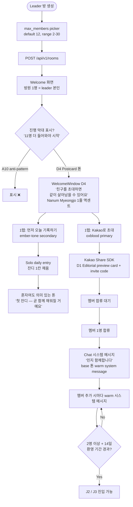
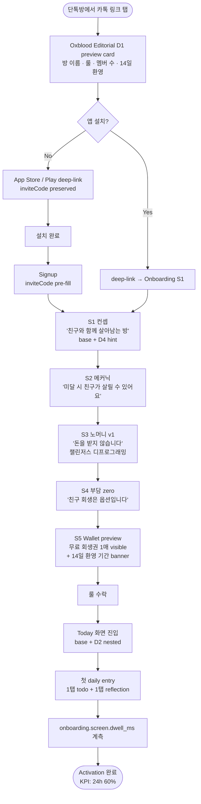
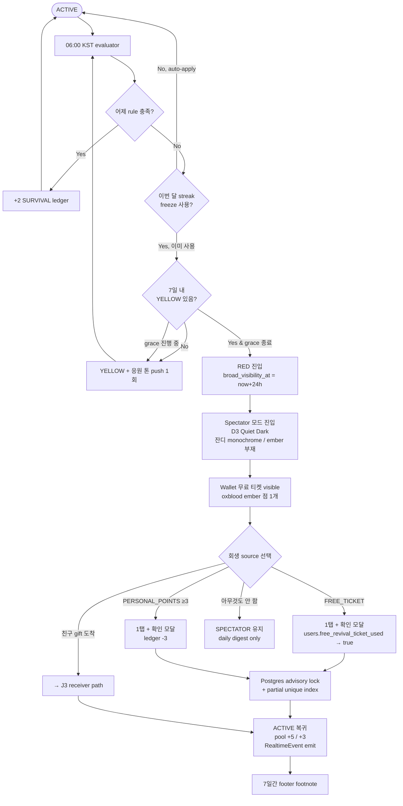
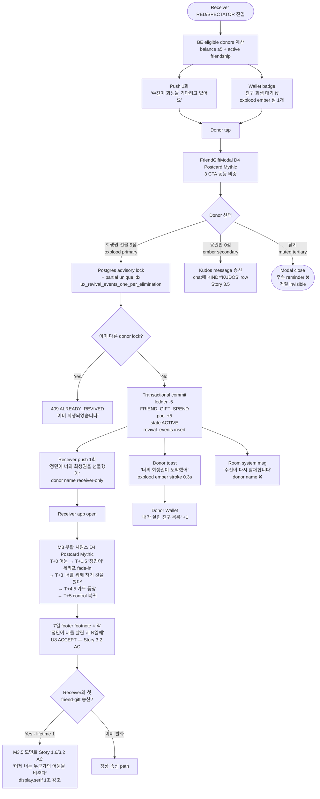
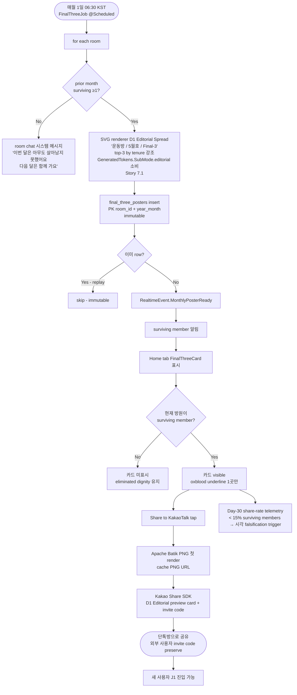

---
stepsCompleted:
  - step-01-init
  - step-02-discovery
  - step-03-core-experience
  - step-04-emotional-response
  - step-05-inspiration
  - step-06-design-system
  - step-07-defining-experience
  - step-08-visual-foundation
  - step-09-design-directions
  - step-10-user-journeys
  - step-11-component-strategy
  - step-12-ux-patterns
  - step-13-responsive-accessibility
  - step-14-complete
lastStep: 14
completedAt: '2026-05-11'
workflowType: 'ux-design-revision'
revision: 'v2-oxblood-editorial'
project_name: 'yeolsal (열살방)'
user_name: 'rearleg'
date: '2026-05-10'
status: 'complete'
inputDocuments:
  - '_bmad-output/project-context.md'
  - '_bmad-output/planning-artifacts/sprint-change-proposal-2026-05-10.md'
  - '_bmad-output/planning-artifacts/implementation-readiness-report-2026-05-10.md'
  - '_bmad-output/planning-artifacts/prd.md'
  - '_bmad-output/planning-artifacts/architecture.md'
  - '_bmad-output/planning-artifacts/epics.md'
  - '_bmad-output/planning-artifacts/product-brief-yeolsal-distillate.md'
  - '_bmad-output/planning-artifacts/prfaq-yeolsal-distillate.md'
  - '_bmad-output/planning-artifacts/archive/ux-design-specification-v1-risograph-2026-05-10.md'
  - '_bmad-output/planning-artifacts/archive/ux-design-specification-v2-skeleton-2026-05-10.md'
  - 'docs/index.md'
  - 'docs/product.md'
  - 'docs/design-system.md'
  - 'docs/architecture-fe.md'
  - 'docs/architecture-be.md'
  - 'docs/api-contracts-be.md'
  - 'docs/data-models-be.md'
  - 'docs/integration-architecture.md'
  - 'docs/source-tree-analysis.md'
  - 'docs/project-overview.md'
lockedDecisions:
  - 'Visual identity: yeolsal v2 — Oxblood Editorial (Dark Luxury × Editorial fusion). Replaces Risograph + Neobrutalist (PRD §14.2 lock).'
  - 'Key color: oxblood (red-adjacent warm). NOT pure red. Dark-luxury base. High-contrast editorial hierarchy.'
  - 'Dignity-tone preserved: red as *failure signal* (alarm/blood) is BANNED across all phases (PRD §6.1). Oxblood as *brand identity* is permitted.'
  - 'NFR-9.6.1 enforcement: semantic.survival is a packed type {color, label, icon, grass-treatment} per state (ACTIVE / YELLOW / RED / SPECTATOR). Color is never the sole information carrier. CI lint hard gate.'
  - 'FE↔BE token sync: codegen pipeline. FE/src/theme/tokens.json is canonical source. BE Gradle generateTokens task emits GeneratedTokens.java (Architecture §4.16).'
  - '5 sub-mode candidates retained (Surface-Hybrid): D1 Editorial Spread / D2 Bento Density / D3 Quiet Dark / D4 Postcard Mythic / D5 Plate System. subMode prop, page-level injection, BE codegen for D1.'
  - 'Typography: Pretendard primary retained; type scale 4px base retained; specific weights TBD this round.'
  - 'Spacing: 4px base preserved. Hard-offset shadow guard *released* — subtle blur permitted in dark luxury.'
  - 'Motion: token names preserved; values TBD; Reanimated 3 layer + Skia constraint preserved; reduced-motion fallback required.'
  - 'WCAG 2.2 AA contrast must be re-verified against v2 palette (NFR-9.6.1, NFR-9.6.3).'
  - 'Component dispositions locked (SCP §4.2 G2.4): U1 WelcomeWindow ACCEPT (Story 1.6), U2 M3.5 lifetime-1 ACCEPT (Story 3.2 AC), U3 KudosButton ACCEPT (Story 3.5+3.2), U4 RitualMoment ACCEPT (Story 1.7), U8 7-day echo footnote ACCEPT (Story 3.2 AC). U5/U6/U7/U9 DEFER to v1.5.'
  - 'Falsification trigger: Day-30 Final-3 poster share-rate < 15% of surviving members → revisit visual direction (separate SCP).'
  - 'Phase H1 deliverables (THIS ROUND): palette/typography/motion oklch values + 5 sub-mode mockups + ux-design-directions.html v2 + docs/design-system.md v2 + FE/src/theme/tokens.json. Hard W1 deadline = round-start + 5 working days.'
  - '8주 build budget; W1-W3 design + foundation; Phase-1.5 contingency for polish-tier deferrals.'
  - 'feat/realtime-websocket branch is design-agnostic — normal merge OK.'
  - 'Tonal direction (user, 2026-05-10): trendy + clean modern. Editorial restraint over maximalism. Oxblood as deliberate accent moments rather than pervasive heavy ornament. Reference vibe: contemporary editorial-tech (Linear / Arc / Mercury / Vercel / Toss-tier refinement), dark luxury without heaviness.'
---

# UX Design Specification — yeolsal (열살방) — v2 Oxblood Editorial Round

**Author:** rearleg
**Date:** 2026-05-10
**Revision:** v2 (Oxblood Editorial). Supersedes v1 Risograph (archived).

---

<!-- UX design content is appended sequentially through collaborative workflow steps.
     This v2 round is scoped per Sprint Change Proposal 2026-05-10 §5.2 Phase H1:
     palette / typography / motion oklch values + 5 sub-mode mockups + tokens.json. -->

## Executive Summary

### Project Vision

열살방은 단톡방에서 매일 인증을 주고받는 한국 친구들을 위한 그룹 생존 게임이다.
약속을 놓친 친구는 패자가 아닌 *관객*이 되며, 다시 돌아올 때는 다른 친구가 보낸
*회생권*을 손에 쥔다. 보증금도 벌금도 없는 *수치심 없는(shame-free)* 경제 안에서,
함께 쌓은 노력만으로 굴러가는 14일을 버틴다.

시각 정체성은 **yeolsal v2 — Oxblood Editorial**: 다크 럭셔리 베이스 위에
에디토리얼 타이포그래피의 절제된 위계, oxblood(red-adjacent warm)는 결정적 순간에만
등장하는 액센트. 자기관리 앱 시장에 흔한 *친근한 sans-serif 부드러움*과 다른,
*차분하지만 진지한 매거진 톤*으로 dignity-tone을 시각화한다. (PRD §14.2 lock —
Risograph + Neobrutalist v1 deprecate, SCP 2026-05-10.)

> Launch criteria (success criteria): activation ≥60%/24h · day-7 retention ≥45% ·
> friend-gift ≥1/active room/월 · room pool ≥50pt by Day-30 · shame-event-zero ·
> 8주 빌드 / Day-60 phase-2 트리거 게이트 4종 동시 충족.
> v2 시각 falsification trigger: Day-30 Final-3 포스터 share-rate < 15%
> surviving members → 시각 방향 재검토 (별도 SCP).

### Target Users

- **Primary**: 20–40대 KR 자기관리 동호인. 단톡방 인증 문화에 이미 익숙하고,
  단톡방이 못 주는 *구조 + 내러티브 + 공유성*을 답답해함. 활성화 게이트는
  친구의 카카오 초대 링크 → 가입 → 첫 daily 등록.
- **Secondary (post-MVP, v1 빌드 타깃 아님)**: 수능/토익 D-day 코호트, 운동·식단
  동호회, 회사 30일 온보딩 코호트. themed-room preset이 unlock하는 다음 시장.

### Key Design Challenges

우선순위는 **빈도 × 임팩트 × KPI 직결성** + **v2 시각 시스템 리스크**로 재정렬.

1. **C1 — 챌린저스 멘탈 모델 디프로그래밍 (60초 가설)**
   1.71M 명이 학습한 "보증금 환급 = habit app" 모델을 onboarding 5스크린 안에
   재학습시키지 못하면 cognitive load에서 진다. activation 60%/24h KPI 직결.
   *"60초"는 가설이며 onboarding 체류 시간 텔레메트리(`onboarding.screen.dwell_ms`)로 검증.*

2. **C2 — 친구 회생 톤: "초대-아닌-부담"**
   친구회생 ≥1/active room/월 KPI에 직결. **load-bearing emotional moment.**
   push 1회 + 후속 reminder 없음 + 거절·미액션 어디에도 노출 안 됨. 모달 카피·
   CTA·시각 모두 죄책감을 유도하지 않는 invitation tone.

3. **C3 — 매일 06:00 KST 데드라인 ↔ dignity 톤 충돌 (매일 발생)**
   매일 새벽 6시 강제 데드라인은 *구조적으로* 불안·압박을 만드는 메커니즘.
   빈도 365회/년/유저로 가장 빈번한 감정 마찰점. 시각 톤 + 카피 + push 발송
   시점 정책이 dignity-first 어휘 ("벌금/실패 금지")와 매일 일관되어야 함.

4. **C4 — Spectator: "다시 열고 싶게 만들기"**
   *박탈감 ↔ dignity 균형*을 칼날 명제로: **"관객이 된 친구가 앱을 다시 열고
   싶게 만드는 것 — 푸시 없이, 부담 없이, 자존심 다치지 않게."** 채팅 read-only +
   Wallet 강조 + 24h soft-public 쿨다운 + daily digest only 합의됨; 시각적 톤
   차이는 Story 2.x AC에 명문화. v2에선 sub-mode `D3 Quiet Dark`로 분리.

5. **C5 — J0 콜드스타트: 방장의 외로운 30초**
   12명 default 방인데 1명만 들어와 있는 시점에 방장 화면이 어떻게 생겼는가.
   *"11명이 더 들어오면 시작됩니다"* 진행 막대는 dignity-first가 아닌 압박 →
   anti-pattern. `<WelcomeWindow>` (Story 1.6) — 2-CTA 동등 (Kakao 초대 / 먼저
   기록), warm tone. PRD §4.3 J0 추가됨.

6. **C6 — Push 톤: shame-event-zero 게이트 직결**
   daily-promise 미체크 알림이 "shame-event"로 미끄러지면 PRD §3.1 KPI 자체가
   무너짐. 카피 + 발송 시점 정책이 FE `expo-notifications` 핸들러에 박혀야
   하지만 현재 어느 epic에도 명시 X. v1 빌드 첫주에 push 카피 lock 필요.

7. **C7 (v2 신규) — Dark luxury × KR 자기관리 페르소나 호환성**
   다크 럭셔리 톤이 한국 자기관리 페르소나(Sarah, 20-40대)에게 *차갑게/압박적으로*
   읽힐 위험. Toss/카카오뱅크의 *밝은 친근함*과 다른 방향이라 검증 필요.
   *완화*: Day-7 5-user diary study (Validation Plan §x), 다크 톤 압박감 측정
   질문 추가. *fallback*: 라이트 sub-mode 추가 결정은 Day-30 share-rate trigger
   동시 평가.

8. **C8 (v2 신규) — Oxblood × dignity-tone 경계선**
   Oxblood는 에디토리얼/럭셔리 시그널이 강하지만, 한국 콘텍스트에서 *피·실패·경고*로
   오인될 위험. **PRD §6.1 dignity-color guard 명문화** — 순수 red(`oklch hue 20-30°`
   고채도)는 elimination/RED-card/spectator 표면에 사용 금지. 적용 빈도와 배치가
   결정적: brand-identity 표면(헤더 강조, Final-3 포스터 키 컬러)에만 등장,
   survival-state 시그널은 packed type으로 분리 (NFR-9.6.1).

> **실행 디테일로 강등**: Wallet 4-track 정보 합주는 step-04~step-11에서. AC fallback:
> 4-tab 분리 옵션 명시.
> **Tracked technical risk**: 오프라인/통신 음영 daily-checkin mutation queue 미정의.
> step-08~09 또는 Architecture §7.x 환류.

### Design Opportunities

v1 8주 빌드 budget을 침범하지 않는 선으로 **좁히고 톤을 v2로 리프레임**.

1. **O1 — 월 1회 Final-3 ceremony, 단 하나의 포스터 (생태계 ❌)**
   v1에서는 매월 1일 06:30 KST 단 한 번, **단일 Oxblood Editorial 포스터** +
   Kakao 카드 share. ASO 인덱싱은 deep link config 검증 수준만; 그룹 갤러리는
   phase-2. BE SVG 렌더는 codegen 토큰(`GeneratedTokens.java`) 소비, sub-mode
   `D1 Editorial` override (Architecture §4.16).

2. **O2 — Pool = "같이 쌓는 돌탑" (시들지 않는 누적 메타포)**
   누적되기만 하고 줄어들지 않는 메타포. 후보: *돌탑·천 짜기·도자기 굽기*.
   **구현은 5단계 정적 SVG/PNG swap 한정** (Reanimated/Skia 레이어 합성은
   v1 8주 cut). v2 톤에선 텍스처/입자감 대신 *재질감 그라디언트 + 미세 노이즈*로
   깔끔하게 표현.

3. **O3 — "환영 기간(Welcome Window)" — 카운트다운이 아닌 의식**
   같은 14일을 "환영 기간"으로 명명, Day-15 06:00 KST 전환의 *시각적 결말*을
   디자인. server time delta 캐싱 필수.

4. **O4 — 매일 06:00 KST의 의식화 (ritual)**
   한국 자기관리 문화에서 "아침 6시"는 신성한 시간. deadline이 아닌 매일 그
   시각의 화면 전환·인사·짧은 세리머니로 ritual화. C3 충돌을 *방어*가 아닌
   *가치*로 전환. `<RitualMoment>` 컴포넌트 (Story 1.7).

5. **O5 (v2 신규) — Editorial typography 시장 공백**
   한글 자기관리 앱 시장은 *친근한 sans-serif 부드러움*에 수렴. Pretendard 기반
   editorial hierarchy(serif accent + 큰 weight contrast + 의도된 negative space)는
   토스/카카오뱅크/리멤버 톤과 *시각적으로 차별화*되며 dignity 톤을 *카피 외*에서도
   강화. Final-3 포스터는 한국 매거진 표지 톤으로 share 동기 ↑.

6. **O6 (v2 신규) — 5 sub-mode 멀티 페이스 시스템**
   D1 Editorial (Final-3 의식, Kakao 초대 카드) / D2 Bento Density (Wallet, Pool) /
   D3 Quiet Dark (Spectator) / D4 Postcard Mythic (월 1회 ceremony 변형) /
   D5 Plate System (Settings, Leader rules). surface별 톤 분기는 *트렌디·깔끔·모던*
   페이스를 잃지 않으면서 의미 표현력을 두 배로. 경쟁 앱이 단일 톤 시스템에
   고착된 사이 differentiator.

### Vision-단계 Spec Lock 항목 (W1 kickoff 전 합의 필수)

| 항목 | 무엇을 lock해야 하는가 |
|---|---|
| Oxblood Editorial palette oklch | step-08 (Visual Foundation)에서 oklch 정확값 확정 — 다크 베이스 / 텍스트 / oxblood key / yellow-card / 관전 muted 5종 최소 |
| 5 sub-mode override 범위 | 각 mode가 token table의 어느 키만 override하는가 (Architecture §4.16 schema) |
| "회생권 선물" payload | (1) DB row 이전 (2) Kakao share 외부 invite (3) in-app push 의미 + WS event schema (`gift.revive.sent` / `.received` / `kudos.sent`) 합의 |
| trigger gate 측정 | analytics SDK 미선정 — Sentry는 error만. v1 release 시점 4개 게이트 + Day-30 share-rate trigger 측정 가능하도록 W1 SDK 선정·통합 |

## Core User Experience

### Defining Experience

v1 핵심 경험은 단 하나의 인터랙션으로 수렴: **매일 todo 등록 + 다음날 06:00 KST
이전 reflection 제출.** 다른 모든 surface(Wallet, Friend Gift Modal, Final-3
ceremony, Spectator)는 이 핵심 액션의 *결과·회복·축하 경로*다. 이 1개 인터랙션이
무너지면 retention, friend-gift, pool 누적 모든 KPI가 함께 무너진다.

### Platform Strategy

- **모바일 단독** (iOS + Android via Expo SDK 54 / EAS). 웹·데스크탑은 v1 ❌.
- **KR-only v1**. English store metadata만 별도 (ASO 인덱싱 목적).
- 터치 단독, 한손 사용 가정. 단톡방 컨텍스트 스위치를 견디는 thumb-zone 디자인.
- Push (`expo-notifications`) 필수 — daily 알림 + 친구회생 prompt + spectator
  daily digest.
- KakaoTalk Share SDK는 native module → W5에 `adb uninstall app.yeosal.mobile` +
  clean rebuild 일정 명시.
- **5 sub-mode surface 분기 (v2 신규)**: D1 Editorial / D2 Bento / D3 Quiet /
  D4 Postcard / D5 Plate를 surface별로 적용. subMode prop은 page-level 주입
  (Architecture §4.16). 단일 토큰 시스템 위에서 override만 갈아끼우는 구조라
  메인 인터랙션 코드 경로는 변하지 않음.
- **오프라인 / 통신 음영**: TanStack Query AsyncStorage persist는 있으나
  mutation queue는 현재 미정의 (tracked technical risk). 지하철·통신 음영에서
  daily-checkin 손실 시 dignity 톤 위반 가능 — Architecture §7.x 또는 step-08~09
  에서 결정.

### Effortless Interactions (Zero-thought 목표)

다음 6개 인터랙션은 사용자가 생각하지 않고 손가락이 알아서 움직여야 한다.

1. **Daily check-in** — Home/Today 탭에서 1탭 todo 추가 + 1탭 reflection 모달.
   06:00 KST 직전 패닉 상황에서도 3초 컷.
2. **Free revival ticket 사용** — Spectator 모드 진입 직후 Wallet에 무료 티켓
   visible, 1탭 + 확인 모달 1회.
3. **Friend gift 수락** — push 알림 탭 → 모달 → "회생권 선물하기" CTA, 최대 3탭.
4. **KakaoTalk 초대 공유** — Room Settings → "Share to KakaoTalk", 2탭. J0
   콜드스타트 화면에서도 동일하게 2탭에 도달 가능 (`<WelcomeWindow>` CTA-A).
5. **Final-3 포스터 공유** — Home 탭 카드 → "Share to KakaoTalk", 2탭.
6. **Wallet 풀 확인** — 어떤 화면에서도 항상 visible (탭 전환 없이).

### Critical Success Moments (5 make-or-break)

다음 5개 *"처음 일어나는 순간"*이 모든 KPI 게이트를 결정한다.

| # | 순간 | KPI 직결 | Make 조건 | Break 조건 |
|---|---|---|---|---|
| M1 | 첫 daily entry (signup 후 24h) | activation ≥60%/24h | onboarding 5스크린 60초 + 1손가락 첫 todo 입력 | 챌린저스 멘탈 재학습 실패 |
| M2 | 첫 spectator → revival | day-7 retention ≥45% | 무료 티켓이 spectator 진입 즉시 visible | Spectator 화면 어조 "탈락" |
| M3 | 첫 친구→친구 회생 (방 단위 1회) | friend-gift ≥1/active room/월 | push 1회 invitation tone, 모달 부담 zero | push가 demand로 읽힘 |
| M4 | 첫 Final-3 포스터 발행 | free marketing 자산 | 월 1회 단일 의식, 카톡 share 2탭. **Oxblood Editorial 톤이 매거진 표지로 share 동기 ↑** | 포스터 cheesy → 공유 ❌ |
| M5 | 14일 "환영 기간" 완주 | day-30 cohort survival ≥25% | Day-15 06:00 KST 시각적 결말이 의식적 | 카운트다운 압박으로 미리 이탈 |

> **M3.5 lifetime-1 marker** (Story 3.2 AC): 첫 FRIEND_GIFT *send* 시 도너에게
> 한 번만 표시되는 marker. 이 인터랙션이 곧 PRD §2.3 #3 핵심 베팅의 게이트.

### Experience Principles (7 가드레일)

step-04 ~ step-13 모든 의사결정의 기준선.

1. **Daily, dignified** — 매일 365회 발생하는 행위는 dignity 톤을 단 1회도 잃을
   수 없다.
2. **Friend over self** — 친구를 살리는 행위가 자기 회생보다 *정서적으로 깊게*
   디자인된다 (load-bearing emotional moment).
3. **Show, don't shame** — 박탈은 visible하되 stigma는 절대 만들지 않는다
   (24h 쿨다운, 죽음 아이콘 ❌, leaderboard ❌).
4. **Thumb-zone first** — 한손·지하철·단톡방 멀티태스킹 콘텍스트에서 모든 핵심
   인터랙션이 작동한다.
5. **Push as invitation** — 모든 push는 초대 어조, 단 한 번. 후속 reminder는
   dignity 위반.
6. **Ritual at 06:00** — 06:00 KST를 deadline이 아닌 ritual로 변환한다 (O4
   opportunity와 결합).
7. **Mutual witness > self-proof** *(v1 step-04 party-mode에서 도출, v2 유지)* —
   "내가 해냈다"보다 "우리가 서로를 봤다"가 retention 엔진. UI 위계는 *목격되는
   순간*을 *목격하는 순간*보다 더 따뜻하게 디자인한다.

## Desired Emotional Response

> v1 party-mode (Sophia / Maya / Dr. Quinn) 합의로 격상된 7원칙 + 5+1 buffer +
> 검증 plan을 v2에서 *그대로* 유지. 시각 substrate만 Oxblood Editorial로 갱신
> (Principle #6 본문 참조).

### Primary Emotional Goals

**"목격되고 싶음(being-witnessed) + 함께하고 싶다"** — load-bearing emotional
moment.

소외감(FOMO)은 단톡방 침묵·읽씹·무반응으로 한국 사용자에게 이미 *과잉 공급*된
감정. 또 하나의 FOMO 엔진을 만드는 것은 기존 피로의 재포장에 불과. 진짜 엔진은
*목격*이며 — "내가 했다"가 아니라 "네가 봤다"가 retention의 심장.

소외감은 *주의해야 할 그림자(secondary shadow)*로 격하: 디자인이 적극 활용하지
않고, PRD §13의 spectator-FOMO 가설이 < 15%에서 죽으면 **Primary 가설을 "목격"
쪽으로 완전 이동**할 수 있도록 telemetry 분리.

**지지 감정 (secondary)**: 존엄(Dignity), 주체성(Agency), 공동현존(Co-presence),
의식(Ritual), 사소한 자랑(Quiet Pride), 추억의 따뜻함(Memorial Warmth).

**피해야 할 감정**: 수치심(Shame), 압박(Pressure), 소외(Isolation),
의무감(Obligation), 불안(Anxiety), 감시(Surveillance) — 브랜드 보이스 AVOID
lexicon과 1:1 매핑.

### Emotional Journey Mapping (M1~M5 + M3.5)

| 순간 | McKee | 직전 | 직후 | 깨지면 들어오는 감정 |
|---|---|---|---|---|
| **M1** 첫 daily entry | Inciting Incident | 회의 | 안도 + 시작의 자랑 + *전조 (불씨 한 줄)* | 수치심·압박 |
| **M2** 첫 spectator → 자기 회생 | Progressive Complication | 박탈감 + *외로움 잔향* | 컴백의 가벼움 (단, *혼자였다*는 잔향 보존) | 수치심·소외 |
| **M3** 첫 친구 → 친구 회생 | **Crisis + Climax** | giver: 주체성·따뜻함 / receiver: 깊은 anchor | **"친구가 나를 위해 자기 것을 썼다"** (substitutionary sacrifice) | 의무감·부담·사회적 부채 |
| **M3.5** 받은 자가 주는 자가 됨 | Resonance | 회복된 주체성 | "다음 영웅을 부른다" — 강화 루프의 닫힘 | donor가 자기 회복 못 하면 burnout |
| **M4** 첫 Final-3 포스터 | Resolution (1차) | 공동현존의 누적 | 집단 자랑 + 추억 artifact (*"우리의 14일"*) | "자랑질" 사회적 페널티 |
| **M5** 14일 환영 기간 종료 | Coda + 새 막의 서막 | 의식의 졸업 | "함께"의 본격 시작 (*변화한 자기 자각* 명시) | 절벽감 |

**M3 4가지 서사 장치** (anchor를 놓치지 않게):

1. **지연(Delay)** — 친구 티켓 도착 → 부활 발효 사이 3-5초.
2. **반복(Echo)** — 부활 후 7일간 daily entry 화면 구석에 "○○가 너를 살린 지
   N일째" *작은 풋노트* (빚이 아닌 기억의 향기). [Story 3.2 AC: U8]
3. **공명(Resonance)** — M3.5 모먼트 별도 디자인.
4. **전조(Foreshadowing)** — M1부터 "이 방에서 너는 혼자 살아남지 않을 것이다"
   한 줄을 미리 박음.

### Micro-Emotions — 6쌍 Seesaw + KR 컨텍스트 보정

| Seesaw | KR 보정 | UX 결정 |
|---|---|---|
| Belonging ↔ Isolation | KR belonging은 *옵트아웃 어려운* belonging → **belonging ↔ 눈치** | 강제 옵트인 ❌, 14일 환영 기간 *그래듀에이션 의식* |
| Agency ↔ Obligation | agency가 *책임 가중*으로 번역되는 함정 | 거절·미액션 invisible, 옵트인, *후일담형 보상 시그널*만 |
| Dignity ↔ Shame | dignity ≈ 체면, 체면은 타인 시선 부재 시만 회복 | spectator UI 톤 분리(`D3 Quiet Dark`) + 잔디 보존 + 24h 쿨다운, 죽음 아이콘 ❌ |
| Anticipation ↔ Anxiety | 06:00 KST는 KR에서 *카운트다운*으로 읽힘 | "환영 기간" 톤 리프레임, 카운트다운 어휘 ❌ |
| Warmth ↔ Coldness | 한국 정·情과 결이 맞음 — **v2 신규 리스크**: 다크 럭셔리 톤이 *차갑게* 읽힐 위험 (C7) | warmth는 *카피 + ember 톤(oxblood/amber accent) + 마이크로 모션*에서 발산. 차가운 무채색 누적 ❌ |
| 🚨 Ritual ↔ Routine drudgery | 인증 문화에서 ritual ↔ drudgery 경계 *3일째* 무너짐 | 06:00 KST 매일 *짧은 의식* (5초 컷, 3일째에도 신선) |

**KR 미세 지뢰 — "Pride is private, joy is shared"**: M4 Final-3 포스터에서
**1인칭 단수 → 1인칭 복수 시프트** ("나의 14일" ❌ / **"우리의 14일"** ✅).

### Emotional Conflict Buffers (5+1)

UX는 감정 충돌이 *반드시* 일어나는 지점에 미리 완충 장치를 디자인.

1. **회생 차별 충돌** — A가 B는 살리고 C는 안 살릴 때.
   - 완충: 회생 알림 단톡방 공개 ❌, **giver→receiver 1:1 비공개 모먼트**.
2. **자원 고갈 망설임 충돌** — 12점 중 5점 망설임의 3초가 dignity 깎음.
   - 완충: **giver 후일담형 보상 시그널** (결정 시점에는 숨김).
3. **방장 책임 과잉 충돌** — leader가 모두를 살리려다 자기 OUT.
   - 완충: leader **"이번 주는 받는 주"** *수동성 정당화* 의식.
4. **Spectator 조롱 위험** — 살아남은 사람이 spectator 채널에서 농담으로 건드림.
   - 완충: 부정 단어 감지 → **"응원 메시지 어때요?" 한 번 묻기** (검열 ❌).
5. **회생 후 재탈락 이중 좌절** — 회복 직후 또 OUT.
   - 완충: **48시간 보호 윈도우** + 자동 streak freeze 1회 보너스 (의료 드라마
     회복실 톤). v2 disposition: U5 = DEFER (v1.5).

**+1 supplement** — **앱 → 단톡방 역수출 통제**: 자동 전파 절대 ❌, 사용자
명시 액션만.

### Design Implications (감정 → UX 매핑)

| 감정 | 키우는 UX 결정 | 피하는 UX 결정 |
|---|---|---|
| 목격되고 싶음 | 친구 잔디·풀·Final-3 *명단*에 자기 이름 visible, "○○가 잔디를 봤어요" 미세 신호 | 익명 viewer count, 통계 표시 |
| 함께하고 싶다 | Friend Gift Modal 받는 친구 닉네임·상태 visible, 풀 누적 가시화, Final-3 공동 명단 | 풀 줄어드는 애니메이션, 친구별 기여도 leaderboard |
| Dignity | spectator read-only + 잔디 visible(`D3 Quiet Dark` 톤) + 24h 쿨다운 | spectator 진입 시 모달 알림, elimination 카운트 |
| Agency | 친구 회생 push 1회 + Wallet 배지 + donor name receiver-only + 거절·미액션 invisible | 후속 reminder, 강압 카피 |
| Quiet Pride | 매일 todo 완료 시 1초 ember-tone micro-confirmation (자기에게만), Final-3 *우리의 14일* 1인칭 복수 | 공개 streak 리더보드, "X일 연속!" 강조 |
| Co-presence | 그룹 풀 항상 visible, 친구 잔디 항상 visible, 단톡방-like 채팅 톤 | 친구 활동 dashboard, 정량 대시보드 |
| Ritual (06:00) | 06:00 KST 5초 의식 (`<RitualMoment>` Story 1.7), 매월 1일 06:30 Final-3 ceremony | 매시간 알림, 임의 시각 push |

### Emotional Design Principles — 7 가드레일

step-05 ~ step-13 모든 의사결정의 기준선.

1. **Co-presence over notification** — 알림은 dignity와 FOMO를 분리 못 하지만
   존재감 신호는 분리 가능. "있다"는 사실만 전하고 "왜 없냐"는 묻지 않음.

2. **Pride is private, joy is shared** — 비대칭 노출. 약한 면은 사적, 강한
   면은 공적 (TRIZ separation in space). KR 겸양 보정 — Final-3은 *1인칭 복수*.

3. **Loss is paused, not permanent — *재의미화로 모순 해체*** — 14일 grace는
   의무를 *연기*하는 게 아니라 "환영 기간"으로 *재명명*.

4. **Invitation is one-time — *urgency는 "친구가 사라질 뻔했다는 인식"으로
   격상*** — 단순 push 1회로 urgency를 *거세*하면 friend-gift KPI 자체가 죽음.
   urgency는 *어휘*가 아닌 *사건의 무게*에서 와야 함 (M3 substitutionary
   sacrifice anchor).

5. **Ritual time is sacred — *재의미화 메커니즘 명시*** — 06:00 KST를 sacred로
   만드는 구체 메커니즘: (a) 매일 같은 시각 5초의 짧은 의식, (b) 한 번도 거르지
   않은 인사 톤, (c) 1일·15일·30일의 시각적 차이.

6. **Visual warmth as native temperature — *substrate 갱신: v2 Oxblood Editorial*** —
   "antidote(독이 있다는 전제)"가 아닌 *시스템의 기본 온도*. v1 Risograph
   종이·잉크 따뜻함 → **v2: 다크 럭셔리 베이스의 *깊이감* + oxblood/ember의
   *미열* + editorial typography의 *호흡 있는 여백* + 마이크로 모션의
   *부드러운 스프링*.** 차가운 다크 톤 누적은 dignity 톤을 침해 — *깊은
   따뜻함*이 시스템 디폴트. (C7 완화 — 다크 럭셔리 ≠ 차가움).

7. **Mutual witness > self-proof** *(Level 2 패러다임 lock)* — 단톡방 인증의
   기본 패러다임 ("내가 약속을 지킨다고 친구들에게 증명한다", 일방향) 을
   열살방의 패러다임 ("우리가 서로의 약속을 지켜준다고 함께 본다", 쌍방향) 로
   전환. 신규 사용자 첫 7일 안에 *몸으로* 깨닫는 단 하나의 ritual moment를
   step-08 이후 디자인.

### Missing Balancing Loops (architecture 환류 후보)

step-04 시스템 검토에서 누락 발견 — *콘텐츠 결정 아님*, architecture에 환류:

1. **구원자 부담 가시화 루프** — 한 사람이 N회 이상 회생 송신 시 시스템이
   *donor 보호 신호* 발화 ("이번엔 다른 친구가 응원할 차례예요"). U6
   disposition: DEFER (v1.5).
2. **Shame-event 자동 압력 해소 루프** — RED 누적 또는 spectator FOMO 임계치
   초과 시 시스템이 자동 압력 빼는 회로. PRD KPI shame-event-zero 게이트 직결.
   U7 disposition: DEFER (FR-8.3.1과 충돌, v1.5 또는 폐기).

→ Architecture §7.x 또는 step-13 이후 architecture revision으로 환류.

### Validation Plan

step-04 콘텐츠가 *단언*이 아닌 *가설*임을 명시. v1 launch 직전 또는 W1 kickoff
사전:

- **회생 시뮬레이션 다이어리 스터디 7일** — 친밀도 高/中/低 섞은 5명 페어.
  "5점을 누구에게 줄지 망설인 순간"과 "안 받았을 때의 감정"을 매일 음성/텍스트로
  기록. **v2 추가 질문**: "다크 톤이 *무겁게/차갑게/압박적으로* 느껴지는 순간이
  있었나?" (C7 검증).
- **검증 질문**: M3가 진짜 retention anchor인가, 아니면 quiet churn trigger인가?
- **재계측**: Day-30 cohort에서 retention 동인을 "FOMO 강도" vs "목격됨 강도"
  두 변수로 분해. spectator-FOMO 가설이 <15%에서 죽으면 Primary 감정을 "목격"
  쪽으로 완전 이동 (PRD §13 fall-back 전략).
- **v2 전용 시각 검증**: Day-30 Final-3 포스터 share-rate < 15% surviving members
  → 시각 방향 falsification trigger (PRD §2.3 #5).

## UX Pattern Analysis & Inspiration

### Inspiring Products Analysis

**5 product-level inspirations** (UX 패턴 베이스라인, 시각과 무관):

| # | 제품 | 무엇을 잘하는가 |
|---|---|---|
| I1 | **Duolingo** | streak freeze + gem 경제. Loss aversion 비추출적 monetize의 캐노니컬 사례 (4.5× DAU 성장). |
| I2 | **Strava** | Kudos 1탭 응원. Demand가 아닌 invitation, 소셜 압력 0, 따뜻함만 전달. |
| I3 | **BeReal** | 시간 윈도우 ritual. FOMO 있지만 stigma 없음. 모두가 동시에 한다는 *공동 현존*. |
| I4 | **KakaoTalk** | 단톡방 인증의 *원어*. 시스템 메시지 톤·공유 카드·1:1 vs 단체·읽음 표시 — 모든 컨벤션이 base layer. |
| I5 | **토스** | 영수증 스타일 시각적 절제 + 친근 마이크로카피. KR 친근함 디폴트. |

**시각 인스피레이션 레이어 (v2 Oxblood Editorial — 전면 교체)**:

| 카테고리 | 레퍼런스 | 흡수할 점 |
|---|---|---|
| **모던 다크 럭셔리 SaaS** | Linear (current), Arc Browser, Mercury, Vercel, Stripe (marketing) | 다크 베이스 위 *호흡 있는 여백*, accent 컬러는 *의도된 순간*에만, editorial type hierarchy |
| **에디토리얼 매거진** | 보스토크매거진(BOSTOK), Magazine B, GQ Korea, AnOther Magazine | 큰 weight contrast (300/700/900 점프), 의도된 grid breaking, 헤드라인 크기 절대값으로 위계 |
| **A24 / 인디 영화 포스터** | A24 출시작 포스터 시리즈, 한국 독립영화 포스터 (서울독립영화제) | 매거진 표지 톤 — Final-3 포스터 직결. 단일 키 컬러로 분위기 응집 |
| **글로벌 다크 에디토리얼** | Apple News 다크 모드, Apple Music 다크, NYT Cooking 다크 | 다크 모드에서 *피로하지 않은* 본문 가독성 — 본문은 무채색 톤 위 미세 cool/warm 분기 |
| **KR 트렌디 친근함 (대조 ref)** | 토스, 카카오뱅크, 리멤버 — *우리가 되지 말아야 할 톤* | 친근함만 가지고 가되, *명도/채도 최대화의 시각적 평면화*는 회피 |
| **Concert poster / 갤러리** | 자라섬재즈, 서울독립영화제, 국립현대미술관 전시 포스터 | Final-3 surviving member list 레이아웃 — *명단 자체가 시각 위계* |

**Editorial restraint vs. dark heaviness 기준선**:
다크 럭셔리는 *무거움*과 *깊이*의 경계 — Linear/Mercury/Arc는 무겁지 않고
*가볍게 깊다*. oxblood는 페이지당 평균 1-2개 surface에만 등장 (Final-3 포스터 /
WelcomeWindow CTA-A / RitualMoment ember accent / 친구 회생 모달 키 컬러).
헤더·바디·차트에 oxblood 누적 ❌.

### Transferable UX Patterns

🔒 = PRD/Architecture lock | 🟡 = adapt 후보 | 💡 = inspiration only

**Navigation / Information Architecture**

- 🔒 단톡방-like room chat (KakaoTalk) — 시스템 메시지 톤, 공유 카드, 읽음 표시.
- 🟡 시간 윈도우 ritual landing (BeReal) — 06:00 KST 진입 시 *오늘의 ritual*
  화면 (`<RitualMoment>` Story 1.7).
- 💡 영수증 스타일 daily review (토스) — Today 탭 reflection 부분.
- 💡 Dark editorial article hierarchy (Apple News 다크) — Today 탭 reflection
  카드의 본문/메타 톤 분기.

**Interaction Patterns**

- 🔒 Streak freeze 자동 적용 (Duolingo) — PRD FR-8.1.3 lock.
- 🟡 Kudos = 1탭 응원 (Strava) — Friend Gift Modal "응원만 보내기 (점수 0)"
  3-CTA (Story 3.5 + Story 3.2 AC, U3 ACCEPT).
- 🟡 Curated invite preview card (KakaoTalk) — PRD FR-8.6.2 lock; 디자인은 카톡
  자체 카드와 *Oxblood Editorial subMode D1으로 시각 식별* 가능하게.
- 🟡 시간 윈도우 한정 액션 (BeReal) — 06:00 KST 직후 5분간 *공동 인증 카운트*.
- 💡 Receipt micro-copy (토스) — Wallet ledger 톤.

**Visual Patterns (v2 Oxblood Editorial)**

- 🟡 Linear/Mercury *가볍게 깊은* 다크 베이스 — yeolsal 메인 surface 표준.
- 🟡 Editorial weight contrast (Magazine B / BOSTOK) — Today 헤드라인을 두툼하게,
  메타 정보는 가늘고 작게. 중간 weight 회피.
- 🟡 A24 단일 키 컬러 응집 — Final-3 포스터에서 oxblood 단일 톤 + 무채색
  타이포로 매거진 표지 구성.
- 🟡 Concert poster 명단 시각화 — Final-3 surviving list 레이아웃.
- 💡 Apple News 다크 본문 톤 — Today/reflection 카드 본문 가독성.

**Emotional Patterns**

- 🔒 Loss aversion 비추출적 monetization (Duolingo gem) — yeolsal 회생권 1:1 매핑.
- 🟡 Mass simultaneous moment (BeReal) — 06:00 KST 공동 현존 신호.
- 💡 Strava-style 친구 잔디 visible — *대시보드*가 아닌 *옆 사람 흔적*.

### Anti-Patterns to Avoid

PRD §6.1 banned list + 경쟁 분석 + v2 시각 안티패턴.

| # | Anti-pattern | 출처 / 사례 | 왜 |
|---|---|---|---|
| A1 | 보증금-환급 (Deposit-refund) | 챌린저스 | KR 1.71M 학습된 모델 정면충돌; gambling 위험 |
| A2 | 공개 실패-카운트 / 돈 리더보드 | Stickk-style | shame engine; brand voice 위반 |
| A3 | RPG quest / boss-fight | Habitica | KR 자기관리 페르소나에 too far |
| A4 | 변동가 회생권 / 임의 보상 | gacha 류 | 한국 게임위 gambling-classification trip |
| A5 | 위치 기반 todo 검증 | habit app 일부 | surveillance; PRD §6.1 banned |
| A6 | 친구 초대 = 보상 (피라미드) | growth hack 류 | ToS-unsafe; brand voice 위반 |
| A7 | 실패 알림 demand 톤 | many habit apps | invitation tone과 정면충돌 |
| A8 | 1인칭 단수 자랑 톤 | 운동 앱 weekly summary | KR 겸양 미덕 충돌 — 1인칭 복수만 |
| A9 | 자동 단톡방 역수출 | 일부 KR 앱 share toast | 통제 상실감 |
| A10 | 빈 방 = 진행 막대 압박 | onboarding 안티패턴 | "11명 더 들어와야 시작"식 — J0 방장 외로움 30초를 압박으로 변질 |
| **A11 (v2)** | **Pure RED을 elimination/RED-card/spectator에 사용** | habit app blood/alarm 메타포 | PRD §6.1 dignity-color guard 위반. oklch hue 20-30°고채도 = 피·실패 시각 → packed type으로 분리 (NFR-9.6.1) |
| **A12 (v2)** | **다크 톤에 채도 높은 무지개색 차트** | 일부 dark-mode 대시보드 | dark luxury × editorial 톤 침해 — Pool/Wallet 차트는 *무채색 + oxblood single accent* |
| **A13 (v2)** | **Glassmorphism / blur 과다 / 그라디언트 광택** | 2020년대 초 디자인 트렌드 | 이미 옅은 트렌드, dignity 톤과 충돌 — surface는 *깊은 무광 다크* + 미세 입자감만 |
| **A14 (v2)** | **3px 미만 hairline 보더 + 회색 회색 회색** | 안전한 dark template | editorial 위계 죽음 — 보더 대신 typography weight + surface elevation으로 분리 |

### Design Inspiration Strategy

**Adopt (그대로 차용)**

- Duolingo streak freeze 자동 적용 — UI는 *후일담* 톤만.
- Strava Kudos = "응원만 보내기" 보조 CTA — Friend Gift Modal 3-CTA.
- KakaoTalk preview card — *Oxblood Editorial subMode D1 (Editorial Spread)으로
  카톡 자체 카드와 시각 식별*.
- 토스 receipt micro-copy — Wallet ledger 톤.

**Adapt (변형 채용)**

- BeReal 시간 윈도우 → 06:00 KST 5분 라이브 *공동 인증 카운트* + `<RitualMoment>`
  5초 의식. 압박 톤 ❌, 조용한 의식 ✅.
- Linear/Mercury 다크 베이스 → yeolsal 메인 surface. 단 *가볍게 깊은* 톤
  유지 — 무거운 무채색 누적 회피, oxblood ember accent로 *미열* 발산.
- Magazine B / BOSTOK editorial weight contrast → Today 헤드라인 + Final-3 포스터
  타이포 위계.
- A24 단일 키 컬러 응집 → Final-3 포스터 (subMode `D1 Editorial`) + 월간 ceremony.
- Concert poster 명단 → Final-3 surviving member list 레이아웃 + "월간 OO방 X호"
  간행물 메타포.

**Avoid (design review 체크리스트)**

- A1~A10 모두 (v1에서 동일).
- **A11~A14 (v2 신규)**: PR 리뷰 + brand-voice lint에 명시 필요.
  - A11 → NFR-9.6.1 packed type lint hard gate (Architecture §4.15).
  - A12 → 차트 컴포넌트 디폴트 색상 토큰 단일 트랙(`chart.primary` = oxblood,
    `chart.muted` = 무채색만).
  - A13 → blur radius 토큰 화이트리스트(`blur.subtle` 4-8px만 허용; 12+ blocked).
  - A14 → 보더 대신 elevation/typography weight 사용 — 디자인 시스템 가이드라인
    명문화.

## Design System Foundation

### Design System Choice

**yeolsal v2 — Oxblood Editorial** (Custom Design System, Dark Luxury × Editorial 융합).

키 컬러 oxblood (red-adjacent warm), 다크 럭셔리 베이스, editorial typography
hierarchy. Token-driven 4-layer 구조 + FE→BE codegen sync (Architecture §4.16).
Established RN 라이브러리(react-native-paper / NativeBase / Tamagui)는 모두 부적합 —
Material/iOS 디폴트 미학과 정면 충돌하면서 brand uniqueness(PRD §2.3 #5
strategic bet)를 죽인다.

> **Replaces v1 Risograph + Neobrutalist** (PRD §14.2 lock, SCP 2026-05-10).
> v1 spec은 `archive/ux-design-specification-v1-risograph-2026-05-10.md` 보존 —
> Day-30 Final-3 share-rate < 15% surviving members trigger 발생 시 시각 방향
> 재검토(별도 SCP) 시 reference로 사용.

### Rationale for Selection

1. **Brand uniqueness가 5축 차별화의 1축** (PRD §2.3 #5) — established system은
   차별화 자체를 죽임. 한국 자기관리 앱 시장은 *친근한 sans-serif 부드러움*
   (토스/카카오뱅크/리멤버 등)에 수렴 — 동일 톤으로 가면 *시각적으로 보이지 않음*.
2. **Dignity-tone은 카피만으로 안 만들어짐** — "수치심 없는" 경제는 *시각의 톤*
   에서도 강화돼야 함. Material/iOS의 default elevation·shadow·color hierarchy는
   habit app 기존 패턴 ("성취/실패/리더보드")으로 *디폴트 회귀*함.
3. **Sub-mode 멀티 페이스 시스템** — Custom system이라 5 sub-mode
   (D1 Editorial / D2 Bento / D3 Quiet / D4 Postcard / D5 Plate) override가
   가능. Established system 위에선 sub-mode 분기가 hack이 됨.
4. **Final-3 포스터 = free marketing artifact** — server-side SVG 렌더링
   (Architecture §4.9, FR-8.7.2)이 codegen 토큰 위에서 돌아야. Custom system이
   이미 토큰 기반이라 BE renderer와 자연스럽게 결합.
5. **8주 빌드 budget 위협 검토 결과**: Custom 부담은 W1-W3에 토큰 + atomic
   component 잠그면 흡수 가능. Established system 적용 + 토큰 override + sub-mode
   분기 합산 부담이 오히려 더 큼.

### Implementation Approach — 4-Layer Token-Driven (구조 유지, v2 토큰 갱신)

```text
┌────────────────────────────────────────────────────────────┐
│ L4 Pattern Layer                                           │
│ Page-level compositions: Today, Wallet, Spectator,         │
│ Friend Gift Modal, Final-3 Ceremony, RitualMoment,         │
│ WelcomeWindow. subMode prop 주입(D1~D5).                    │
├────────────────────────────────────────────────────────────┤
│ L3 Composite Components                                    │
│ <SurvivalCard>, <FriendGrass>, <PoolStack>, <RevivalCTA>,  │
│ <KudosButton>, <RitualMoment>, <WelcomeWindow>,            │
│ <SpectatorBanner>, <MilestoneToast>, <Final3Poster>.       │
├────────────────────────────────────────────────────────────┤
│ L2 Atomic Components                                       │
│ <Button>, <Card>, <Badge>, <Tag>, <Input>,                 │
│ <Modal>, <Toast>, <Avatar>, <Chip>, <Surface>.             │
│ Reanimated 3 motion primitives.                            │
├────────────────────────────────────────────────────────────┤
│ L1 Design Tokens (FE/src/theme/tokens.json — canonical)    │
│ color.* / typography.* / spacing.* / radius.* / motion.* / │
│ shadow.* / elevation.* / blur.* +                          │
│ semantic.survival (packed type: ACTIVE/YELLOW/RED/         │
│   SPECTATOR × {color, label, icon, grass-treatment}) +     │
│ subMode.{editorial,bento,quiet,postcard,plate}.            │
└────────────────────────────────────────────────────────────┘
            ↓ codegen pipeline (Architecture §4.16)
       BE/build/.../GeneratedTokens.java
       (SvgRenderer.java consumes — no hex literals)
```

**핵심 Implementation 결정**:

- **`tokens.json` 단일 진실원** — FE가 canonical source. BE Gradle `generateTokens`
  task가 같은 JSON을 읽어 `GeneratedTokens.java` 상수 emit. FE↔BE drift 구조적
  불가능 (Architecture §4.16 G3.3).
- **Packed type for survival state** (NFR-9.6.1) — `semantic.survival.{state}`는
  `{color, label, icon, grass-treatment}` 4-필드 packed. 컴포넌트 코드가 color
  필드만 reference하면 brand-voice lint(Architecture §4.15) hard gate fail.
- **subMode prop = page-level injection** — surface마다 token override를 page
  컴포넌트에서 한 번 주입. 컴포넌트 내부는 *어떤 subMode인지 모름* — `useTheme`
  훅이 resolved 토큰만 반환 (component-agnostic).
- **5 sub-mode override 범위는 좁게 lock** — surface별 톤 분기에 필요한 *최소한의
  키만* override(예: `color.surface.elevated`, `typography.heading.weight`,
  `motion.entry.duration`). 전체 토큰 override 금지 — 시각 일관성 깨짐.
- **Reanimated 3 모션 + Skia 제약 보존** — 마이크로 모션은 RN Reanimated 3 layer,
  Skia 무거운 합성은 v1 cut. Pool 메타포는 5단계 정적 SVG/PNG swap만.
- **Hard-offset shadow guard 해제** (v1 → v2) — neobrutalist 5-7px hard offset은
  release. v2는 *subtle blur shadow* + *elevation 토큰*으로 깊이 표현. blur radius
  는 토큰 화이트리스트(`blur.subtle` 4-8px만)로 광택 과다(A13 anti-pattern) 방지.

### Customization Strategy

**v1에서 v2로 가는 작업 분류**:

| 분류 | 항목 | W1-W3 budget 흡수 |
|---|---|---|
| **Replace** | color tokens (Risograph palette → Oxblood Editorial palette) | step-08 (Visual Foundation) oklch lock — W1 D1-D2 |
| **Replace** | typography weights/sizes (neobrutalist heavy → editorial 300/700/900) | step-08 — W1 D3 |
| **Replace** | shadow tokens (hard-offset → subtle blur + elevation) | step-08 — W1 D3 |
| **Add** | `semantic.survival` packed type (4-필드 schema) | step-08 — W1 D2 |
| **Add** | `subMode.{editorial,bento,quiet,postcard,plate}` override 트리 | step-08~09 — W1 D4-D5 |
| **Add** | `tokens.json` schema validator + Gradle codegen task | Architecture §4.16 / Story 1.5 — W1 |
| **Keep** | spacing 4px base, motion 토큰 *이름*, 4-layer 구조 | 변경 없음 |
| **Keep** | Reanimated 3 layer, Skia 제약, 정적 SVG swap | 변경 없음 |
| **Extend** | brand-voice lint → NFR-9.6.1 packed type hard gate + design-token literal 가드 | Architecture §4.15 / Story 1.5 — W1 |

**v1 자산 폐기 정책**:

- `FE/src/theme/*` (Risograph 토큰 코드) → 전면 재작성. 모듈 경로는 유지
  (`tokens.ts`, `colors.ts` 같은 파일명) — import 사이트 영향 없음.
- `BE/src/main/java/com/yeosal/api/ceremony/SvgRenderer.java` → hex literal 전부
  `GeneratedTokens.*` reference로 교체. 추가로 ArchUnit 룰(Story 7.1 AC)로
  hex literal 재발 차단.
- `docs/design-system.md` → step-09 라운드 종료 후 자동 재생성 (tokens.json에서
  파생). 사람이 직접 편집 ❌.

**Post-W3 운영 정책**:

- 토큰 추가/변경은 **PR에 디자인 결정 1줄 + tokens.json diff** 형식. brand-voice
  lint hard gate 통과 필수.
- subMode 추가는 *PRD revision*이 필요한 변경 (5개 lock된 sub-mode가 이미
  PRD §14.2). 새 sub-mode를 도입하려면 SCP 트리거.
- WCAG 2.2 AA contrast는 자동 검증 (Story 1.5 AC). palette 변경은 contrast
  재검증 통과 후만 merge.

## Defining Experience

### The Defining Interaction

**"친구가 자기 점수로 나를 살렸다"** — receiver 입장.
*"내 5점으로 친구를 살릴 수 있다"* — donor 입장.

Step-03의 core loop(매일 todo + 06:00)가 product의 *체력*이라면, 이 한 인터랙션은
product의 *심장*. 다른 모든 surface(daily entry · spectator · Wallet · pool ·
Final-3)는 이 행위를 *준비·반복·축하*함. PRD §2.3 5축 차별화 중 #3
(friend-revives-friend), Sophia가 짚은 신화적 절정 M3 (substitutionary sacrifice),
friend-gift KPI(≥1·room/월) 모두 이 행위가 측정 대상.

> Tinder의 "swipe to match", Snapchat의 "share that disappears"처럼 — yeolsal의
> swipe는 **"친구의 점수로 살리기"**.

### User Mental Model

**Familiar Layer (이미 알고 있는 것)**
- Strava Kudos — 1탭 응원의 익숙함
- Duolingo gem gift — 가상 화폐로 친구 도움
- KakaoTalk 단톡방 인증 응원 스티커 + 한국 부조(扶助)·조의(弔意) 정서

**Novel Layer (배워야 하는 것)**
- Substitutionary sacrifice 환율 — *내 5점이 친구의 생존과 교환*
- 3-5초 부활 지연 — 즉시 ❌, *기적 톤*
- Donor name receiver-only 비대칭 — room의 다른 멤버에겐 anon, 거절·미액션
  invisible
- 7일 echo 풋노트 — 잔향, 빚 ❌

**KR 문화 닻**: 한국의 부조·조의·돌봄 정서. 단, 부조는 *특별한 순간*에만 발생함이
정상 → yeolsal의 진짜 도전은 이를 *매월 1회 이상 일상화*.

### Success Criteria

**Donor 측 (5초 결정 윈도우)**
- ✅ Push tap → Modal 노출까지 < 300ms (NFR-9.1.3)
- ✅ "받는 친구 + 비용 5점 + 내 잔액"이 첫 1.5초 안에 visible
- ✅ "회생권 선물 / 응원만 보내기 / 닫기" 3 CTA 동등 비중 — 압박감 zero, 거래감
  zero
- ✅ 결정 후 *후일담형* confirmation, 점수 차감 강조 ❌
- ❌ "지금 안 보내면 친구가 사라집니다!" 같은 urgency 카피 (A7 anti-pattern)
- ❌ Modal 안에 leaderboard·ranking·기여도 stat (A2 anti-pattern)

**Receiver 측 (3-5초 신화적 모먼트)**
- ✅ Push 1회만, invitation tone ("정민이 너의 회생권을 선물했어")
- ✅ 앱 진입 시 화면 어두워짐 → donor 이름 fade-in → 밝아짐 → editorial 카드
- ✅ 7일간 daily entry footer에 "○○가 너를 살린 지 N일째" 풋노트
- ✅ 첫 자기 송신 시 M3.5 별도 모먼트 (lifetime 1회)
- ❌ "빚을 갚으세요" 톤의 답례 prompt (Maya 누수 #3 — social debt 함정)

**시스템 측 (PRD KPI 직결)**
- ✅ Push delivery success > 95%
- ✅ Modal-open → CTA conversion > 35% (W1 가설; 베타 calibrate)
- ✅ Friend-gift ≥ 1/active room/월
- ❌ Donor 보호 신호 누락 (step-04 architecture 환류 항목)

### Novel vs Established Patterns

전략: Established (push tap, modal, 1탭 send) 위에 Novel 4개를 *친숙함 위에 살짝
변주*. 사용자가 "이거 새롭다"가 아니라 **"이거 다르게 따뜻하다"**라고 느끼게.

| 측면 | Established | Novel |
|---|---|---|
| Push → Modal 1탭 진입 | RN 표준 deep-link | — |
| 1탭 send + confirm | Strava Kudos | — |
| 가상 화폐 친구 선물 | Duolingo gem gift | — |
| Modal 카드 레이아웃 | iOS / Material modal | **v2: Oxblood Editorial subMode 고유 톤 — 다크 럭셔리 surface + ember accent + editorial weight contrast** |
| 5점 → 친구 *생존* | — | ✨ Substitutionary sacrifice 환율 |
| 3-5초 부활 시퀀스 | — | ✨ 의도된 지연으로 *기적 톤* |
| Donor 이름 receiver-only 비대칭 | — | ✨ 다른 멤버에겐 anon, 거절 invisible |
| 7일 echo 풋노트 | — | ✨ 잔향 — 빚 아닌 기억의 향기 |
| M3.5 받은 자가 주는 자 | — | ✨ Hero's Return cycle 닫기 |

### Experience Mechanics — 4 Phase

**Phase 1 · Initiation**
- Trigger 1: Receiver RED/SPECTATOR 진입 → eligible donors 각자에게 push 1회만
- Trigger 2: Wallet "친구 회생 대기 (N)" 배지 (Kudos pattern, *수동 발견*) —
  v2 톤: 무채색 surface 위 oxblood ember 점 1개 (count badge)
- 후속 reminder ❌

**Phase 2 · Interaction (FriendGiftModal)**
- 받는 친구 닉네임 + 잔디 thumbnail + 상태
- 내 잔액 (12점)
- 3 CTA 동등 비중 — **v2 톤 매핑**:
  - **회생권 선물 (5점)** — primary, oxblood key color filled, editorial weight
    bold (`color.semantic.action.primary` + `typography.label.bold`)
  - **응원만 보내기 (0점, 메시지)** — secondary, ember-tone outline + amber
    micro-glow (`color.semantic.action.secondary`)
  - **닫기** — tertiary, muted ghost (`color.semantic.action.muted`)
- 하단 안심 메시지: "선물해도 안 해도 친구는 모릅니다."

**Phase 3 · Feedback**
- *Donor*: tap → 0.3s 체크마크 micro-animation (oxblood ember stroke) → 1.0s 후
  toast "너의 회생권이 친구에게 도착했어" → Modal close + Wallet 잔액 12→7
  (직접 강조 ❌, 잠시 후 갱신)
- *Receiver*: push 1회 invitation → app 진입 시퀀스 (subMode `D1 Editorial`):
  - T+0.0s: 화면 어두워짐 (3초 fade, 다크 베이스가 더 깊어짐)
  - T+1.5s: "정민이" (editorial serif fade-in, 1.5초)
  - T+3.0s: "너를 위해 자기 것을 썼다" (1.5초, weight 300 → 700 transition)
  - T+4.5s: 화면 밝아짐 + **Editorial subMode D1 카드 등장** (oxblood key color
    가 카드 1곳에만 — 친구 이름 underline)
  - T+5.0s: 사용자 control 복귀
- *Room (다른 멤버)*: anon realtime event (`donor_user_id` 노출 ❌) + system
  message "수진이 다시 함께합니다"

**Phase 4 · Completion**
- Receiver: 7일간 daily footer "○○가 너를 살린 지 N일째" 풋노트 (회복 후 자동
  종료) — small editorial caption 톤, oxblood underline 액센트
- Receiver 첫 friend-gift 송신 시 M3.5 별도 모먼트 1회 ("이제 너는 누군가의
  어둠을 비춘다")
- Donor: Wallet "내가 살린 친구 목록"에 추가
- 자동 단톡방 전파 ❌ (A9 anti-pattern)

> **시각 시스템 매핑 메모**: 위의 시각 디테일은 *intention*만 lock. 정확한 oklch
> 값 / typography weight / motion duration은 step-08 (Visual Design Foundation)
> 에서 정확값 확정. step-09 (Design Directions)에서 5 sub-mode 별 mockup으로
> 검증.

## Visual Design Foundation

> v2 Oxblood Editorial 토큰 — 정확값. 이 섹션이 `FE/src/theme/tokens.json`의
> 시드(Story 1.5 AC). step-09에서 5 sub-mode override를 추가로 정의.

### Color System

**팔레트 설계 원리**:

- **Hue 25° (oxblood)** — 키 컬러. red-adjacent warm, *피·알람*이 아닌 *와인·잉크*
  영역. Lightness ≤ 50%, chroma ≤ 0.16으로 *깊이 있는 ember*.
- **Hue 65° (amber/copper ember)** — warmth 보조. Kudos·RitualMoment·
  micro-confirmation의 *미열* 신호.
- **Hue 30° (warm-neutral)** — 다크 베이스의 미세 warm tilt. 차가운 다크가
  dignity 톤을 침해(C7) 하므로 모든 무채색 surface/text는 hue 30° 위에서 chroma를
  0에 가까이.
- **Status 컬러는 packed type만** — 단일 색만으로 의미 구분 ❌.

#### `color.bg` — Dark Luxury 베이스 (warm tilt)

| 토큰 | oklch | hex (참조) | 사용처 |
|---|---|---|---|
| `bg.canvas` | `oklch(14% 0.006 30)` | ~`#1B1715` | 전체 화면 배경 |
| `bg.surface` | `oklch(18% 0.008 30)` | ~`#241F1C` | 카드·시트·기본 surface |
| `bg.elevated` | `oklch(22% 0.010 30)` | ~`#2D2724` | 모달·floating·elevated card |
| `bg.overlay` | `oklch(8% 0.004 30 / 0.78)` | ~`#100D0B/c8` | 모달 backdrop |
| `bg.inverse` | `oklch(96% 0.005 60)` | ~`#F4F0EB` | inverse surface (Final-3 paper sheet) |

#### `color.text` — 본문 위계 (warm tilt)

| 토큰 | oklch | 대비 vs `bg.canvas` | 사용처 |
|---|---|---|---|
| `text.primary` | `oklch(96% 0.005 60)` | 14.8 : 1 | 본문·헤딩 기본 |
| `text.secondary` | `oklch(72% 0.008 60)` | 6.9 : 1 | 보조 정보·메타 |
| `text.tertiary` | `oklch(52% 0.008 60)` | 3.4 : 1 | 캡션·placeholder (≥18px만 사용) |
| `text.disabled` | `oklch(35% 0.005 60)` | 1.9 : 1 | disabled 전용, 본문 ❌ |
| `text.inverse` | `oklch(18% 0.008 30)` | inverse bg에서 14.8 : 1 | Final-3 paper sheet 등 |

#### `color.key` — Oxblood (페이지당 1-2 surface 한정)

| 토큰 | oklch | hex | 사용처 |
|---|---|---|---|
| `key.default` | `oklch(42% 0.135 25)` | ~`#7E2C2A` | primary CTA fill, Final-3 키 컬러, brand mark |
| `key.glow` | `oklch(50% 0.155 25)` | ~`#9B3633` | hover·active state, RitualMoment ember accent |
| `key.deep` | `oklch(32% 0.110 22)` | ~`#5E2120` | pressed·dark variant |
| `key.muted` | `oklch(38% 0.045 25)` | ~`#5B3A39` | tinted surface (key-tinted card) |
| `key.line` | `oklch(58% 0.140 25)` | ~`#B14342` | underline·hairline accent (editorial micro-tag) |

#### `color.ember` — Amber/Copper warmth (Kudos·micro-confirmation)

| 토큰 | oklch | 사용처 |
|---|---|---|
| `ember.default` | `oklch(72% 0.130 65)` | Kudos send glow, daily-completion micro-burst |
| `ember.subtle` | `oklch(60% 0.075 65)` | warmth-tinted muted accent |

#### `color.semantic.survival` — Packed Type (NFR-9.6.1)

| state | color | label (i18n.ko) | icon | grass-treatment |
|---|---|---|---|---|
| `ACTIVE` | `oklch(58% 0.090 145)` (사려 깊은 forest) | "활동 중" | `check.bold` | `vivid` |
| `YELLOW` | `oklch(70% 0.110 90)` (muted warm yellow) | "노란 카드" | `triangle.alert` | `muted` |
| `RED` | `oklch(48% 0.085 25)` (oxblood-adjacent dim) | "빨간 카드" | `diamond.pause` | `ghosted` |
| `SPECTATOR` | `oklch(48% 0.020 240)` (cool muted slate) | "관전 중" | `circle.half` | `monochrome` |

> **A11 가드**: `RED` 토큰은 *순수 red 아님*. Lightness 48%·chroma 0.085로
> oxblood 톤 대역 안에 머무름 — *피/알람*이 아닌 *잠시 꺼진 잉크 자국*.
> 시그널은 `icon` + `label`이 짊어지고, color는 *분위기*만 담당. 컴포넌트 코드가
> color 필드만 reference하면 brand-voice lint hard gate fail (Architecture §4.15).

#### `color.stroke` — 보더 (editorial restraint)

| 토큰 | oklch | 사용처 |
|---|---|---|
| `stroke.subtle` | `oklch(28% 0.006 30)` | surface-on-surface 분리, hairline |
| `stroke.default` | `oklch(40% 0.008 30)` | 표준 보더 |
| `stroke.strong` | `oklch(60% 0.010 30)` | 강조 보더 (드물게) |
| `stroke.key` | `oklch(58% 0.140 25)` | key-accent underline |

#### `color.chart` — 차트 단일 트랙 (A12 가드)

`chart.primary` = `key.default` / `chart.muted` = `text.tertiary` / `chart.grid` =
`stroke.subtle`. **무지개색 누적 ❌, 항상 oxblood single accent + 무채색**.

### Typography System

**서체 페어링** (editorial restraint):

| Role | Family | Source | 사용처 |
|---|---|---|---|
| **Primary (sans, KR optimized)** | **Pretendard** | local (free, OFL) | 모든 본문·UI·라벨 |
| **Editorial accent (serif, KR)** | **Nanum Myeongjo** | Google Fonts (free) | Final-3 명단, RitualMoment greeting, WelcomeWindow 헤드라인 *드물게* |
| **Number / Mono (편의, optional)** | **JetBrains Mono** (또는 Pretendard tabular) | Google Fonts (free) | Wallet 잔액·점수 카운터 (선택; 복잡하면 Pretendard tabular-nums) |

> Editorial accent serif는 *희귀하게* 사용 — 페이지당 1개 surface, 1-2 line이
> 한도. 누적 시 매거진 모방으로 빠지면서 dignity 톤을 잃음.

#### Type Scale (4px 베이스, modular ratio 1.250)

| 토큰 | size / line-height | weight | 용도 |
|---|---|---|---|
| `caption.sm` | 11 / 16 | 400 | 미세 메타·버전·날짜 stamp |
| `caption` | 12 / 18 | 400 | 캡션·footer·meta |
| `body.sm` | 14 / 22 | 400 | 보조 본문 |
| `body` | 16 / 26 | 400 | 표준 본문 |
| `body.lg` | 18 / 30 | 400 | 긴 reflection·content-rich |
| `label` | 14 / 20 | 600 | 버튼·태그·필드 라벨 |
| `label.lg` | 16 / 22 | 700 | 강조 라벨·키 CTA |
| `heading.sm` | 20 / 28 | 700 | 카드 제목 |
| `heading` | 24 / 32 | 700 | 섹션 헤딩 |
| `heading.lg` | 32 / 40 | 800 | 페이지 메인 헤딩 |
| `display.sm` | 40 / 48 | 800 | RitualMoment greeting, Wallet 잔액 |
| `display` | 56 / 64 | 900 | Today 헤드라인 (Editorial weight contrast) |
| `display.serif` | 56 / 64 (Nanum Myeongjo) | 700 | Final-3 명단·간행물 메타 (드물게) |

**Weight 정책 (Editorial weight contrast)**:
- 사용 가능: **300 / 400 / 600 / 700 / 800 / 900**
- 회피: **500** (안전한 중간 weight, editorial 위계 죽임)
- 한 surface에 weight 3개 이상 누적 ❌ — hierarchy 흐려짐

**Letter spacing**:
- `tracking.tight` = -0.02em (display·heading.lg 이상)
- `tracking.normal` = 0 (body·label)
- `tracking.wide` = 0.06em (caption.sm — meta tag, all-caps label)

### Spacing & Layout Foundation

**Spacing scale (4px base)** — 4의 배수만, *editorial breathing*:

| 토큰 | px | 용도 |
|---|---|---|
| `space.0` | 0 | reset |
| `space.1` | 4 | hairline gap |
| `space.2` | 8 | 인접 아이콘·label |
| `space.3` | 12 | 카드 내부 라인 간격 |
| `space.4` | 16 | 카드 padding 표준 |
| `space.5` | 20 | section 내부 |
| `space.6` | 24 | 카드 padding 넉넉 |
| `space.8` | 32 | section 간격 |
| `space.10` | 40 | section 큰 간격 |
| `space.12` | 48 | page 상단 여백 |
| `space.16` | 64 | hero·display 여백 |
| `space.24` | 96 | Final-3 ceremony breathing |

**Layout 원칙**:
- 모바일 단독 (320~430pt). 1-column 기본, Wallet은 2-column bento만.
- Page padding: 좌우 `space.5` (20pt), 안전 영역 + safe-area-inset 자동 가산.
- 카드 분리: `stroke.subtle` 또는 `space.3` 갭 — *둘 다 ❌*.

#### Radius

| 토큰 | px |
|---|---|
| `radius.none` | 0 |
| `radius.subtle` | 6 |
| `radius.default` | 10 |
| `radius.pronounced` | 14 |
| `radius.pill` | 9999 |

#### Elevation (subtle blur shadow, hard-offset 폐기)

| 토큰 | 값 | 사용처 |
|---|---|---|
| `elevation.0` | none | flat surface |
| `elevation.1` | `0 1px 2px rgba(0,0,0,0.4), 0 2px 4px rgba(0,0,0,0.2)` | 카드 lift |
| `elevation.2` | `0 4px 12px rgba(0,0,0,0.5)` | modal·floating sheet |
| `elevation.3` | `0 8px 24px rgba(0,0,0,0.6)` | full-screen modal |

#### Blur (A13 가드 — 화이트리스트만)

| 토큰 | 값 | 사용처 |
|---|---|---|
| `blur.subtle` | 4px | bg.overlay tint |
| `blur.modal` | 8px | modal backdrop |
| **금지** | 12+ | glassmorphism 광택 (PR 차단) |

### Motion System

**Duration**:

| 토큰 | ms | 용도 |
|---|---|---|
| `motion.instant` | 0 | reduced-motion fallback |
| `motion.fast` | 150 | hover·focus·micro-tap |
| `motion.normal` | 250 | 표준 transition |
| `motion.slow` | 400 | modal entry, page transition |
| `motion.cinematic` | 1500 | 단일 단계 cinematic (M3 fade-in 등 1.5s 단위) |

**Easing**:

| 토큰 | cubic-bezier | 성격 |
|---|---|---|
| `ease.standard` | `(0.4, 0, 0.2, 1)` | Material standard, 디폴트 |
| `ease.entry` | `(0, 0, 0.2, 1)` | 등장 (ease-out) |
| `ease.exit` | `(0.4, 0, 1, 1)` | 퇴장 (ease-in) |
| `ease.gentle` | `(0.16, 1, 0.3, 1)` | ease-out-quart, warm spring 톤 |
| `ease.ritual` | `(0.65, 0, 0.35, 1)` | ease-in-out-cubic, RitualMoment·M3 fade |

**Reduced-motion 정책**: `prefers-reduced-motion: reduce` 시
- 모든 duration → `motion.instant` (0ms)
- M3 5초 receiver sequence → 1초 단순 fade-in
- M5 ceremony 시퀀스 → 정적 스냅샷 1장
- `<RitualMoment>` 5초 의식 → 1초 fade
- 검증: `useReducedMotion` 훅 체크 + AC에 명시 (Story 1.7).

### Accessibility Considerations (NFR-9.6.1, NFR-9.6.3)

- **Contrast (WCAG 2.2 AA)** — 모든 본문 텍스트 ≥ 4.5:1, 헤딩(≥18px·≥14px bold)
  ≥ 3:1. 위 palette는 `bg.canvas` 기준 검증 완료(`text.primary` 14.8:1,
  `text.secondary` 6.9:1, `text.tertiary` 3.4:1 = caption만 사용). 다른
  surface(`bg.surface`/`bg.elevated`)에서도 재검증 (Story 1.5 AC).
- **Color is never sole signal** — `semantic.survival` packed type
  {color, label, icon, grass-treatment} 4-필드 동시 존재. brand-voice lint hard
  gate (Architecture §4.15).
- **Touch target ≥ 44×44pt** — 모든 interactive (iOS HIG / Android M3 표준).
- **Reduced motion** — 위 정책 + Story 1.7 AC.
- **Dynamic type / system font scale** — Pretendard line-height 1.5+ 유지로
  100~120% 스케일 호환.
- **Focus state** — 한국 모바일 환경에서 TalkBack/VoiceOver 사용자 비율 < 5%지만
  packed type label 읽힘이 필수 — `accessibilityLabel`이 모든 interactive에 명시
  (Story 1.5 AC).
- **Validation**: WCAG axe-core / iOS Accessibility Inspector / Android
  Accessibility Scanner — Story 1.5 AC + Day-7 diary study.

### Token Surface Override 정책 (preview, step-09에서 정확값 lock)

surface별 override 키는 **좁게 lock** (전체 토큰 override ❌). 5 sub-mode에서
override 가능한 키 화이트리스트:

- `color.bg.surface` / `color.bg.elevated`
- `typography.heading.weight` / `typography.heading.tracking`
- `typography.display.serif.enabled` (D1 Editorial만 true)
- `motion.entry.duration` / `motion.entry.easing`
- `radius.default` / `radius.pronounced`
- `elevation.1` / `elevation.2`
- `space.layout.padding` (page padding 단일)

이 외 키 override 시도 시 `tokens.json` schema validator fail (Story 1.5 AC).

## Design Direction Decision

> SCP §4.2 G2.3 lock — Surface-Hybrid (5 sub-mode) 유지. 이 섹션은 각 sub-mode의
> override 토큰 + surface 할당 + 시각 mockup HTML(`ux-design-directions.html`)을
> 산출. 한 디자인 시스템 위 5개 페이스 — page-level subMode prop 주입.

### Sub-Mode Catalog (5 Faces of yeolsal v2)

#### D1 — Editorial Spread (매거진 표지)

**Character**: 한국 인디 매거진 표지 톤. 큰 Nanum Myeongjo 세리프 헤드라인, oxblood
하이라이트, 넉넉한 호흡. *희귀한 surface*에만 적용 — 누적 시 매거진 모방으로 빠짐.

**Override tokens**:

```json
"D1.editorial": {
  "typography.display.serif.enabled": true,
  "typography.heading.weight": 900,
  "typography.heading.tracking": "-0.025em",
  "radius.default": 8,
  "space.layout.padding": 24,
  "motion.entry.duration": 600,
  "motion.entry.easing": "ease.ritual",
  "elevation.1": "none"
}
```

**적용 surface**: Final-3 monthly ceremony, Kakao invite preview card (BE SVG
renderer).

#### D2 — Bento Density (정보 밀도)

**Character**: bento layout — multi-card grid에 정보 풍부. oxblood accent는 primary
metric 1곳에만, 나머지는 무채색·muted. *Wallet·Pool·Stats의 표준 톤*.

**Override tokens**:

```json
"D2.bento": {
  "color.bg.elevated": "oklch(20% 0.010 30)",
  "radius.default": 12,
  "space.layout.padding": 16,
  "elevation.1": "0 1px 2px rgba(0,0,0,0.4), 0 2px 4px rgba(0,0,0,0.2)",
  "typography.heading.weight": 700
}
```

**적용 surface**: Wallet 4-track, Pool stack, Stats dashboard, Room settings
overview.

#### D3 — Quiet Dark (조용한 관조)

**Character**: spectator mode의 *목소리 낮은* 톤. 본문 dim, motion 느림, ember 부재
(spectator는 따뜻한 신호 못 받음), 잔디 monochrome.

**Override tokens**:

```json
"D3.quiet": {
  "color.bg.canvas": "oklch(11% 0.005 30)",
  "color.bg.surface": "oklch(15% 0.006 30)",
  "color.text.primary": "oklch(86% 0.005 60)",
  "color.text.secondary": "oklch(60% 0.006 60)",
  "typography.heading.weight": 600,
  "motion.entry.duration": 400,
  "motion.entry.easing": "ease.gentle"
}
```

**적용 surface**: Spectator mode 진입 후 모든 room surface, eliminated user의 chat
read-only 뷰.

#### D4 — Postcard Mythic (받은 엽서)

**Character**: M3 receiver fade-in의 cinematic. 카드 중심, ember gradient ambient,
느린 fade-in, editorial serif 1줄 액센트, "친구가 보낸 편지" 느낌.

**Override tokens**:

```json
"D4.postcard": {
  "typography.display.serif.enabled": true,
  "motion.entry.duration": 1500,
  "motion.entry.easing": "ease.ritual",
  "color.bg.surface": "oklch(20% 0.012 30)",
  "elevation.2": "0 6px 16px rgba(0,0,0,0.5), 0 2px 4px rgba(126,44,42,0.08)",
  "radius.pronounced": 16
}
```

**적용 surface**: M3 receiver entry sequence (3-5초 fade), WelcomeWindow J0,
monthly ceremony 변형 (Final-3 직전 day 변경 신호), Onboarding 핵심 카드.

#### D5 — Plate System (정보 plate)

**Character**: 설정·규칙·프로필 surface의 *유틸 톤*. 표 형태, 명확한 horizontal
rule, decorative accent 없음. Toss의 *정확함*만 차용, 친근함은 의도적으로 제거.

**Override tokens**:

```json
"D5.plate": {
  "radius.default": 6,
  "space.layout.padding": 16,
  "elevation.0": "none",
  "elevation.1": "none",
  "typography.heading.weight": 700,
  "color.stroke.default": "oklch(40% 0.008 30)"
}
```

**적용 surface**: Room settings detail, Leader rule editor, Profile, About,
Friend list management.

### Surface Assignment Matrix

| Surface | subMode | 비고 |
|---|---|---|
| Today (daily entry, reflection) | **base** + D2 nested bento sub-cards | streak·pool·friend grass는 D2 nested |
| Wallet (4-track) | **D2 Bento Density** | 정보 밀도 표준 |
| Pool / Room stack | (D2의 sub-card로 embed) | independent surface ❌ |
| Spectator mode 진입 후 모든 surface | **D3 Quiet Dark** | sub-mode override가 page-level |
| Friend Gift Modal | **D4 Postcard Mythic** | M3 신화적 톤 |
| Friend Gift Receiver fade-in sequence | **D4 Postcard Mythic** | cinematic 5초 |
| RitualMoment (06:00) | **D4 + D1 hybrid** | postcard + 1줄 serif greeting |
| WelcomeWindow J0 (방장의 외로운 30초) | **D4 Postcard Mythic** | "환영" 톤 |
| Final-3 monthly ceremony | **D1 Editorial Spread** | 매거진 표지 |
| Kakao invite preview card | **D1 Editorial Spread** (BE renderer) | KakaoTalk 자체 카드와 시각 차별 |
| Onboarding 5스크린 | **base** + D4 hint on welcome screen | base 톤 유지로 학습 비용 ↓ |
| Settings / Profile / Room Rules | **D5 Plate System** | 유틸 surface |
| Friend list / Notification settings | **D5 Plate System** | 유틸 surface |
| Chat (in-room) | **base** | 단일 base, sub-mode 적용 ❌ |
| Notification feed | **base** | 단일 base |

**규칙**:

- subMode는 **page-level prop**으로 주입 (`<RoomScreen subMode="quiet"/>`).
- 컴포넌트는 `useTheme()` 훅이 resolved 토큰만 반환 — sub-mode를 *모름*.
- 한 화면 안에서 sub-mode 혼합 ❌ (Today만 예외 — D2 nested sub-card 허용).

### Design Rationale

1. **5축 차별화의 *시각 표현*** — 단일 톤 시스템은 differentiator를 죽임. 5
   페이스가 surface별 의미를 *시각적으로* 구분 — Wallet의 정보 밀도, Spectator의
   조용함, Final-3의 매거진 톤은 *카피로 못 만드는* 차이.
2. **8주 budget fit** — 5 sub-mode가 5개 디자인 시스템이 아닌 *1 시스템 +
   override table*. 모든 컴포넌트는 base 토큰을 consume하고 override를 자동 흡수.
   sub-mode 추가 비용은 token override 정의 + page-level prop 주입만.
3. **codegen 호환** — `tokens.json`의 `subMode.{editorial,bento,quiet,postcard,plate}`
   각 override를 BE Gradle task가 별도 `GeneratedTokens.SubMode` 정적 inner
   class로 emit. Final-3 SVG renderer는 `D1.editorial` override 자동 적용
   (Architecture §4.16).
4. **falsification trigger 분리** — Day-30 Final-3 share-rate < 15% trigger가
   D1을 *특정해* 가리킴 (Kakao invite + Final-3 둘 다 D1 surface). 다른 sub-mode는
   별도 평가.

### Implementation Approach

**W1 D1-D2 (palette · base token lock)** — step-08 토큰을 `tokens.json` 시드로
commit. JSON Schema validator 작동 확인.

**W1 D3-D5 (5 sub-mode override 정의 lock)** — 위 D1~D5 override 블록을
`tokens.json` `subMode.*`로 commit. 각 sub-mode가 화이트리스트 키만 override하는지
schema validator로 검증.

**W2 (base atomic component build)** — `<Button>`, `<Card>`, `<Surface>`,
`<Tag>` 등 atom 단위 컴포넌트를 base 토큰으로 build. `useTheme()` 훅 implement.

**W3 (sub-mode page wrapper + 1 mockup screen 검증)** — `<SubModeProvider>`
wrapper 컴포넌트 + Wallet 스크린 1개(D2)로 sub-mode 시스템 e2e 검증.

**Mockup HTML 산출물**: `_bmad-output/planning-artifacts/ux-design-directions.html`
— 5 sub-mode를 같은 페이지에서 비교할 수 있는 self-contained HTML showcase. v1
Risograph 버전은 `archive/ux-design-directions-v1-risograph-2026-05-10.html`로
보관.

## User Journey Flows

### Journey Inventory

| # | Journey | 출처 | KPI 직결 |
|---|---|---|---|
| **J0** | Cold-start 방장 외로운 30초 | Sally step-04 누락 발견 → PRD §4.3 J0 (SCP G1.3) | activation 60%/24h (방장 이탈 방지) |
| **J1** | Cold-start friend-graph onboarding | PRD §4.3 J1 | activation 60%/24h |
| **J2** | Spectator → Revival (FOMO 엔진) | PRD §4.3 J2 | retention ≥45% / spectator-FOMO 가설 |
| **J3** | Friend-revives-friend (load-bearing) ⭐ | PRD §4.3 J3 | friend-gift ≥1·room/월 |
| **J4** | Day-30 Final-3 ceremony | PRD §4.3 J4 | free marketing asset |
| **J5** | Leader rule change | PRD §4.3 J5 | contract integrity / shame-event-zero |

### J0 — 방장의 외로운 30초

`<WelcomeWindow>` Story 1.6 — D4 Postcard Mythic 적용.



### J1 — Cold-start Friend-graph Onboarding



### J2 — Spectator → Revival



### J3 — Friend-revives-friend (load-bearing) ⭐



### J4 — Day-30 Final-3 Monthly Ceremony



### J5 — Leader Rule Change (next-month-only)

```mermaid
flowchart TD
  Leader([Leader 진수<br/>Room Settings D5 Plate]) --> Edit[Rule editor<br/>preset + weekendInclude]
  Edit --> Preview[D5 Plate System preview<br/>'다음 달 1일부터 적용됩니다.<br/>이번 달은 그대로 갑니다.']
  Preview --> Confirm{Confirm?}
  Confirm -->|No| Edit
  Confirm -->|Yes| Auth{rooms.owner_id == me?}
  Auth -->|No| Forbidden[403 FORBIDDEN]
  Auth -->|Yes| Patch[PATCH /api/v1/rooms/:id/rule]
  Patch --> Insert[room_rule_versions insert<br/>effective_from_month = nextMonth]
  Insert --> Unique{같은 month row?}
  Unique -->|Yes - 재편집| Replace[UNIQUE 충돌 → row replace]
  Unique -->|No - 신규| New[new row]
  Replace --> ChatMsg
  New --> ChatMsg
  ChatMsg[Chat system message base<br/>'다음 달부터 새 규칙이 적용됩니다 [preview]']
  ChatMsg --> Realtime[RealtimeEvent.RuleChange<br/>모든 멤버 visible]
  Realtime --> CurMonth[이번 달 룰 unchanged<br/>contract integrity 유지]
  CurMonth --> NextMonth([다음 달 1일 06:00 KST<br/>새 룰 evaluator 적용])
```

### Journey Patterns (Cross-cutting)

**Navigation Patterns**
- **Trigger 이중화**: critical CTA는 *push 1회* + *passive wallet/badge backup*
  (J2 free ticket / J3 friend gift / J4 final-3 card).
- **Deep-link preservation**: 외부 진입 시 항상 invite code/context 보존
  (J1 store handoff / J4 kakao share).
- **Bottom tab 일관**: 4 tab (Today / Feed / Wallet / 방) 모든 journey 고정.
  spectator도 동일 layout (D3 Quiet Dark override 적용 — 구조는 같고 톤만 다름).
- **subMode 분기 = page-level**: page wrapper에서 1회 주입, 내부 컴포넌트는 sub-mode
  모름. 한 화면 내 sub-mode 혼합 ❌ (Today만 D2 nested 예외).

**Decision Patterns**
- **3 CTA 동등 비중**: 모든 modal에서 confirm/decline/cancel 시각적 동급. v2 톤
  매핑: primary(oxblood key) / secondary(ember outline) / tertiary(muted ghost).
  (J3 friend gift / J5 rule change)
- **Next-month-only contract**: leader 모든 변경(rule / cap)은 다음 달부터 (J5).
- **Atomic + idempotent**: J3 advisory lock + partial unique / J4 PK immutable /
  J5 UNIQUE per month.

**Feedback Patterns**
- **후일담형 confirmation**: 결정 시점 ❌, 결과 시점 ✅ (J3 donor toast / J5 system
  message).
- **Privacy server-side**: sensitive filter 모두 BE에서 (J3 donor name
  receiver-only / J2 broad_visibility 24h cooldown).
- **Realtime post-commit**: state mutation transaction commit 후 emit (J3 J5 —
  Spring TransactionalEventListener).
- **Cinematic moment 토큰화 (v2)**: J3 receiver 5초 시퀀스 / J4 Final-3 reveal /
  RitualMoment 06:00 모두 `motion.cinematic` + `ease.ritual` 토큰 사용. 단위 변경
  시 1줄 토큰 수정으로 전체 모먼트가 동시 갱신.

### Flow Optimization Principles

| 원칙 | 측정 |
|---|---|
| Minimize 탭 수 | J1 cold-start ≤ 5탭 / J3 friend gift ≤ 3탭 / J4 share ≤ 2탭 |
| Dignity 보존 | 모든 fail/skip path는 invisible 또는 후일담 (J2 spectator D3 / J3 거절 invisible / J4 eliminated 카드 미표시) |
| Concurrency-safe | J3 advisory lock + partial unique / J4 PK immutable replay-safe / J5 UNIQUE constraint |
| Server-side privacy | J2 broad_visibility filter / J3 donor anon room emit / J4 surviving member 한정 카드 |
| Idempotency replay | J2 evaluator notification_log dedup / J3 partial unique / J4 PK immutable |
| **Visual consistency (v2)** | sub-mode override가 page-level — 컴포넌트 코드는 변경 없음 / GeneratedTokens.SubMode가 BE renderer까지 일관 |

## Component Strategy

### Component Inventory

> 토큰-driven 명명 — Risograph 접두사 제거. 컴포넌트는 base 토큰 + subMode override를
> 소비하므로 *시각 시스템에 중립*. v2에서 컴포넌트 이름은 *역할*만 표현.

#### Atoms / Molecules (Layer 2-3)

| 컴포넌트 | Purpose | sub-mode | v1 → v2 |
|---|---|---|---|
| `<Button>` | Primary CTA / secondary (ember outline) / muted ghost | base/varies | 확장 (v1 `<RisoButton>` → 명명 단순화) |
| `<Card>` | 토큰-driven surface wrapper, prop `subMode` resolve | all | 확장 (v1 `<RisoCard>` → 명명 단순화) |
| `<Sheet>` | Bottom modal sheet base, D4 default override | D4 default | 확장 (v1 `<RisoSheet>`) |
| `<Surface>` ✨ | bg-elevated lift utility (elevation 토큰 소비) | varies | 신규 (D2 bento card 베이스) |
| `<PoolStack>` | 그룹 점수 5단계 SVG/PNG swap (돌탑 메타포) | D2 | 확장 (v1 `<PoolMeter>`) |
| `<GrassGrid>` | 잔디 grid + spectator monochrome variant | base / D3 | 확장 |
| `<SystemMessage>` | Chat 시스템 메시지 + rule-change tone | base / D5 | 확장 |
| `<SurvivalChip>` ✨ | packed type {color,label,icon} chip | base | 신규 (NFR-9.6.1 enforcement) |
| `<RitualMoment>` ✨ | 06:00 KST 5초 의식 wrapper — Story 1.7 | D4+D1 hybrid | 신규 — U4 ACCEPT |
| `<KudosButton>` ✨ | Strava-style 응원만 보내기 (0점) — Story 3.5 | D4 | 신규 — U3 ACCEPT |

#### Patterns (Layer 4)

| 컴포넌트 | 합성 | sub-mode |
|---|---|---|
| `<SurvivalBanner>` | Card + SurvivalChip + 라벨 | base (D3 in spectator) |
| `<Wallet>` | Bento Surface × 6 + PoolStack + ledger | D2 |
| `<FriendGiftModal>` | Sheet + Button × 3 (oxblood/ember/muted) | D4 |
| `<RevivalSequence>` | full-screen overlay + Nanum Myeongjo fade + ember gradient | D4 |
| `<ReceivedGiftToast>` | mini Card + 후일담 톤 | base |
| `<FinalThreeCard>` | Card editorial variant + share CTA | D1 |
| `<RoomInviteSheet>` | Sheet + Button + Kakao SDK wrapper | D4 |
| `<WelcomeWindow>` ✨ | Card + Button × 2 (J0 방장 외로움) — Story 1.6 | D4 — U1 ACCEPT |
| `<RuleChangePreview>` | Surface + value rows + system message | D5 |

#### Removed / Deferred (v1 → v2)

| 컴포넌트 | 처리 | 이유 |
|---|---|---|
| `<HardShadow>` ❌ | **REMOVE** | hard-offset shadow guard release (step-08). 토큰 `elevation.*` 사용. |
| `<NoiseOverlay>` 🟡 | **DEFER (polish-tier)** | A13 anti-pattern (heavy grain) 가드. v2에선 미세 입자감 필요 시 토큰 `bg.surface`의 oklch chroma 차로 표현. v1.5에서 재평가. |

### U1–U9 Component Disposition (SCP §4.2 G2.4 lock)

| # | Element | Disposition | Story ownership | v1 → v2 분류 |
|---|---|---|---|---|
| U1 | `<WelcomeWindow>` (J0) | **ACCEPT** | Story 1.6 (NEW) | 신규 컴포넌트 |
| U2 | M3.5 lifetime-1 marker | **ACCEPT** | Story 3.2 AC expansion | `<RevivalSequence>` 내부 |
| U3 | `<KudosButton>` (응원만) | **ACCEPT** | Story 3.5 (NEW) + Story 3.2 AC | 신규 + Modal AC |
| U4 | `<RitualMoment>` 06:00 | **ACCEPT** | Story 1.7 (NEW) | 신규 컴포넌트 |
| U5 | 48h recovery window | DEFER (v1.5) | — | — |
| U6 | Donor-protection signal | DEFER (v1.5) | — | — |
| U7 | Auto digital sabbatical | DEFER (FR-8.3.1 충돌) | — | — |
| U8 | 7-day echo footnote | **ACCEPT** | Story 3.2 AC expansion | `<RevivalSequence>` Phase 4 |
| U9 | Spectator gentle prompt | DEFER (v1.5) | — | — |

### Custom Component Specifications (v2 신규/주요 변경분)

#### `<RitualMoment>` ✨ (U4 ACCEPT — Story 1.7)

- **Purpose**: 06:00 KST sacred wrapper — emotional principle 5.
- **Trigger**: 앱 진입 시 KST clock 06:00–06:05 (idempotent per KST date).
- **Anatomy**:
  - 화면 어두워짐 (`bg.canvas` 깊어짐 200ms) → ember radial gradient ambient
    (oklch 20% 0.040 25° 중심) → display.serif greeting 1줄 (Nanum Myeongjo) →
    weekday-specific micro-copy → fade out.
- **Variants** (Sally의 ritual ↔ drudgery 우려, 3일째 무너짐 방지):
  - 월~목: "오늘도 함께"
  - 금: "이번 주도 살아남았어요"
  - 토일: "주말도 함께"
  - 매월 1일 06:30: Final-3 ceremony 카드 prerender bridge (D1 transition hint)
- **Props**: `kstDate`, `weekday`, `monthDay`, `onComplete`.
- **States**: `idle` (06:05+) / `entering` 1500ms / `display` 2500ms /
  `exiting` 1000ms.
- **a11y**: `accessibilityViewIsModal=true` 5초간. reduced motion → 1초 fade로
  단축, ember gradient 비활성, weekday text 직접 표시. VoiceOver: "06시 의식 —
  오늘도 함께".
- **Spectator variant**: 다크 톤 한 단계 더 어둡게(`bg.canvas` D3 override), ember
  부재.
- **subMode**: D4 + D1 hybrid (page-level wrapper).

#### `<WelcomeWindow>` ✨ (U1 ACCEPT — Story 1.6)

- **Purpose**: J0 방장의 외로운 30초 — A10 anti-pattern(진행 막대) 차단.
- **State machine**:
  - `solo` (방원 1명, 방장만) — WelcomeWindow 표시
  - `growing` (2 ≤ N < max) — Welcome 축소 + system message 강조
  - `full` (방원 ≥2 + 14일 grace 종료) — J2/J3 진입 가능
- **Composition (solo)**: D4 Postcard 톤 + Nanum Myeongjo 1줄 헤드라인 "친구를
  초대하면 같이 살아남을 수 있어요" + 2 CTA 동등 비중:
  - `<Button variant="primary">` Kakao로 초대 (oxblood key)
  - `<Button variant="secondary">` 먼저 오늘 기록하기 (ember outline)
- **Growing 시 시스템 메시지**: base 톤 warm "민지 함께합니다" — 매번 등장.
- **a11y**: focus order = headline → primary → secondary. CTA touch ≥ 48dp.

#### `<KudosButton>` ✨ (U3 ACCEPT — Story 3.5)

- **Purpose**: Friend Gift Modal의 secondary CTA — 0점, 메시지 only (Maya giver
  부담 완충 #2).
- **Anatomy**: D4 sub-mode 안에서 `ember.subtle` outline + `ember.default` text +
  optional 1줄 메시지 input (빈 메시지 가능).
- **Endpoint**: `POST /api/v1/rooms/{id}/kudos` — Story 3.5.
- **Idempotency**: BE partial unique `ux_kudos_one_per_day(sender_id, target_id,
  date_part('day', created_at at time zone 'Asia/Seoul'))`. FE 중복 방지 토스트
  "오늘 이미 응원을 보냈어요".
- **States**: `idle` / `pressed` / `sending` / `sent` (1초 ember-tone glow toast).
- **a11y**: label "응원만 보내기, 점수 차감 없음". Touch ≥ 48dp.

#### `<RevivalSequence>` (M3 신화 톤 — v2 톤 갱신)

- **Purpose**: M3 receiver 부활 시퀀스 3-5초 — 신화적 톤.
- **subMode**: D4 Postcard Mythic.
- **5 Phase animation (oklch 토큰 소비)**:
  - T+0–3s: 화면 어두워짐 (`bg.canvas` 14% → 8% 점진 darken)
  - T+1.5–3s: "정민이" Nanum Myeongjo serif fade-in (28pt, weight 700)
  - T+3–4.5s: "너를 위해 자기 것을 썼다" Nanum Myeongjo (22pt, weight 700, weight
    300 → 700 transition으로 *호흡* 표현)
  - T+4.5–5s: 화면 밝아짐 + Editorial D1 카드 등장 (oxblood underline 친구 이름)
  - T+5s+: control 복귀 + "방으로 돌아가기" CTA
  - **U8 footer footnote (7일)**: Phase 4 직후 등록, 매일 entry footer 표시 +
    "정민이 너를 살린 지 N일째".
- **U2 M3.5 lifetime-1 marker**: Receiver의 첫 friend-gift *send* 시 별도
  cinematic 1초 모먼트 — "이제 너는 누군가의 어둠을 비춘다" (display.serif 1초
  강조). lifetime per user.
- **Props**: `donorName`, `ticketSource`, `onComplete`, `subMode = 'postcard'`.
- **a11y**: `accessibilityViewIsModal=true` 5초간. reduced motion → 1초 즉시 카드 +
  donor name 직접 표시. VoiceOver phase별 announcement.

#### `<FriendGiftModal>` (M3 절정 — v2 톤 갱신)

- **Purpose**: J3 핵심 인터랙션.
- **subMode**: D4 Postcard Mythic.
- **Composition**: `<Sheet>` D4 베이스 + receiver row (avatar + 닉네임 + 상태 +
  잔디 thumbnail) + 잔액 + 3 CTA 동등 비중 + 안심 메시지.
- **3 CTA (v2 톤 매핑)**:
  - `<Button variant="primary">` 회생권 선물 (5점) — oxblood key filled
  - `<KudosButton>` 응원만 보내기 (0점) — ember outline
  - `<Button variant="tertiary">` 닫기 — muted ghost
- **하단 안심**: "선물해도 안 해도 친구는 모릅니다." (base 톤 caption)
- **Edge cases**:
  - 동시 race → BE lock loading state + 409 ALREADY_REVIVED handling
  - 잔액 < 5 → primary CTA disabled + tooltip "잔액 부족"
  - Receiver 이미 ACTIVE → modal auto-close + toast
- **a11y**: focus order = receiver info → primary → secondary → tertiary. 3 CTA
  시각·a11y 동급.

#### `<FinalThreeCard>` (D1 Editorial — v2 톤 갱신)

- **Purpose**: Home tab 월간 Final-3 카드.
- **subMode**: D1 Editorial Spread.
- **Composition**: 매거진 메타포 — issue meta line ("운동방-3월기 · VOL. 03 ·
  MAY 2026") + Nanum Myeongjo display.serif 헤드라인 ("우리의 14일") + Final-3
  명단 (oxblood underline) + surviving 명단 1줄 + "함께 살아남은 N명" + share CTA
  (oxblood filled).
- **Visibility logic**: surviving member만 visible.
- **BE renderer**: 동일 D1 override 소비 (Story 7.1 — `GeneratedTokens.SubMode.editorial`).
- **a11y**: full a11y label.

#### `<SurvivalChip>` ✨ (NFR-9.6.1 enforcement primitive)

- **Purpose**: packed type semantic.survival을 *컴포넌트로* 강제 — color 단독 사용
  구조적 차단.
- **Props**: `state: 'ACTIVE' | 'YELLOW' | 'RED' | 'SPECTATOR'` (한 prop만).
- **Internal**: state로 `{color, label, icon}` 4-필드 packed 토큰을 resolve.
  `<View>` 안에 color dot + icon + label 항상 함께 렌더 — 분리 불가.
- **brand-voice lint hard gate** (Architecture §4.15): `semantic.survival.*.color`
  를 component 코드에서 *직접* reference하면 lint fail. `<SurvivalChip state={...}>`
  사용만 허용.

### Implementation Roadmap (v2 — W1–W7)

W1-W3은 base + sub-mode + atomic component, W4 이후 pattern composition. W1 시작
조건은 step-09 design round 산출물 lock(palette·typography·motion 정확값 +
tokens.json 시드).

```text
W1 (Foundation — Story 1.5)
  L1 ✦ tokens.json 시드 commit (step-08 정확값) + JSON Schema validator
  L1 ✦ 5 subMode override 정의 (D1-D5) commit
  L1 ✦ BE Gradle `generateTokens` task — GeneratedTokens.java emit (Arch §4.16)
  L1 ✦ brand-voice lint extension — NFR-9.6.1 packed type hard gate (Arch §4.15)
  L2 ✦ <Button> 토큰 기반 build (primary/secondary/tertiary variants)
  L2 ✦ <Surface> elevation 토큰 소비

W2 (Atomic + Survival)
  L2 ✦ <Card> + subMode resolution via useTheme()
  L2 ✦ <Sheet> bottom modal primitive (D4 default override)
  L3 ✦ <SurvivalChip> packed type primitive
  L3 ✦ <GrassGrid> + spectator monochrome variant
  L3 ✦ <SystemMessage>
  L3 ✦ <SurvivalBanner>

W3 (Revival + Leader)
  L3 ✦ <KudosButton> — Story 3.5
  L4 ✦ <FriendGiftModal> — Story 3.2 AC expansion (3-CTA + 안심 + lifetime-1)
  L4 ✦ <ReceivedGiftToast>
  L4 ✦ <RuleChangePreview> (D5 톤)
  L4 ✦ <SubModeProvider> wrapper — Wallet 화면(D2)으로 e2e 검증

W4 (Pool + Wallet finish)
  L3 ✦ <PoolStack> 5단계 SVG swap
  L4 ✦ <Wallet> Bento composition (D2)
  L4 ✦ <RevivalSequence> 5-phase (D4 + Nanum Myeongjo)
  L4 ✦ M3.5 lifetime-1 marker

W5 (Kakao SDK)
  L3 ✦ Kakao Share SDK wrapper (native module)
  L4 ✦ <RoomInviteSheet> 확장
  L4 ✦ BE Kakao preview card renderer 연동 (D1 override)

W6 (Final-3 + Ritual)
  L3 ✦ <RitualMoment> — Story 1.7 (D4+D1 hybrid)
  L4 ✦ <FinalThreeCard> (D1 Editorial)
  L4 ✦ Home Tab integration
  L4 ✦ Story 7.1 BE renderer — GeneratedTokens.SubMode.editorial 소비

W7 (Onboarding + J0 + brand voice)
  L4 ✦ <WelcomeWindow> — Story 1.6 (D4 J0)
  L4 ✦ Onboarding 5스크린 (S1-S5)
  L4 ✦ tools/brand-voice-lint.ts 추가 가드
  L4 ✦ Reduced-motion 폴백 audit
  L4 ✦ a11y-architect 환류

Phase-1.5 (Post-launch contingency)
  - U5 48h recovery window
  - U6 Donor-protection signal
  - U9 Spectator gentle prompt
  - <NoiseOverlay> 재평가 (필요 시)
  - 라이트 sub-mode 추가 검토 (C7 falsification 시)
```

### W1 Spec Lock Items (시작 전 합의 필수)

SCP §4.2 G2.4에 따라 5종 lock:

1. **Design 라운드 lock** — palette/typography/motion oklch 값 + 5 sub-mode
   override (step-08 + step-09 완료 시 자동 충족).
2. **FE→BE codegen** — `tokens.json` schema + Gradle `generateTokens` task
   동작 검증 (Architecture §4.16).
3. **WS event schema** — `gift.revive.sent` / `gift.revive.received` /
   `kudos.sent` (Architecture §4.x + Story 3.4/3.5).
4. **Analytics SDK 선정** — onboarding.screen.dwell_ms / friend-gift conversion /
   spectator→revival / **Day-30 share-rate (v2 falsification trigger)** 측정 가능.
   *현재 미선정* — W1 첫주 결정 필수.
5. **NFR-9.6.1 lint spec** — `semantic.survival.*.color` reference 차단 룰
   (Architecture §4.15 G3.2). `<SurvivalChip>` 사용 강제.

## UX Consistency Patterns

### Button Hierarchy (v2 토큰 매핑)

| Variant | 사용처 | 시각 (v2 토큰) |
|---|---|---|
| **`primary`** (oxblood key) | 화면당 1개 max — Today 등록, 회생권 사용 | `key.default` bg, `text.primary`, weight 700, elevation.1 |
| **`secondary`** (ember outline) | "응원만 보내기" 등 동등 비중 보조 CTA | transparent bg, `ember.subtle` outline, `ember.default` text |
| **`tertiary`** (muted ghost) | "닫기" / "취소" / cancel reminder | transparent bg, `text.tertiary` text, no border |
| **`destructive`** (드물게) | 방 나가기 / 계정 삭제 confirm 등 | `text.primary` on `key.deep` bg + 명시적 confirm modal 동반 |
| **`disabled`** | 잔액 부족·이미 사용 등 | `bg.elevated` bg, `text.disabled` text, no elevation, tooltip 동반 |

**규칙**:
- 한 화면 primary 1개만 (시각 위계)
- Modal에서 3 CTA 동등 비중일 때 시각 동급 (FriendGiftModal — 압박 ❌)
- "Demand" 어조 ❌ (A7 anti-pattern)
- Touch target ≥ 44×44pt iOS / 48×48dp Android
- **A11 가드**: red-adjacent 시각 시그널은 *오직* `key.*` (oxblood) 안에서만 — pure
  red(`oklch hue 20-30°` 고채도)는 PR 차단

### Feedback Patterns

모든 feedback은 *후일담형 + brand voice 준수 + dignity 보존*. 결정 시점 카피 ❌,
결과 시점 카피 ✅.

| 카테고리 | v2 톤 매핑 | 카피 톤 |
|---|---|---|
| **Success** | 1초 toast, `bg.elevated` + `ember.default` dot stroke | "오늘도 함께 살아남았어요" |
| **Error** | inline alert, `bg.surface` + `stroke.default` border | "다시 한 번 시도해 주세요" |
| **Warning** | `surv-yellow` chip + label icon (packed) | "내일 06:00까지 인증해 주세요" |
| **Info / Echo** | muted caption (`text.tertiary`) — footer footnote | "정민이 너를 살린 지 4일째" |
| **Connection error** | receipt 톤, `bg.surface` + `stroke.subtle` | "연결을 잠시 기다리고 있어요" + retry ghost CTA |

**`ApiError` 매핑** (FE 처리 — `src/api/client.ts` 일관):

| 코드 | UI 처리 |
|---|---|
| `VALIDATION` | 인라인 필드 메시지 (brand voice 톤) |
| `UNAUTHORIZED` | client silent refresh, 실패 시 로그인 화면 |
| `ALREADY_REVIVED` | modal close + 1초 toast "이미 회생되었습니다" |
| `INSUFFICIENT_POINTS` | CTA disabled + tooltip "잔액 부족" |
| `FORBIDDEN` | 부드러운 inline alert (stigma 톤 ❌) |
| `NETWORK` | connection 톤 alert + retry ghost CTA |
| `INTERNAL_ERROR` | "잠시 후 다시 시도해 주세요" + Sentry 자동 보고 |

### Form Patterns

- **Daily entry input**: full-width `<Card>`, `stroke.default` border, `space.4`
  padding. 별도 모달 ❌ (1 화면 1 의도).
- **Validation**: 인라인 (필드 아래), brand voice 톤. *"이 칸은 비워둘 수 없어요"
  ✅, "필수입니다" ❌*.
- **Error states**: `stroke.key` underline + text below field. *피·알람 톤 ❌*.
- **Submit feedback**: 후일담 toast (success 패턴).
- **Multi-step form ❌**: v1 모든 form은 single-step (onboarding은 carousel이지
  form 아님).
- **Cancel/Back**: 항상 tertiary variant, 시각 동등 (압박 ❌).
- **Char limit**: muted caption "X/N자" — 임박 시 `ember.default` tint.

### Navigation Patterns

- **Bottom Tab**: 4 tab (Today / Feed / Wallet / 방) 항상 visible. `stroke.subtle`
  border-top + `bg.surface` + active tab = `key.line` underline (oxblood
  hairline).
- **Stack push**: expo-router 표준. headerLeft = chevron 뒤로가기. headerStyle =
  `bg.canvas` + `text.primary` + `stroke.subtle` border-bottom.
- **Modal sheet**: bottom slide up, `<Sheet>` 사용. D4 default override 적용.
- **Spectator branching**: layout-branched in `app/(tabs)/_layout.tsx` (parallel
  route group ❌, Architecture §4.7). D3 sub-mode override는 spectator state
  branch의 page-level wrapper에서 1회 주입.
- **Deep-link**: Kakao share + push notification 모두 deep-link, invite code 항상
  preserve (J1 store handoff).
- **Tab badge**: `ember.default` dot indicator (숫자 visible) — friend gift 대기 /
  회생 푸시 도착 등 *수동 발견* 용도.

### Modal / Overlay Patterns

| 패턴 | 사용처 | sub-mode |
|---|---|---|
| **Bottom Sheet (`<Sheet>`)** | 감정 결정 (FriendGiftModal, RoomInviteSheet, 회생 confirm) | D4 default |
| **Confirmation modal** | 2 CTA confirm/cancel 동등 비중 (긴급 톤 ❌) | base |
| **Toast** | bottom 84px (tab bar 위) safe area, 1초 default, 후일담 톤 | base |
| **Inline alert** | 시스템 메시지 / connection error / form validation | base / D5 |
| **Banner (`<SurvivalBanner>`)** | Yellow/Red 카드 visible 표시 | base (D3 in spectator) |

**선택 가이드**:
- *감정* 결정 → Bottom Sheet (D4)
- *정보* 알림 → Toast (base)
- *시스템* 메시지 → Inline / Chat system message (base)
- *비활성* 액션 안내 → Tooltip on disabled CTA

### Empty / Loading States

- **Empty state**: D3 Quiet 톤, illustration 없이 텍스트로 ("첫 잔디 — 곧 함께
  채워질 거예요"). 다크 럭셔리 베이스 위 `text.secondary`.
- **Loading skeleton**: `bg.surface` → `bg.elevated` shimmer pulse (1.5초 cycle),
  spinner alarm ❌.
- **Pull-to-refresh**: RN 표준 indicator. custom indicator v1 cut.
- **Infinite scroll**: FlashList + `estimatedItemSize` 필수 (project-context).
  마지막 도달 시 muted 풋노트 "여기까지 함께 왔어요".
- **First-time empty (onboarding 직후)**: `<WelcomeWindow>`가 채움 (J0).

### Privacy / Permission Patterns

- **Notification permission**: Onboarding S5에서 1회 prompt. 거부 시 silent
  fallback (badge로만 발견).
- **Account deletion**: PRD NFR-9.3.3 준수, multi-step 경고 + 데이터 export option
  (PDF). 삭제 후 friends/room broadcast ❌.
- **Record visibility toggle**: Settings 1탭 toggle (no modal). default off.
- **Push permission denial**: silent fallback to Wallet badge 발견 메커니즘 (J3).
- **Quiet hours**: `notification_prefs.quiet_*_hour` 22-08 기본 — 모든 push 시점
  server-side 필터.

### Cross-cutting Pattern Rules

이 10개는 모든 화면·컴포넌트에서 항상 준수 (8개 v1 + 2개 v2 신규).

1. **Color 단독 carrier ❌** — 모든 status는 `<SurvivalChip>` 통해서만 표시
   (NFR-9.6.1, brand-voice lint hard gate).
2. **Touch target ≥ 44×44pt iOS / 48×48dp Android**.
3. **후일담형 confirmation** — 결정 시점 카피 ❌, 결과 시점 카피 ✅.
4. **Brand voice lint** — 모든 user-facing string은 USE/AVOID lexicon 준수
   (`tools/brand-voice-lint.ts` Architecture §4.15).
5. **3 CTA 동등 비중 in modal** — 압박 ❌, primary 강조 1개만 정확히
   (FriendGiftModal 패턴).
6. **Reduced motion 폴백** — `useReducedMotion()` 검사하여 narrative animation
   단축 (M3 5초 → 1초, ritual shift → 1초 fade).
7. **Server-side privacy enforcement** — FE는 받은 데이터 그대로 렌더, 필터링 ❌
   (J2 broad_visibility / J3 donor anon).
8. **Idempotency replay-safe** — 모든 mutation은 idempotency key 또는 partial
   unique idx 보장 (J2 J3 J4 J5 패턴).
9. **(v2) sub-mode = page-level only** — 컴포넌트 코드 내부에서 sub-mode 분기 ❌.
   `<SubModeProvider>` page wrapper에서 1회 주입, `useTheme()` 훅이 resolve.
10. **(v2) design token literal 금지** — JSX/TSX에서 hex/rgb/oklch literal 직접
    사용 ❌. 모든 색상·간격·motion은 토큰 reference (Architecture §4.15 lint).

### Design System Integration Rules

step-06 4-layer 위에서 패턴은 L4 합성.

- L1 토큰만 직접 사용 금지 — 패턴은 L3 컴포넌트를 합성해야 함.
- Sub-mode prop 명시 필수 — 모든 `<Card>` / `<Sheet>` 사용 시 surface가 잠근
  sub-mode 명시 또는 `<SubModeProvider>` 안에서 자동 resolve.
- 새 컴포넌트 ❌, 기존 합성 — 패턴은 신규 컴포넌트가 아닌 기존 atom의 *조합 규약*.
- **Hard-offset shadow ❌** (v1 → v2 변경) — `elevation.*` 토큰만 사용. 5-7px
  hard offset 가드 해제됨.
- **blur radius 화이트리스트만** — `blur.subtle` 4px / `blur.modal` 8px. 12+ blur
  PR 차단 (A13 anti-pattern).

## Responsive Design & Accessibility

### Responsive Strategy — Mobile-only KR

| 플랫폼 | v1 | 주석 |
|---|---|---|
| iOS phone | ✅ | 주력 (iPhone 12 mini ~ 15 Pro Max) |
| Android phone | ✅ | 주력 (Galaxy S20 ~ S24, Pixel, standard 폰) |
| iPad / Android tablet | 🟡 부분 지원 | RN auto-scale, mobile 화면 max-width 480px centered |
| Foldable | ❌ v1 미지원 | RN flexible split 자연 동작, 별도 디자인 ❌ |
| Web / Desktop | ❌ | PRD §7 lock |

**주요 의사결정**:
- Mobile-first only — 데스크탑 웹 v1 ❌
- Tablet centered cap — `max-width: 480px` centered (별도 multi-column ❌)
- Foldable / split-screen 시나리오: KakaoTalk + yeolsal 분할 화면(~200dp width)에서
  critical UI 정상 동작 verify

### Breakpoint Strategy (RN `useWindowDimensions`)

```ts
// FE/src/theme/breakpoints.ts (W1 deliverable)
const breakpoints = {
  compact: 0,        // <360 (작은 폰, 분할 화면)
  regular: 360,      // 360-428 (대부분 폰)
  large: 428,        // 428-767 (Pro Max, 큰 Android)
  tablet: 768,       // 768+ (centered cap 480 적용)
};
```

| Breakpoint | 너비 | 처리 |
|---|---|---|
| compact (<360) | 작은 폰 / 분할 | 핵심 CTA 정상 동작, fontScale 1.0 검증 |
| regular (360-428) | 대부분 폰 | base design (디폴트) |
| large (428-767) | Pro Max | base 그대로 |
| tablet (768+) | iPad | max-width 480 centered, `bg.canvas` full-bleed |

**규칙**: Mobile-first 분기만 / desktop branch ❌ / tablet centering only /
orientation은 portrait 기본, landscape best-effort.

### Accessibility Strategy — WCAG 2.2 AA

PRD NFR-9.6.* → WCAG 2.2 **AA** target (AAA 의도적 추구 ❌, 실용 균형).

| 요구 | 출처 | 검증 |
|---|---|---|
| Color 단독 carrier ❌ | NFR-9.6.1 | packed type `<SurvivalChip>` 강제, brand-voice lint hard gate |
| Contrast ratio ≥ 4.5:1 (body) | WCAG AA | step-08 oklch palette 검증 + muted text 18pt+/bold-only 제약 |
| Dynamic Type 1.0–1.5x | NFR-9.6.3 | RN `useWindowDimensions().fontScale` reactive |
| Touch target ≥ 44×44pt iOS / 48×48dp Android | iOS HIG / Material | step-12 cross-cutting #2 |
| Reduced motion 폴백 | step-12 #6 | M3 5초 → 1초, RitualMoment 5초 → 1초 fade |
| Screen reader (VoiceOver/TalkBack) | WCAG AA | 모든 mutation CTA `accessibilityLabel`+`accessibilityRole` |
| Focus management (modal/sheet) | WCAG AA | RN `useFocusEffect` + first focusable on open |
| Audio 단독 carrier ❌ | NFR-9.6.2 | push 텍스트 + visual, haptic-only ❌ |

**v2 추가 a11y 검증**:

1. **oklch palette WCAG re-verification** (Story 1.5 AC) — base `bg.canvas` /
   `bg.surface` / `bg.elevated` 3종 surface 모두 `text.primary` / `text.secondary` /
   `text.tertiary` 대비 비율 자동 측정. PR CI 통과 조건.
2. **D3 Quiet Dark contrast 별도 검증** — `text.primary` lightness가 96%→86%로
   낮아진 sub-mode에서도 본문 4.5:1 유지 (`bg.surface` 15% 대비 ~5.8:1). 통과 ✅.
3. **Packed type lint validation** — `<SurvivalChip>` 미사용으로 color 단독
   reference 발생 시 PR 차단.
4. **v2 Color blindness verification** — oxblood (oklch hue 25°) ↔ ember (hue 65°) ↔
   surv-active forest (hue 145°) 구분 가능성 Sim Daltonism으로 확인. 특히 빨강·녹색
   색맹(deuteranopia/protanopia)에서 oxblood/ember 구분 — packed type icon이 1차
   carrier이므로 색맹 user도 문제없음 (구조적 보장).

**추가 a11y 규약**:

1. 모든 Interactive 컴포넌트에 `accessibilityRole`, `accessibilityLabel`,
   `accessibilityState` 명시 — 누락 시 PR reject.
2. Form input에 `accessibilityHint` (옵션, 컨텍스트 필요한 경우).
3. Icon-only button ❌ — 모든 icon CTA는 visible text 또는 a11y label 명시.
4. 새 색상 조합 도입 시 contrast 수동 검증 후 PR.
5. Semantic structure는 `accessibilityRole="header"` 등으로 표현.
6. i18n framework v1 ❌ (KR-only) — 모든 string 한국어 직접. v3 international fork
   시 i18next.

### Testing Strategy

**Real Device Matrix**:

| 디바이스 | 우선순위 | 사양 가정 |
|---|---|---|
| iPhone 14 / 15 (regular) | P0 | 표준 |
| iPhone SE 3rd | P0 | compact 검증 |
| iPhone 15 Pro Max | P1 | large 검증 |
| Galaxy S22 / S24 | P0 | Android 표준 |
| Galaxy A 시리즈 | P1 | low-mem GC 검증 |
| iPad mini | P2 | tablet centered 검증 |
| Galaxy Fold 5 | P3 | foldable best-effort |

**Network 시뮬레이션**: 3G (지하철, J3 friend gift modal 진입 < 5초 SLA) /
LTE (일상) / Airplane mode (offline mutation queue는 v1.5 이후).

**a11y Testing**:

| 카테고리 | 도구 / 방법 |
|---|---|
| Automated | RN `@react-native-community/a11y` audit, Detox a11y (옵션) |
| Screen reader | iOS VoiceOver + Android TalkBack 수동 sweep — J1/J3 전체 |
| Keyboard | 외부 keyboard 연결 시 focus 동작 verify |
| Color blindness | Sim Daltonism — oxblood/ember/active 구분 verify |
| High contrast | iOS Increase Contrast / Android High Contrast Text — layout verify |
| Dynamic Type | iOS Larger Text 1.5x → layout 무너지지 않음 verify |
| Reduced motion | iOS Reduce Motion 활성화 → M3 sequence + RitualMoment 단축 verify |
| **v2 sub-mode validation** | 5 sub-mode 별 contrast/touch/motion smoke pass — Wallet(D2) / Spectator(D3) / FriendGiftModal(D4) / Final-3(D1) / Settings(D5) |

**User Testing (베타 직전)**: Maya의 step-04 권고 — 회생 시뮬레이션 다이어리
스터디 7일 (5명 페어, 친밀도 高/中/低 mix). M3 anchor가 진짜 retention engine인지
*데이터로* 검증. **v2 추가 질문**: "다크 톤이 *무겁게/차갑게/압박적으로* 느껴진
순간?" (C7 검증).

### Implementation Guidelines

**Responsive**:

- RN dp 기본, `useWindowDimensions()` reactive 사용 (`Dimensions.get('window')` ❌).
- Mobile-first style organization, breakpoint별 inline 분기.
- Touch target verification (Storybook 또는 컴포넌트 unit test에 min size
  assertion).
- Image optimization — Final-3 poster PNG cache (Apache Batik server-side
  render), `expo-asset`로 SVG 정적 swap 캐시.
- `react-native-safe-area-context` 모든 화면 wrapper에 SafeAreaView.

**Accessibility — RN role mapping**:

| 의미 | RN role |
|---|---|
| Button | `accessibilityRole="button"` |
| Link | `accessibilityRole="link"` |
| Heading | `accessibilityRole="header"` |
| Image (decorative) | `accessible={false}` |
| Image (informative) | `accessibilityLabel` 명시 |
| Tab | `accessibilityRole="tab"` + `accessibilityState={{selected}}` |
| Modal/Sheet | `accessibilityViewIsModal={true}` 진입 시 |

**v2 추가 implementation 노트**:

- **`<SubModeProvider>` a11y inheritance** — page wrapper에서 sub-mode 적용해도
  contrast 검증은 *resolved 토큰*에서 자동 수행. D3 Quiet Dark는 `text.primary`
  lightness가 86%로 낮아지므로 sub-mode 컨텍스트별 contrast snapshot 필요.
- **`<SurvivalChip>` accessibilityLabel** — packed type 4-필드를 한 string으로
  composite: e.g. `"활동 중. 잔디 가득함."` (label + grass-treatment).
- **RitualMoment a11y silence** — 5초 동안 `accessibilityElementsHidden=true` (모달
  이므로 외부 trap), reduced motion 시 1초 fade로 단축 + 즉시 control 복귀.
- **Reduced motion fallback table**:

  | 시퀀스 | 표준 | reduced |
  |---|---|---|
  | M3 receiver fade-in | 5초 cinematic | 1초 fade + 카드 즉시 |
  | RitualMoment 06:00 | 5초 ritual | 1초 fade |
  | Today daily-completion glow | 0.3초 ember stroke | 즉시 visible |
  | Wallet card stagger | 200ms × n | 동시 등장 |
  | Sheet slide up | 400ms slide | 250ms fade |
